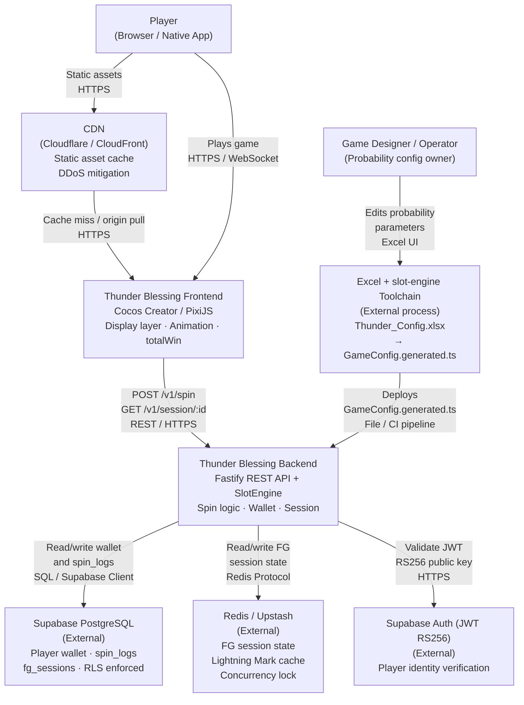
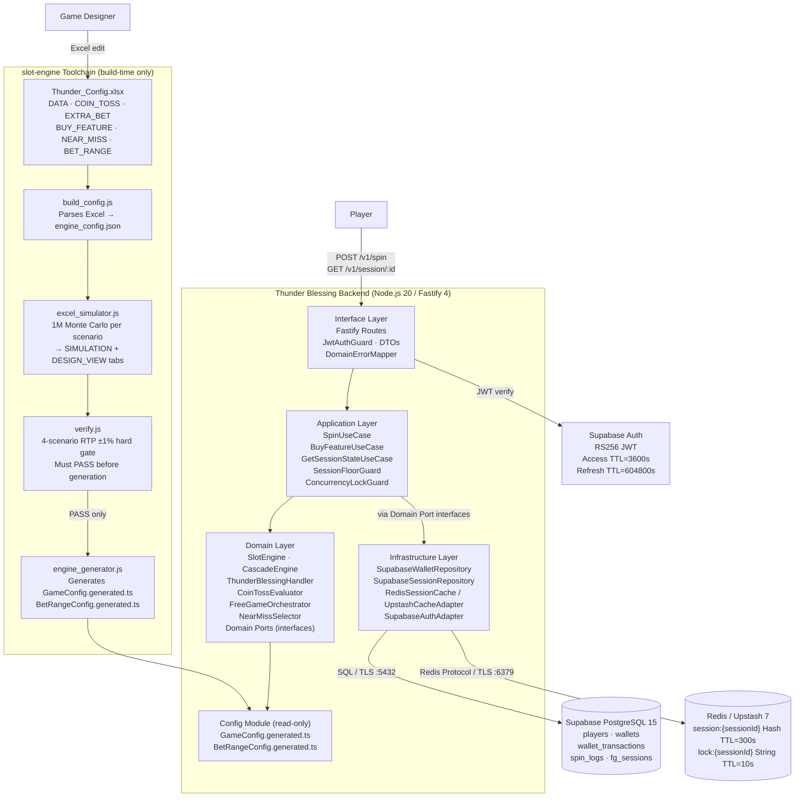
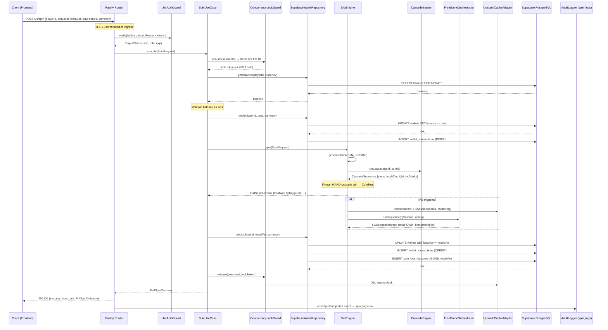
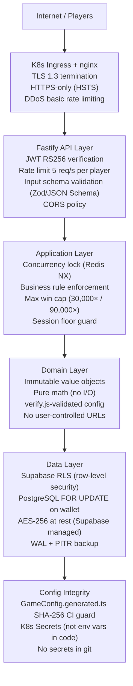
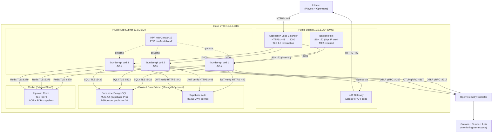
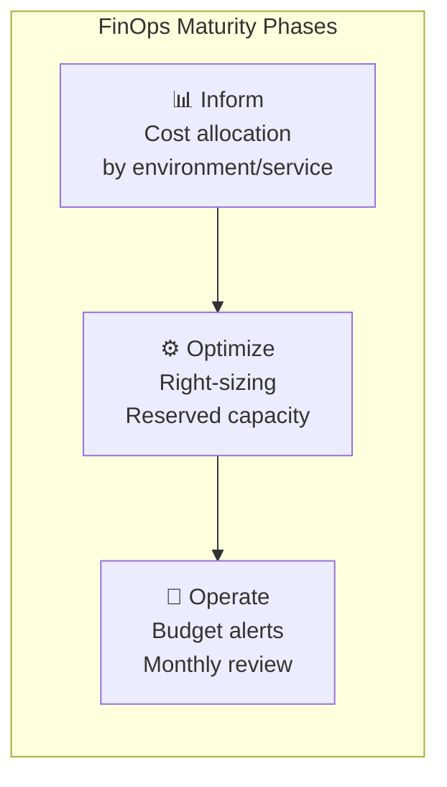

# ARCH — Architecture Design Document
# Thunder Blessing Slot Game

---

## §0 Document Control

| Field | Content |
|-------|---------|
| **DOC-ID** | ARCH-THUNDERBLESSING-20260426 |
| **Product** | Thunder Blessing Slot Game |
| **Version** | v1.0 |
| **Status** | DRAFT |
| **Author** | AI Generated (gendoc-gen agent) |
| **Date** | 2026-04-26 |
| **Upstream EDD** | [EDD.md](EDD.md) |
| **Upstream PDD** | [PDD.md](PDD.md) |
| **Upstream PRD** | [PRD.md](PRD.md) |
| **Reviewers** | Engineering Lead, QA Lead, Security Lead |
| **Approver** | CTO |

### Change Log

| Version | Date | Author | Summary |
|---------|------|--------|---------|
| v1.0 | 2026-04-26 | AI Generated | Initial generation covering all 16 sections |
| v1.1 | 2026-04-26 | gendoc review | R1 fixes: APP→INFRA arrow labeled; ADR-007/008/009 full entries added; ADR numbering note; FinOps multi-scale projections; frontend version clarified. Note: EDD §1.1 states layer order as "Domain←Application←Infrastructure←Interface" — this is a typo in EDD. Correct order (confirmed here and in ARCH §2) is Domain←Application←Adapters←Infrastructure (Infrastructure is outermost). EDD §1.1 should be corrected in next EDD update. |
| v1.2 | 2026-04-26 | gendoc review | R2 fixes: ADR §1.2 titles corrected (ADR-005=verify.js hard gate, ADR-006=totalWin accounting authority, ADR-009=Excel as sole probability source); duplicate ADR-009 replaced with distinct Excel-as-source ADR; Partial Failure Compensation table added to §6; xlsx added to §11 tech stack; CDN section added to §13. |
| v1.3 | 2026-04-26 | gendoc review | R3 fixes: C4 L2 INFRA→SupaDB labeled "SQL / TLS :5432", INFRA→RedisDB labeled "Redis Protocol / TLS :6379"; CDN node (Cloudflare/CloudFront) added to C4 L1 System Context with Player→CDN→TB_Frontend static asset path. |
| v1.4 | 2026-04-26 | gendoc review | R4 fixes: §5.1/§15 D-02/F-03/ADR-003 corrected — wallet IS debited before engine; engine timeout requires compensating credit per §6; C4 L3 HC and DTOS nodes connected (Client→HC, GC→DTOS); BetRangeConfig.generated.ts node added to C4 L3 with GC→BCF arrow; §11 frontend version placeholder standardized; EDD §2.1 synchronized with CDN node addition. |
| v1.5 | 2026-04-26 | gendoc review | R5 fixes: C4 L3 AC (authController future node) removed (orphaned); GSU→ISC arrow added (Redis primary for GET /v1/session); §9.2 NetworkPolicy egress adds port 4317 (OTLP gRPC); §9.2 monitoring namespace label corrected to kubernetes.io/metadata.name:monitoring; EDD §1.1 layer order corrected (Adapters←Infrastructure). |

---

## Table of Contents

1. Architecture Goals
   - 1.1 Quality Attribute Requirements (QAR)
   - 1.2 Architecture Decision Record (ADR) Index
2. Architecture Pattern Selection
3. System Component Diagram
   - 3.1 C4 Model — System Context (L1)
   - 3.2 C4 Model — Container (L2)
   - 3.3 C4 Model — Component (L3)
   - 3.4 Data Flow Diagram
4. Service Boundaries
5. Communication Patterns
   - 5.1 Sync / Async Communication Matrix
   - 5.2 API Gateway & Circuit Breaker
   - 5.3 Event-Driven Communication
6. Data Layering
7. High Availability Design
8. Disaster Recovery (DR)
9. Security Architecture
   - 9.1 Defense in Depth
   - 9.2 Zero-Trust Network Policy
   - 9.3 Secret Rotation Strategy
   - 9.4 Network Architecture
   - 9.5 Compliance Mapping
10. Scalability Strategy
    - 10.1 Horizontal Auto-Scaling
    - 10.2 Scalability Ceiling Analysis
11. Technology Stack Overview
12. Observability Architecture
13. External Dependency Map
14. Architecture Decision Records (Full)
15. Architecture Review Checklist
16. FinOps Cost Optimization

---

## §1 Architecture Goals

### §1.1 Quality Attribute Requirements (QAR)

Inherited from EDD §9.1 SLO/SLI table and PRD §7 NFRs:

| Quality Attribute | Target | Measurement Method | Priority |
|-------------------|--------|--------------------|----------|
| Availability | ≥ 99.5% successful responses / total requests | Grafana Uptime SLO dashboard, synthetic probe | P0 |
| Base Spin Latency | P99 ≤ 500ms end-to-end (no FG) | Prometheus `spin_duration_seconds` histogram | P0 |
| FG Sequence Latency | P99 ≤ 800ms end-to-end (full FG sequence) | Prometheus `spin_duration_seconds{fg_triggered="true"}` | P0 |
| Error Rate | < 0.5% (5xx / total requests) | `spin_error_total / spin_total` counter ratio | P0 |
| Wallet Accuracy | 0 debit/credit discrepancy events per day | Audit reconciliation job | P0 (Compliance) |
| Throughput | 100 RPS peak (9× headroom with 3 replicas) | k6 load test | P1 |
| Scalability | HPA min 3 → max 10 replicas, PDB minAvailable=2 | K8s HPA + PDB verification | P1 |
| Security | Zero-trust; RS256 JWT; Rate limit 5 req/s per player | Penetration test, SAST (semgrep/CodeQL) | P0 |
| Observability | Trace coverage > 95% on error paths; 5% sampling on normal traffic | OpenTelemetry + Grafana Tempo | P1 |
| Config Integrity | 0 CI build failures from manual config edits | SHA-256 checksum guard in CI | P0 |
| RTP Accuracy | 100M Monte Carlo simulation; all 4 scenarios within ±1% | verify.js pass gate | P0 |
| Single-Trip API | ≤ 1 HTTP round-trip per complete spin (including all FG rounds) | Integration test assertion | P0 |

**Constraints:**

- Budget: Supabase Pro + Upstash Standard + K8s 3-node cluster (target ~$400–600 USD/month)
- Regulatory: B2B gambling compliance; RTP auditable via `verify.js` output; Max win caps enforced (30,000× main; 90,000× EB+BuyFG)
- Existing system: No legacy integration; greenfield deployment
- Team preference: TypeScript/Node.js + Fastify; Clean Architecture as mandated by EDD §3.1

---

### §1.2 Architecture Decision Record (ADR) Index

The following architecture decisions have been recorded and tracked. Full ADR entries appear in §14.

> **ADR numbering note**: ARCH ADR IDs are independent from EDD ADR IDs. EDD §3.2 covers toolchain and game-engine level decisions (EDD-ADR-001 through EDD-ADR-008); ARCH ADRs cover system-level architecture decisions. Cross-reference by title, not by number.

| ADR-ID | Decision Title | Status | Date | Scope |
|--------|---------------|--------|------|-------|
| ADR-001 | Fastify over Express as HTTP framework | Accepted | 2026-04-26 | API Layer |
| ADR-002 | Clean Architecture (Domain←Application←Adapters←Infrastructure) | Accepted | 2026-04-26 | Full system |
| ADR-003 | Single-trip POST /spin returns complete FullSpinOutcome | Accepted | 2026-04-26 | API design |
| ADR-004 | Redis for FG session state (not PostgreSQL) | Accepted | 2026-04-26 | Data layer |
| ADR-005 | verify.js as hard gate before engine_generator.js | Accepted | 2026-04-26 | Toolchain |
| ADR-006 | outcome.totalWin as sole accounting authority (wallet credit) | Accepted | 2026-04-26 | Domain |
| ADR-007 | Supabase PostgreSQL + RLS for wallet/audit persistence | Accepted | 2026-04-26 | Data layer |
| ADR-008 | Kubernetes Canary deploy for production, Blue-Green for staging | Accepted | 2026-04-26 | Deployment |
| ADR-009 | Excel (Thunder_Config.xlsx) as sole probability configuration source | Accepted | 2026-04-26 | Toolchain |

> New decisions must first be drafted as ADR proposals and reviewed before this index is updated.

---

## §2 Architecture Pattern Selection

**Selected Architecture:** Clean Architecture (Robert Martin, 2017) — Modular Backend Monolith with clear layer boundaries.

**Rationale:**

1. **Dependency Rule enforcement**: Domain layer has zero external dependencies. All probability logic, game rules, and business invariants are testable in isolation without DB or Redis.
2. **Single Source of Truth for game config**: The toolchain (Excel → `GameConfig.generated.ts`) can be tested independently of the API or persistence layers.
3. **Testability first**: Slot engine math must be verified by 1M Monte Carlo simulations. A pure domain layer (no framework coupling) enables fast, deterministic unit tests.
4. **Auditability**: Clean separation between `outcome.totalWin` (domain authority) and `session.roundWin` (UI counter) prevents accounting errors.

**Rejected Alternatives:**

| Alternative | Rejection Reason |
|------------|-----------------|
| NestJS | Over-engineered for a pure REST API; decorator magic obscures dependency graph; adds ~30% startup overhead |
| MVC (Express/Fastify without layers) | Domain and infrastructure coupling makes engine unit testing impossible without mocking DB |
| Microservices | Team size and current RPS do not justify operational overhead; monolith is extractable via Strangler Fig if needed |
| Event Sourcing full CQRS | Overkill for single-game backend; CascadeSequence immutable value objects provide sufficient audit trail |

**Architecture Evolution Path:**

```
Phase 1 (Current, <100 RPS): Clean Architecture Modular Monolith
  → 3 K8s replicas, Supabase Pro, Upstash Standard
Phase 2 (100–500 RPS): Read Replica + PgBouncer + Redis Cluster
  → Split GameConfig read paths; add CDN for static config
Phase 3 (500–2000 RPS): Extract FreeGame Orchestrator + Wallet as separate services
  → CQRS for spin_logs read path; separate analytics service
Phase 4 (>2000 RPS): Multi-region Active-Passive + Event Sourcing for audit log
```

---

### Interface Definition Convention

All Service and Repository abstractions are defined as TypeScript interfaces in `src/domain/ports/` or `src/domain/interfaces/`. Concrete implementations live in `src/infrastructure/` or `src/adapters/`, and are injected via DI container at startup.

**Naming conventions:**

- Domain interfaces: `I<Entity>Repository`, `I<Entity>Cache`, `I<Provider>Provider`
- Domain services: `<Name>Engine`, `<Name>Handler`, `<Name>Evaluator`, `<Name>Orchestrator`
- Application use cases: `<Action><Entity>UseCase`
- Infrastructure adapters: `Supabase<Entity>Repository`, `Redis<Entity>Cache`, `<Provider><Entity>Adapter`

**Interface examples (TypeScript):**

```typescript
// src/domain/ports/IWalletRepository.ts
export interface IWalletRepository {
  getBalance(playerId: string, currency: "USD" | "TWD"): Promise<number>;
  debit(playerId: string, amount: number, currency: "USD" | "TWD"): Promise<void>;
  credit(playerId: string, amount: number, currency: "USD" | "TWD"): Promise<void>;
}

// src/domain/ports/ISessionCache.ts
export interface ISessionCache {
  get(sessionId: string): Promise<SpinSession | null>;
  set(sessionId: string, session: SpinSession, ttlSeconds?: number): Promise<void>;
  del(sessionId: string): Promise<void>;
  acquireLock(sessionId: string): Promise<boolean>;
  releaseLock(sessionId: string): Promise<void>;
}

// src/domain/ports/ISessionRepository.ts
export interface ISessionRepository {
  findById(sessionId: string): Promise<SpinSession | null>;
  save(session: SpinSession): Promise<void>;
}

// src/domain/interfaces/IProbabilityCore.ts
export interface IProbabilityCore {
  spin(request: SpinRequest): FullSpinOutcome;
  generateGrid(weights: SymbolWeight[], extraBet: boolean): Grid;
}
```

**Dependency direction (Clean Architecture):**

```
Domain Layer  ←  Application Layer  ←  Adapters / Interface Layer  ←  Infrastructure Layer
(no deps)        (depends on Domain)    (depends on Application)        (implements ports)
```

Prohibited: Infrastructure calling Application; Adapters calling Domain directly (only via Application); Domain importing any npm package.

---

## §3 System Component Diagram

### Component Inventory (All PRD P0 Features Covered)

| Component | Layer | Responsibility | PRD Feature |
|-----------|-------|---------------|-------------|
| `SlotEngine` | Domain | Top-level spin orchestration; calls all sub-engines | Base spin (P0) |
| `CascadeEngine` | Domain | Chain elimination, Lightning Mark generation, row expansion | Cascade + Lightning Mark (P0) |
| `ThunderBlessingHandler` | Domain | SC + mark first/second hit upgrade logic | Thunder Blessing Scatter (P0) |
| `CoinTossEvaluator` | Domain | Stage-aware RNG-based Heads/Tails (coinProbs[stage]) | Coin Toss (P0) |
| `FreeGameOrchestrator` | Domain | FG multiplier sequence ×3→×7→×17→×27→×77, bonus draw | Free Game (P0) |
| `NearMissSelector` | Domain | Config-driven near-miss grid adjustment | Near Miss (P0) |
| `IWalletRepository` | Domain/Port | Wallet debit/credit interface | Wallet (P0) |
| `ISessionCache` | Domain/Port | FG session state + concurrency lock interface | Session (P0) |
| `ISessionRepository` | Domain/Port | Session persistence interface | Session (P0) |
| `SpinUseCase` | Application | Orchestrates wallet debit/credit + spin + floor guard | Base spin, Extra Bet (P0) |
| `BuyFeatureUseCase` | Application | Guaranteed Heads×5, session floor ≥ 20× baseBet | Buy Feature (P0) |
| `GetSessionStateUseCase` | Application | FG session restore for reconnect | FG reconnect (P0) |
| `SessionFloorGuard` | Application | Enforces Buy Feature totalWin ≥ 20× baseBet at session end | Buy Feature floor (P0) |
| `ConcurrencyLockGuard` | Application | Redis NX lock; returns 409 on concurrent spin | Concurrency (P0) |
| `JwtAuthGuard` | Interface | RS256 JWT verification Fastify preHandler | JWT auth (P0) |
| `gameController` | Interface | Fastify route handlers: POST /v1/spin, GET /v1/session/:id | API (P0) |
| `healthController` | Interface | GET /health, GET /ready liveness/readiness | K8s health (P0) |
| `DomainErrorMapper` | Interface | Translates Domain errors → HTTP 4xx/5xx + error codes | Error handling (P0) |
| `SupabaseWalletRepository` | Infrastructure | PostgreSQL wallet CRUD; implements IWalletRepository | Wallet persistence (P0) |
| `SupabaseSessionRepository` | Infrastructure | PostgreSQL FG session persistence | Session persistence (P0) |
| `RedisSessionCache` / `UpstashCacheAdapter` | Infrastructure | Redis FG session state + concurrency lock | Session cache (P0) |
| `GameConfig.generated.ts` | Config (generated) | All probability params from Excel toolchain | RTP config (P0) |
| `BetRangeConfig.generated.ts` | Config (generated) | USD/TWD bet ranges (TWD maxLevel=320) | Currency (P0) |
| `build_config.js` | Toolchain | Parses Thunder_Config.xlsx, emits engine_config.json | Toolchain (P0) |
| `excel_simulator.js` | Toolchain | 1M Monte Carlo simulations per scenario | RTP validation (P0) |
| `verify.js` | Toolchain | Hard gate: 4-scenario RTP ±1% check | RTP gate (P0) |
| `engine_generator.js` | Toolchain | Generates GameConfig.generated.ts from verified config | Config codegen (P0) |

### Layered Design (Clean Architecture)

```
┌─────────────────────────────────────────────────────────────────────┐
│  Interface / Adapter Layer                                          │
│  Fastify routes (gameController, authController, healthController)  │
│  JwtAuthGuard · DomainErrorMapper · SpinRequest DTO · Response DTO │
│  → Input validation, routing; NO business logic                     │
├─────────────────────────────────────────────────────────────────────┤
│  Application Layer (Use Cases & Guards)                             │
│  SpinUseCase · BuyFeatureUseCase · GetSessionStateUseCase           │
│  SessionFloorGuard · ConcurrencyLockGuard                           │
│  → Orchestrates domain services; owns transaction boundary           │
├─────────────────────────────────────────────────────────────────────┤
│  Domain Layer (Pure TypeScript, zero external deps)                 │
│  SlotEngine · CascadeEngine · ThunderBlessingHandler                │
│  CoinTossEvaluator · FreeGameOrchestrator · NearMissSelector        │
│  Entities: Grid, SpinEntity, FreeGameSession, FGRound               │
│  Value Objects: CascadeStep, CascadeSequence, LightningMarkSet      │
│  Ports: IWalletRepository · ISessionCache · ISessionRepository      │
│  → All game math, business invariants; immutable value objects       │
├─────────────────────────────────────────────────────────────────────┤
│  Infrastructure Layer (Adapters implementing Domain Ports)          │
│  SupabaseWalletRepository · SupabaseSessionRepository               │
│  IoRedisAdapter / UpstashCacheAdapter · SupabaseAuthAdapter         │
│  → Concrete I/O; substitutable for testing                          │
└─────────────────────────────────────────────────────────────────────┘

Dependency arrows: Interface → Application → Domain ← Infrastructure (inverted)
                   Infrastructure implements Domain Ports (Dependency Inversion)

Prohibited: Domain → Infrastructure (direct)
Prohibited: Application → Infrastructure (direct; always via Port interface)
Prohibited: Controller → Domain (must go through Application Use Cases)
```

### Domain Model

```
Grid (Value Object)
  cells: Symbol[][]     — immutable 5×N grid
  rows: number          — 3 to 6
  cols: number          — always 5
  withCell(row, col, symbol): Grid   — returns new Grid
  withRows(rows): Grid               — returns new Grid

CascadeStep (Value Object)
  index: number
  grid: Grid
  winLines: WinLine[]
  stepWin: number
  newLightningMarks: Position[]
  rows: number

CascadeSequence (Value Object)
  steps: CascadeStep[]
  totalWin: number
  finalGrid: Grid
  finalRows: number
  lightningMarks: LightningMarkSet

LightningMarkSet (Value Object)
  positions: Position[]
  count: number
  — accumulated across Cascade steps; cleared on new Main Game spin; persists in FG

FreeGameSession (Entity)
  sessionId: string
  rounds: FGRound[]
  currentMultiplier: number      — 3 | 7 | 17 | 27 | 77
  totalFGWin: number
  bonusMultiplier: number        — 1 | 5 | 20 | 100
  lightningMarks: LightningMarkSet
  isComplete(): boolean

SpinEntity (Entity)
  sessionId: string
  playerId: string
  baseBet: number
  totalWin: number               — SOLE ACCOUNTING AUTHORITY
  cascadeSequence: CascadeSequence

PlayerWallet (Entity)
  playerId: string
  currency: "USD" | "TWD"
  balance: number                — always read from DB (never cached)

GameConfig (Value Object — generated)
  symbols: SymbolDefinition[]    — 4-scenario independent weight sets
  paylines: Payline[]            — 25 initial → 57 at 6 rows
  coinToss: CoinTossConfig       — coinProbs: [0.80, 0.68, 0.56, 0.48, 0.40]
  fgMultipliers: number[]        — [3, 7, 17, 27, 77]
  fgBonusWeights: FGBonusWeight[]
  nearMiss: NearMissConfig
  maxWinMain: number             — 30_000 × baseBet
  maxWinEBBuyFG: number          — 90_000 × baseBet
```

---

### §3.1 C4 L1 — System Context Diagram



---

### §3.2 C4 L2 — Container Diagram



---

### §3.3 C4 L3 — Component Diagram (Backend Internal)

```mermaid
graph TD
    Client["Client (Frontend)"]

    subgraph Interface["Interface Layer"]
        GC["gameController\nPOST /v1/spin\nGET /v1/session/:id\nGET /v1/config"]
        HC["healthController\nGET /health\nGET /ready"]
        JWG["JwtAuthGuard\nFastify preHandler\nRS256 verify"]
        EM["DomainErrorMapper\nDomain → HTTP error codes"]
        DTOS["SpinRequest DTO\nSpinResponse DTO"]
    end

    subgraph Application["Application Layer"]
        SU["SpinUseCase\nexecute(SpinRequest)\n→ FullSpinOutcome"]
        BU["BuyFeatureUseCase\nexecute(BuyRequest)\nGuaranteed Heads×5"]
        GSU["GetSessionStateUseCase\nexecute(sessionId)\n→ SpinSession"]
        SFG["SessionFloorGuard\napplyFloor(session, baseBet)\n→ max(win, 20×baseBet)"]
        CLG["ConcurrencyLockGuard\nacquire/release Redis NX lock"]
    end

    subgraph Domain["Domain Layer"]
        SE["SlotEngine\nspin(request)\n→ FullSpinOutcome"]
        CE["CascadeEngine\nrunCascade(grid)\n→ CascadeSequence"]
        TBH["ThunderBlessingHandler\nevaluate(grid, marks, hasScatter)\napplyFirstHit / applySecondHit"]
        CTE["CoinTossEvaluator\nevaluate(rng, config, stage)\n→ Heads | Tails"]
        FGO["FreeGameOrchestrator\nrunSequence(fgSession)\ndrawBonusMultiplier()"]
        NMS["NearMissSelector\nselect(grid, config)"]
        IWR[("IWalletRepository\n(port interface)")]
        ISC[("ISessionCache\n(port interface)")]
        ISR[("ISessionRepository\n(port interface)")]
        GCF["GameConfig.generated.ts\n(read at startup)"]
        BCF["BetRangeConfig.generated.ts\n(read at startup)\nUSD/TWD bet levels"]
    end

    subgraph Infrastructure["Infrastructure Layer"]
        SWR["SupabaseWalletRepository\ngetBalance · debit · credit\nPostgreSQL FOR UPDATE"]
        SSPG["SupabaseSessionRepository\nfindById · save\nPostgreSQL fg_sessions"]
        RSC["UpstashCacheAdapter / IoRedisAdapter\nget · set · del · acquireLock\nTTL 300s session / 10s lock"]
        SAA["SupabaseAuthAdapter\nverifyJWT(token)\n→ PlayerClaims"]
    end

    Client -->|"HTTPS"| GC
    Client -->|"HTTPS no-auth"| HC
    GC --> JWG
    GC --> DTOS
    GC --> SU
    GC --> BU
    GC --> GSU
    GC --> EM
    JWG --> SAA
    SU --> SE
    SU --> SFG
    SU --> CLG
    SU --> IWR
    SU --> ISC
    BU --> SU
    GSU --> ISC
    GSU --> ISR
    SE --> CE
    SE --> TBH
    SE --> CTE
    SE --> FGO
    SE --> NMS
    SE --> GCF
    GC --> BCF
    IWR -.->|implements| SWR
    ISR -.->|implements| SSPG
    ISC -.->|implements| RSC
```



---

### §3.4 Data Flow Diagram

#### Write Path — Spin Request Sequence



#### PII Sensitive Data Flow Table

| PII Data Type | Flow Path | Storage Location | Masking Rule | Access Control |
|---------------|-----------|-----------------|--------------|----------------|
| Player email | Supabase Auth → `players.email` | PostgreSQL (AES-256 at rest) | Log: `e***@domain.com` (mask local-part) | RLS: player reads own row; service_role full access |
| Player UUID (`playerId`) | All layers — non-PII identifier | All tables as FK | No masking needed (UUID only) | JWT `sub` claim enforcement |
| `totalWin` (financial) | SpinUseCase → wallet_transactions → spin_logs | PostgreSQL | Never logged to debug level in production | service_role only for direct DB access |
| Spin outcome JSONB | SlotEngine → spin_logs.outcome | PostgreSQL JSONB | `rngSeed` field masked/excluded in logs | service_role + operator role only |
| JWT Access Token | Client → API → Supabase Auth | Never stored | Token not logged; only claims logged | Supabase Auth RS256 key pair |
| FG session state | SpinUseCase → Redis hash | Redis / Upstash (TLS in-transit) | Redis key `session:{sessionId}` — no plaintext PII | Redis ACL; internal network only |

**Masking Rules:**
- All email addresses in structured logs: replace local-part with `e***` before `@`
- `rngSeed` values: excluded from production logs (`LOG_RNG_VALUES=false` default)
- Balance values: logged only at `info` level with explicit field name `balance` (no accidental embedding in stack traces)

---

## §4 Service Boundaries

### Bounded Context Map (from EDD §3.4)

| Bounded Context | Responsibility | Key Aggregates | Owns Tables | External API |
|----------------|---------------|----------------|-------------|-------------|
| **Spin** | Reel spin, grid generation, payline evaluation, outcome computation | `SpinRound`, `Grid`, `Payline` | `spin_logs` | `POST /v1/spin` |
| **Cascade** | Chain elimination, Lightning Mark tracking, row expansion to 6 | `CascadeSequence`, `CascadeStep`, `LightningMarkSet` | (in-memory, serialized to `spin_logs.outcome`) | — |
| **FreeGame** | Multiplier sequence ×3→×7→×17→×27→×77, FG round orchestration, bonus multiplier draw | `FreeGameSession`, `FGRound`, `FGBonusMultiplier` | `fg_sessions` (PostgreSQL) + Redis hash | `GET /v1/session/:id` |
| **Wallet** | Debit baseBet, credit totalWin, balance query; ACID transactions with `FOR UPDATE` | `PlayerWallet`, `WalletTransaction` | `wallets`, `wallet_transactions` | `GET /v1/config` (bet ranges) |
| **Session** | In-flight state, floor guard, concurrency lock; TTL-based Redis | `SpinSession`, `SessionFloor` | Redis only (TTL 300s) | — |
| **Config** | Game parameters from Excel toolchain; bet ranges per currency | `GameConfig`, `BetRangeConfig` | `GameConfig.generated.ts` (file) | `GET /v1/config` |

### Anti-Corruption Layer (ACL)

The only external system requiring translation is **Supabase Auth** (JWT claims → internal `PlayerClaims`):

```typescript
// src/adapters/repositories/SupabaseAuthAdapter.ts
export class SupabaseAuthAdapter implements IAuthProvider {
  async verifyJWT(token: string): Promise<PlayerClaims> {
    const { data, error } = await this.supabase.auth.getUser(token);
    if (error) throw new UnauthorizedError("Invalid or expired JWT");
    return {
      playerId: data.user.id,          // maps JWT `sub` → internal playerId
      role: data.user.role ?? "player",
      expiresAt: data.user.aud,
    };
  }
}
```

### Endpoint Attribution

| Endpoint | Method | Bounded Context | Use Case | Auth |
|----------|--------|----------------|----------|------|
| `/v1/spin` | POST | Spin + Cascade + FreeGame + Wallet + Session | `SpinUseCase` (or `BuyFeatureUseCase`) | JWT Bearer required |
| `/v1/session/:sessionId` | GET | FreeGame + Session | `GetSessionStateUseCase` | JWT Bearer required (own session only) |
| `/v1/config` | GET | Config + Wallet | Direct config read | JWT Bearer required |
| `/health` | GET | — | Liveness probe | None |
| `/ready` | GET | — | Readiness (DB + Redis) | None |

---

## §5 Communication Patterns

### §5.1 Sync / Async Communication Matrix

| From → To | Pattern | Protocol | Timeout | Retry | Notes |
|-----------|---------|----------|---------|-------|-------|
| Frontend → Fastify API | Synchronous | HTTPS REST (TLS 1.3) | 30s client-side | 3× exponential backoff (client) | JWT Bearer; single-trip response |
| Fastify → SpinUseCase | In-process call | TypeScript function call | Engine timeout 2000ms | No retry (wallet IS debited before engine; timeout → 504 + compensating credit per §6) | ConcurrencyLock guards re-entry |
| SpinUseCase → SupabaseWalletRepository | Synchronous | Supabase JS Client / TCP | 2000ms | No retry on debit (idempotency risk); 3× on read | PostgreSQL FOR UPDATE |
| SpinUseCase → UpstashCacheAdapter | Synchronous | Redis Protocol / TLS | 500ms | 2× for read; no retry on lock acquire | NX for lock; EX 10s TTL |
| API → Supabase Auth | Synchronous | HTTPS | 1000ms | No retry (fail fast with 401) | RS256 public key cached 1h |
| worker → Supabase DB | Synchronous (batch) | Supabase JS Client | 60s | 3× linear backoff | RTP report archive |
| CI Toolchain (build-time) | Sequential pipeline | Node.js subprocess | 30min (1M sim) | No retry; fail fast | verify.js PASS gates engine_generator.js |

### §5.2 API Gateway & Circuit Breaker

**API Gateway:** Kubernetes Ingress (nginx-ingress) with Fastify rate limiting plugin (`fastify-rate-limit`). No external API Gateway product required at current scale.

**Fastify route configuration:**

```typescript
// Rate limiting: 5 req/s per player (keyed by JWT sub)
await app.register(import("@fastify/rate-limit"), {
  max: 5,
  timeWindow: "1 second",
  keyGenerator: (req) => req.jwtClaims?.playerId ?? req.ip,
  errorResponseBuilder: () => ({
    success: false,
    code: "RATE_LIMITED",
    message: "Too many requests. Max 5 per second per player.",
    retryAfter: 1,
  }),
});

// JWT auth as preHandler on all /v1/* routes
app.addHook("preHandler", jwtAuthGuard.verify);
```

**Circuit Breaker configuration (from EDD §10.2):**

| Dependency | State machine | Timeout | Open threshold | Half-Open probe |
|-----------|--------------|---------|----------------|-----------------|
| Supabase PostgreSQL | CLOSED → OPEN (5 failures / 10s) → HALF_OPEN (30s) | 2000ms | 5 consecutive failures | 1 probe request |
| Redis / Upstash | CLOSED → OPEN (10 failures / 10s) → HALF_OPEN (30s) | 500ms | 10 consecutive failures | 1 probe request |
| Supabase Auth (JWT) | CLOSED → OPEN (5 failures / 10s) → HALF_OPEN (30s) | 1000ms | 5 consecutive failures | 1 probe request |

```
Circuit Breaker State Machine:

CLOSED ──(error rate > threshold in window)──► OPEN
          ◄──(probe request succeeds)──── HALF-OPEN ◄──(timeout elapsed)── OPEN

On OPEN state: return HTTP 503 with Retry-After header; no spin attempted (lock not acquired → wallet not yet debited)
```

**Retry policy (non-wallet operations only):**

```
Max retries: 2 (read operations only; write operations never retried)
Backoff: exponential, initial 100ms, max 2000ms
Jitter: ±20% (prevents thundering herd on Redis recovery)
No retry for: 400, 401, 403, 404, 409, 429 (client errors)
```

### §5.3 Event-Driven Communication

This system is **not event-driven** at the infrastructure level. Domain Events (EDD §4.2) are in-process only, used for:

- Audit logging (`SpinCompleted` → write to `spin_logs`)
- Metric emission (`FGRoundStarted` → increment Prometheus counter)
- Worker processes consume Redis Streams (future) for RTP archival

**In-process domain events (current):**

| Event | Publisher | Subscriber | In-process handler |
|-------|-----------|-----------|-------------------|
| `SpinStarted` | `SpinUseCase` | `AuditLogger`, `ConcurrencyLock` | Synchronous side-effect |
| `SpinCompleted` | `SpinUseCase` | `WalletRepository`, `AuditLogger` | Synchronous write to spin_logs |
| `FGRoundStarted` | `FreeGameOrchestrator` | Prometheus counter | Metric emission |
| `WalletCredited` | `SupabaseWalletRepository` | `AuditLogger` | spin_logs credit record |
| `SessionFloorApplied` | `SessionFloorGuard` | `WalletAccumulator` | Adjusts totalWin before credit |

**Future async path (Phase 3):** Redis Streams or NATS for spin_log archival, RTP analytics, anomaly detection.

---

## §6 Data Layering

### Layered Data Architecture

```
┌────────────────────────────────────────────────────────┐
│  Application Layer (Use Cases)                         │
│  ● All DB access via IWalletRepository / ISessionCache  │
│  ● Never imports Supabase client directly               │
│  ● Player balance: always read from DB (never cached)   │
├────────────────────────────────────────────────────────┤
│  Repository / Cache Layer                              │
│  ● SupabaseWalletRepository: all wallet CRUD           │
│  ● SupabaseSessionRepository: fg_sessions persistence  │
│  ● UpstashCacheAdapter: FG session Redis hash (TTL 300s)│
│  ● Concurrency lock: Redis NX String (TTL 10s)         │
├────────────────────────────────────────────────────────┤
│  Primary Database (Supabase PostgreSQL 15)             │
│  ● All writes: wallets, wallet_transactions, spin_logs  │
│  ● Strong consistency (FOR UPDATE on wallet debit)     │
│  ● PITR: 5-minute granularity (Supabase Pro)           │
│  ● RLS: players read own rows only                     │
├────────────────────────────────────────────────────────┤
│  Cache Layer (Redis / Upstash 7)                       │
│  ● FG session state: session:{id} Hash, TTL 300s       │
│  ● Concurrency lock: session:{id}:lock String, TTL 10s │
│  ● GameConfig: in-memory (loaded at startup, immutable) │
│  ● JWT public key: in-memory cache, TTL 1h             │
│  ● Player balance: NOT cached (financial accuracy)     │
├────────────────────────────────────────────────────────┤
│  Config Layer (Read-only, startup-loaded)              │
│  ● GameConfig.generated.ts: all probability params     │
│  ● BetRangeConfig.generated.ts: USD/TWD bet levels     │
│  ● Validated at startup; fatal crash if invalid        │
└────────────────────────────────────────────────────────┘

Data Consistency:
  Wallet transactions: ACID (PostgreSQL FOR UPDATE + transaction block)
  FG session state: Eventually consistent via Redis + PostgreSQL fg_sessions
  GameConfig: Immutable until next toolchain deploy (CI-gated)
  Player balance: Always strong-consistent (read primary, never cache)
```

### Error Translation Strategy

**Layer-by-layer error transformation:**

| Layer | Error Type | Translation | HTTP Code |
|-------|------------|-------------|-----------|
| Domain | `InsufficientBalanceError` | → `INSUFFICIENT_FUNDS` | 400 |
| Domain | `InvalidBetLevelError` | → `INVALID_BET_LEVEL` | 400 |
| Domain | `InvalidCurrencyError` | → `INVALID_CURRENCY` | 400 |
| Infrastructure | Redis lock NX fail | → `SpinInProgressError` | 409 |
| Infrastructure | Supabase auth error | → `UnauthorizedError` | 401 |
| Infrastructure | Player account suspended | → `ForbiddenError` | 403 |
| Application | Rate limiter exceeded | → `RATE_LIMITED` | 429 |
| Application | Engine timeout >2000ms | → `ENGINE_TIMEOUT` | 504 |
| Infrastructure | Unexpected DB/Redis error | → `INTERNAL_ERROR` | 500 |
| Interface | `DomainErrorMapper.map(err)` | Translates → `ErrorResponse` | varies |

**Error Response Envelope (consistent across all endpoints):**

```typescript
interface ErrorResponse {
  success: false;
  code: "INSUFFICIENT_FUNDS" | "INVALID_BET_LEVEL" | "INVALID_CURRENCY"
      | "UNAUTHORIZED" | "FORBIDDEN" | "SPIN_IN_PROGRESS"
      | "RATE_LIMITED" | "ENGINE_TIMEOUT" | "INTERNAL_ERROR";
  message: string;        // human-readable; never exposes raw DB error
  requestId: string;      // UUID for log correlation
  timestamp: string;      // ISO 8601
}
```

### Partial Failure Compensation (Debit → Spin → Credit)

The spin flow is: **acquire lock → debit wallet → run engine → credit wallet → release lock → log spin**. If credit fails after a successful debit, the player is financially harmed. Compensation strategy:

| Failure Point | Detection | Compensation |
|--------------|-----------|-------------|
| Lock acquire fails | Redis NX returns 0 | 409 SPIN_IN_PROGRESS; no debit |
| Debit fails | DB transaction rollback | 400/500; no spin; no credit needed |
| Engine throws / times out | Exception caught in SpinUseCase | **Compensating credit** issued immediately for the debited amount via `WalletRepository.credit(playerId, debitedAmount, "spin_abort_refund")`. A `spin_abort` entry is written to `spin_logs`. |
| Credit fails after engine success | Exception in credit step | Retry credit up to 3× (exponential backoff 50ms/100ms/200ms). If all retries fail: record `unresolved_debit` event in `wallet_transactions`; trigger **async reconciliation job** (runs every 5 minutes) that detects `wallet_transactions` rows with type="debit" not matched by a corresponding "credit"/"refund" within 60s, and issues compensating credits. On-call PagerDuty alert triggered. |
| Lock release fails | Redis DEL fails | Acceptable — lock TTL=10s auto-expiry; no player impact |
| Spin log write fails | Supabase write error | Non-fatal; log to structured logging; retry async; does NOT fail the spin response (player already credited) |

> **Invariant**: A player must never lose funds due to a server-side failure. Compensation always errs on the side of crediting the player.

---

## §7 High Availability Design

**Strategy: Active-Passive with K8s HPA + PDB**

The backend is stateless (all state in Redis + PostgreSQL). K8s runs 3 identical API pod replicas across at least 2 AZs. Redis (Upstash) and PostgreSQL (Supabase Pro) are managed services with their own multi-AZ HA.

### Replica Configuration

| Service | Min Replicas | Max Replicas | Pod Disruption Budget | Deploy Strategy |
|---------|-------------|-------------|----------------------|----------------|
| `thunder-blessing-api` (prod) | 3 | 10 | `minAvailable: 2` | Canary (5% → 25% → 100%) |
| `thunder-blessing-api` (staging) | 2 | 4 | `minAvailable: 1` | Blue-Green |
| `thunder-blessing-api` (dev) | 1 | 1 | — | Rolling |

### HPA Configuration

```yaml
# Production HPA
minReplicas: 3
maxReplicas: 10
metrics:
  - type: Resource
    resource:
      name: cpu
      target:
        type: Utilization
        averageUtilization: 70   # scale-out at 70% CPU
scaleDown:
  stabilizationWindowSeconds: 300   # 5-min cool-down prevents flapping
  policies:
    - type: Pods
      value: 1
      periodSeconds: 60
```

### Health Checks

```yaml
livenessProbe:
  httpGet:
    path: /health
    port: 3000
  initialDelaySeconds: 10
  periodSeconds: 15
  failureThreshold: 3        # 45s before pod restart

readinessProbe:
  httpGet:
    path: /ready             # checks DB + Redis connectivity
    port: 3000
  initialDelaySeconds: 5
  periodSeconds: 10
  failureThreshold: 2        # removed from LB after 20s
```

### Graceful Shutdown (SIGTERM)

1. Stop accepting new connections (`fastify.close()`)
2. Wait for in-flight requests (up to 30s)
3. Release all Redis session locks
4. Close PostgreSQL connection pool
5. Exit with code 0

### Cross-AZ Spread

```yaml
topologySpreadConstraints:
  - maxSkew: 1
    topologyKey: topology.kubernetes.io/zone
    whenUnsatisfiable: DoNotSchedule
    labelSelector:
      matchLabels:
        app: thunder-blessing-api
```

---

## §8 Disaster Recovery (DR)

### RTO / RPO Targets (from EDD §10.1)

| Metric | Target | Rationale |
|--------|--------|-----------|
| **RTO** (Recovery Time Objective) | **30 minutes** | B2B slot game; 30-min outage acceptable; covered by Supabase Pro SLA |
| **RPO** (Recovery Point Objective) | **5 minutes** | Supabase PITR 5-minute granularity; Upstash AOF + 5-min RDB snapshots |

### Backup Strategy

| Data Type | Backup Method | Frequency | Retention | Storage | Restore Test |
|-----------|--------------|-----------|-----------|---------|--------------|
| PostgreSQL (wallets, spin_logs, fg_sessions) | Supabase Pro automated backup + PITR | Continuous (PITR) + daily full | 30 days | Supabase managed (same region) | Monthly restore drill |
| Redis / Upstash (FG session state) | Upstash AOF persistence + RDB snapshots | Every 5 minutes | 1 day | Upstash managed | Weekly key recovery test |
| `GameConfig.generated.ts` | Git commit history | On each toolchain run | Indefinite | GitHub repo | CI checksum verification |
| K8s manifests + Helm charts | GitOps (GitHub) | On each change | Indefinite | GitHub repo | Quarterly DR drill |
| Environment secrets | K8s Secret + manual record in Vault | On rotation | Per rotation policy | Vault / K8s etcd (encrypted) | On rotation |

### Failover Plan

```
Scenario 1: API Pod crash / OOM
  Detection: K8s liveness probe fails after 45s (3 × 15s)
  Recovery: K8s auto-restarts pod; PDB ensures minAvailable=2 during rolling restart
  Expected RTO: < 2 minutes

Scenario 2: Full AZ outage
  Detection: ALB health checks remove unhealthy targets automatically
  Recovery: K8s reschedules pods to healthy AZ; HPA scales up
  Expected RTO: 5–10 minutes

Scenario 3: Supabase PostgreSQL outage
  Detection: Circuit breaker opens after 5 failures in 10s
  Recovery: Circuit breaker HALF-OPEN after 30s; retry against Supabase (managed HA)
  Expected RTO: 30 minutes (Supabase Pro RTO SLA)

Scenario 4: Redis / Upstash outage
  Detection: Circuit breaker opens after 10 failures in 10s
  Recovery: FG sessions are also persisted in PostgreSQL fg_sessions; restore from DB
             New spins return 503 with Retry-After until Redis recovers
  Expected RTO: < 10 minutes (Upstash HA)

Scenario 5: Full region outage (catastrophic)
  Detection: External synthetic monitoring (Grafana Cloud probe)
  Recovery: Manual failover to read replica promoted as primary; DNS update
  Expected RTO: 25–30 minutes (within RTO target)
  Expected RPO: 5 minutes (PITR granularity)
```

### DR Drill Schedule

- **Frequency:** Quarterly
- **Scope:** Single-AZ pod eviction simulation + wallet reconciliation verification
- **Owner:** Engineering Lead
- **Runbook:** `infra/runbooks/dr-drill.md` (in repository)

---

## §9 Security Architecture

### §9.1 Defense in Depth



**Defense layers:**
1. **Network**: TLS 1.3 at ingress; HTTPS-only; Strict-Transport-Security header
2. **Authentication**: RS256 JWT; every `/v1/*` request requires valid token; `exp` claim validated
3. **Authorization**: Supabase RLS (players read only own rows); role-based endpoint matrix
4. **Rate limiting**: 5 req/s per player (Redis token bucket); 429 with `Retry-After: 1`
5. **Input validation**: JSON Schema validation on all request bodies before reaching Use Cases
6. **Concurrency**: Redis NX lock prevents double-spin race condition
7. **Wallet atomicity**: PostgreSQL `FOR UPDATE` + transaction block; debit before engine spin
8. **Audit**: Immutable `spin_logs` + `wallet_transactions`; RLS prevents player modification
9. **Config integrity**: CI SHA-256 checksum guard on `GameConfig.generated.ts`

### §9.2 Zero-Trust Network Policy

**Principle:** Never trust, always verify. No implicit trust based on network location.

**Kubernetes NetworkPolicy:**

```yaml
# API pods only accept traffic from Ingress controller
apiVersion: networking.k8s.io/v1
kind: NetworkPolicy
metadata:
  name: thunder-api-ingress
  namespace: thunder-prod
spec:
  podSelector:
    matchLabels:
      app: thunder-blessing-api
  policyTypes:
    - Ingress
    - Egress
  ingress:
    - from:
        - namespaceSelector:
            matchLabels:
              kubernetes.io/metadata.name: ingress-nginx
      ports:
        - protocol: TCP
          port: 3000
    - from:
        - namespaceSelector:
            matchLabels:
              kubernetes.io/metadata.name: monitoring
      ports:
        - protocol: TCP
          port: 9090    # Prometheus metrics scrape only
  egress:
    - to: []            # allow all egress (Supabase + Upstash external endpoints + OTEL Collector)
      ports:
        - port: 443     # HTTPS to Supabase + Upstash
        - port: 6379    # Redis protocol (TLS via Upstash)
        - port: 5432    # PostgreSQL via Supabase (TLS)
        - port: 4317    # OTLP gRPC to OpenTelemetry Collector
```

**Service-to-service authentication matrix:**

| Caller | Target | Auth Method | Permitted Operations |
|--------|--------|-------------|---------------------|
| Frontend (Player) | `/v1/spin`, `/v1/session/:id` | JWT RS256 Bearer | POST spin, GET own session |
| Frontend (Player) | `/v1/config` | JWT RS256 Bearer | GET bet ranges |
| Frontend (Operator) | `/v1/admin/stats` (future) | JWT RS256 Bearer (role=operator) | GET aggregate stats |
| API pods | Supabase PostgreSQL | `SUPABASE_SERVICE_KEY` (K8s Secret) | Full access via service_role |
| API pods | Upstash Redis | `REDIS_URL` (K8s Secret, TLS) | Session state + lock ops |
| API pods | Supabase Auth | `SUPABASE_JWT_SECRET` (public key, K8s Secret) | JWT verification |
| External | Any service subnet | Blocked by NetworkPolicy | None |

**RBAC role matrix (EDD §8.1):**

| Role | `POST /v1/spin` | `GET /v1/session/:id` | `GET /v1/config` | `GET /health` | `GET /v1/admin/stats` |
|------|-----------------|-----------------------|-----------------|--------------|----------------------|
| `player` | ✅ | ✅ (own only, RLS) | ✅ | ✅ | ❌ |
| `operator` | ❌ | ❌ | ✅ | ✅ | ✅ |
| `service_role` | ✅ | ✅ | ✅ | ✅ | ✅ |

### §9.3 Secret Rotation Strategy

| Secret | Storage | Rotation Frequency | Rotation Method | Alert Lead Time |
|--------|---------|-------------------|----------------|----------------|
| `SUPABASE_SERVICE_KEY` | K8s Secret `thunder-secrets` | Every 90 days | Manual rotation; update K8s Secret + redeploy | 14 days before expiry |
| `SUPABASE_JWT_SECRET` (RS256 public key) | K8s Secret `thunder-secrets` | On Supabase key rotation | Supabase triggers rotation; update K8s Secret | Immediate Grafana alert |
| `REDIS_URL` (Upstash connection string) | K8s Secret `thunder-secrets` | On credential change | Manual via Upstash console; update K8s Secret | On any credential event |
| `DATABASE_URL` | K8s Secret `thunder-secrets` | Every 90 days | Supabase Pro connection string rotation | 14 days before expiry |
| JWT Access Token (player) | Never stored server-side | TTL 3600s (auto-expiry) | Supabase Auto | — |
| JWT Refresh Token (player) | Supabase Auth only | TTL 604800s (7 days); single-use rotate | Supabase Auto | — |

**Emergency rotation procedure:**
1. Suspected leak → immediately notify Security Lead
2. Rotate affected K8s Secret within 4 hours
3. Review all access logs in Supabase + Redis for anomalous patterns
4. Write Incident Report within 24 hours

**RBAC for K8s Secrets:** Only `thunder-api` ServiceAccount can read from `thunder-secrets`. No other pods or ServiceAccounts in `thunder-prod` namespace may access the secret.

### §9.4 Network Architecture

#### VPC Topology



#### Security Group Rules

| Resource | Inbound Allowed | Outbound Allowed | Notes |
|----------|----------------|-----------------|-------|
| ALB (Load Balancer) | `0.0.0.0/0 :443` | App Subnet `:3000` | Public HTTPS ingress only |
| API Pods | ALB SG `:3000`, monitoring NS `:9090` | Data Subnet `:5432`, Cache `:6379`, NAT `:443` | No direct internet inbound |
| Supabase PostgreSQL | App Subnet `:5432` | — | Managed; SG controlled by Supabase |
| Upstash Redis | App Subnet `:6379` (TLS) | — | External SaaS; TLS enforced by Upstash |
| Bastion | Ops IP range `:22` | App Subnet `:22` | MFA required; no prod DB direct access |

#### Availability Zone Configuration

| AZ | Components | Role |
|----|-----------|------|
| AZ-a | ALB, Pod-1, Pod-3, NAT Gateway | Primary |
| AZ-b | ALB, Pod-2, Bastion | Secondary (failover) |

### §9.5 Compliance Architecture Mapping

| Regulation / Standard | Affected Components | Data Type | Technical Measures | Audit Log |
|----------------------|--------------------|-----------|--------------------|-----------|
| **Gambling Compliance (B2B)** | `SlotEngine`, `verify.js`, `spin_logs` | RTP, max win cap, bet levels | `verify.js` 4-scenario ±1% gate; `enforceMaxWin()` in domain; `spin_logs.outcome` JSONB immutable | `spin_logs` (immutable); `wallet_transactions` |
| **Financial Data (wallet)** | `SupabaseWalletRepository`, `wallets`, `wallet_transactions` | Balance, transaction amounts | PostgreSQL FOR UPDATE + ACID; AES-256 at rest; no balance caching | `wallet_transactions` with `balance_before` / `balance_after` |
| **Player PII** | `players`, `spin_logs`, logs | email, playerId | RLS restricts player to own rows; logs mask email; `spin_logs` accessible only by service_role | `spin_logs` + Grafana structured logs (1-year retention) |
| **Config Integrity (compliance)** | `GameConfig.generated.ts`, CI pipeline | Probability params, max win | CI SHA-256 checksum guard; `ENFORCE_MAX_WIN_CAP=true` feature flag (must not disable) | GitHub commit history + CI artifact |
| **OWASP Top 10** | All API endpoints | All user input | See EDD §8.2 (A01–A10 mitigations) | OpenTelemetry traces; Grafana error alerts |

**Compliance Zones:**
```
[Gambling Compliance Zone] — spin_logs, verify.js, SlotEngine, max win enforcement
[Financial Zone]           — wallets, wallet_transactions, SupabaseWalletRepository
[PII Zone]                 — players table, email masking in logs, Supabase Auth
[Internal Zone]            — Application layer, Domain layer, Redis session state
[Public Zone]              — /health, /ready (no auth), /v1/config (JWT required)
```

---

## §10 Scalability Strategy

### §10.1 Horizontal Auto-Scaling

| Bottleneck | Scale Method | Scale-Out Trigger | Scale-In Trigger | Cool-Down |
|-----------|-------------|------------------|-----------------|-----------|
| API pods | K8s HPA | CPU > 70% sustained | CPU < 40% for 5min | Scale-out: 60s |
| API pods (secondary) | K8s HPA custom metric | RPS > 30 per pod | RPS < 15 per pod for 5min | Scale-in: 300s |
| PostgreSQL reads | Supabase Pro connection pool | Pool utilization > 80% (20 conn/replica) | — | Manual |
| Redis | Upstash Standard (10K req/s) | Approaching 8K req/s | — | Manual upgrade to Upstash Pro |

**Vertical scaling:** Not applicable to stateless API pods. PostgreSQL and Redis are managed services with their own vertical scaling paths (Supabase Pro → Enterprise; Upstash Standard → Pro).

### §10.2 Scalability Ceiling Analysis

| Bottleneck Point | Current Ceiling | Symptoms at Ceiling | Mitigation Strategy |
|-----------------|----------------|---------------------|---------------------|
| **PostgreSQL connection pool** | 20 connections × 3 replicas = 60 total; Supabase Pro: 1,000 via PgBouncer | Connection wait > 500ms; P99 latency spike | Add PgBouncer external pooler; increase pool size; add read replica for spin_log queries |
| **Redis / Upstash concurrency** | Upstash Standard: 10,000 req/s total | Redis timeout 500ms circuit breaker opens | Upgrade to Upstash Pro (no limit); or Redis Cluster sharding by sessionId prefix |
| **API pod CPU (Node.js single-thread)** | ~300 RPS per pod (I/O-bound); 3 pods = 900 RPS headroom | P99 > 500ms; HPA hits max=10 = 3,000 RPS ceiling | Profile SlotEngine hot path; consider worker_threads for CascadeEngine; vertical scale pod CPU limit |
| **GameConfig in-memory parse time** | Config loaded once at startup; O(1) after startup | Slow pod cold start (>10s) if config is large | Pre-validate config in CI; lazy load large payline arrays |
| **spin_logs table growth** | JSONB `outcome` field averages 2KB per spin; at 100 RPS = 720MB/hour | Query slow scan on large spin_logs; VACUUM overhead | Partition `spin_logs` by `created_at` month; archive to cold storage after 90 days |
| **Kubernetes node capacity** | 3 nodes × 4 vCPU → max ~12 pods at current resource limits | Pod pending (insufficient node resources) | Node auto-provisioner; increase node pool size; or use spot nodes for HPA surge |

**4-Phase Architecture Evolution Roadmap:**

| Phase | Trigger | Architecture Change | Estimated Timeline |
|-------|---------|--------------------|--------------------|
| **Phase 1 (Current)** | < 100 RPS peak | Clean Architecture Monolith; 3 K8s pods; Supabase Pro; Upstash Standard | Launch → 6 months |
| **Phase 2** | 100–500 RPS sustained; spin_logs > 50M rows | Add Supabase read replica; `spin_logs` table partitioning by month; external PgBouncer; Redis Cluster (3 shards) | 6–18 months |
| **Phase 3** | 500–2000 RPS; team > 8 engineers | Extract `FreeGameOrchestrator` + `WalletService` as independent K8s deployments; CQRS for spin_log analytics; dedicated analytics Postgres schema | 18–36 months |
| **Phase 4** | > 2000 RPS; multi-market expansion | Multi-region Active-Passive (primary + DR region); Event Sourcing for audit log; Kafka for real-time RTP anomaly detection; CDN for static GameConfig delivery | 36+ months |

---

## §11 Technology Stack Overview

| Layer | Technology | Version | Purpose | License |
|-------|-----------|---------|---------|---------|
| Runtime | Node.js | 20 LTS | Server runtime; event-loop I/O | MIT |
| Language | TypeScript | 5.4+ | Type-safe development across all layers | Apache 2.0 |
| HTTP Framework | Fastify | 4.x | REST API; native TypeScript types; 30–50% faster than Express | MIT |
| Database | Supabase PostgreSQL | 15 | Wallet, spin_logs, fg_sessions; Row-Level Security | PostgreSQL License |
| Cache | Redis / Upstash | 7.x | FG session state; concurrency lock; TTL-based eviction | Redis BSL / Upstash SaaS |
| Redis Client | IoRedis / Upstash SDK | latest | Typed Redis operations; TLS | MIT |
| Auth | Supabase Auth (JWT RS256) | — | Player identity; RS256 keypair; Access TTL 3600s; Refresh TTL 604800s | Supabase OSS |
| DB Client | Supabase JS Client | 2.x | Type-safe PostgreSQL queries; RLS transparent | MIT |
| Testing (Unit/Integration) | Vitest + Supertest | latest | Unit tests (domain); integration tests (API + DB) | MIT |
| Excel Parsing | exceljs | latest | Thunder_Config.xlsx tab parsing in build_config.js | MIT |
| Excel Parsing (alt) | xlsx (SheetJS) | latest | Used alongside exceljs for binary .xlsx format compatibility in build_config.js | Apache-2.0 |
| DI Container | tsyringe (or manual factory) | latest | Constructor injection; Domain receives only interfaces | MIT |
| Container | Docker | 24+ | Containerization; multi-stage build | Apache 2.0 |
| Orchestration | Kubernetes | 1.29+ | Production deployment; HPA, PDB, NetworkPolicy | Apache 2.0 |
| CI/CD | GitHub Actions | — | Lint → Test → Toolchain → Docker Build → Deploy | GitHub |
| Observability | OpenTelemetry + Grafana | latest | Metrics (Prometheus) + Traces (Tempo) + Logs (Loki) | Apache 2.0 |
| SAST | semgrep + CodeQL | — | Security scan; blocks on CRITICAL findings | Various OSS |
| Ingress | nginx-ingress | latest | K8s Ingress; TLS termination; HTTPS-only | Apache 2.0 |
| Secret Manager | Kubernetes Secrets (etcd encrypted) | — | SUPABASE_SERVICE_KEY, REDIS_URL, DATABASE_URL, SUPABASE_JWT_SECRET | K8s Apache 2.0 |
| Frontend | Cocos Creator 3.x / PixiJS 7.x | TBD — confirmed at frontend milestone (target Q3 2026) | Display layer; Pure View; never calculates win | Various |

---

## §12 Observability Architecture

### Three-Pillar Overview

```
                    ┌────────────────────────────────────────────────┐
                    │           Observability Platform                │
  ┌─────────┐       ├───────────────┬──────────────┬─────────────────┤
  │ API Pods│──────►│  Logs (Loki)  │Metrics(Prom) │Traces (Tempo)   │
  └─────────┘       │  JSON Lines   │Histogram+    │OpenTelemetry    │
                    │  stdout →     │Counter+Gauge │OTLP gRPC :4317  │
                    │  Fluent Bit   │/metrics      │Head sampling 5% │
                    └──────┬────────┴──────┬───────┴────────┬────────┘
                           │               │                │
                    ┌──────▼────────────────▼────────────────▼────────┐
                    │                   Grafana                        │
                    │  Dashboards · Alerting · Explore · On-call       │
                    └─────────────────────────────────────────────────┘
```

### §12.1 Structured Logging

**Log format (JSON Lines to stdout → Fluent Bit → Loki):**

```json
{
  "level": "info",
  "timestamp": "2026-04-26T12:00:00.000Z",
  "service": "thunder-blessing-api",
  "version": "1.0.0",
  "traceId": "4bf92f3577b34da6a3ce929d0e0e4736",
  "spanId": "00f067aa0ba902b7",
  "playerId": "player-42",
  "sessionId": "sess-abc",
  "requestId": "uuid-v4",
  "event": "spin.completed",
  "totalWin": 4500,
  "fgTriggered": true,
  "fgMultiplier": 17,
  "durationMs": 287,
  "scenario": "MAIN"
}
```

**Log levels:**

| Level | Usage | Production enabled |
|-------|-------|-------------------|
| `fatal` | Config load failure, unrecoverable startup | ✅ |
| `error` | Engine errors, DB failures, unexpected exceptions | ✅ |
| `warn` | Rate limit hit, circuit breaker HALF_OPEN | ✅ |
| `info` | Spin start/complete, FG trigger, wallet operations | ✅ |
| `debug` | RNG values, grid state — dev/staging ONLY | ❌ (prod) |

**Log retention policy:**

| Level | Hot (Loki) | Cold (Object Storage) |
|-------|-----------|----------------------|
| `fatal` / `error` | 30 days | 1 year |
| `warn` | 14 days | 90 days |
| `info` | 7 days | 30 days |
| `debug` | 3 days (staging only) | — |

### §12.2 Metrics (Prometheus)

Key metrics exposed at `/metrics` (Prometheus format):

| Metric | Type | Labels | SLO Alert |
|--------|------|--------|-----------|
| `spin_duration_seconds` | Histogram | `scenario`, `fg_triggered`, `env` | P99 > 500ms → Warning |
| `spin_total` | Counter | `scenario`, `result` (success/error) | — |
| `spin_error_total` | Counter | `error_code`, `scenario` | > 0.5% of spins → Critical |
| `fg_triggered_total` | Counter | `multiplier`, `scenario` | — |
| `wallet_debit_total` | Counter | `currency` | — |
| `wallet_credit_total` | Counter | `currency` | — |
| `redis_lock_failures_total` | Counter | `namespace` | > 10/min → Warning |
| `circuit_breaker_state` | Gauge | `dependency` (supabase/redis/auth) | OPEN state → Critical |
| `active_fg_sessions` | Gauge | `env` | — |
| `rng_spin_count_total` | Counter | `scenario` | — |

**Grafana dashboards:**
- `Thunder Blessing - Spin SLO`: spin latency P50/P95/P99 per scenario; error rate; FG trigger rate
- `Thunder Blessing - Wallet`: debit/credit volume; balance accuracy reconciliation
- `Thunder Blessing - Infrastructure`: Pod CPU/Memory; Redis memory; DB connection pool utilization

### §12.3 Distributed Tracing (OpenTelemetry → Grafana Tempo)

**Sampling strategy:**
- 5% of normal traffic (head-based random sampling)
- 100% for all error traces (4xx/5xx or `error` span attribute)
- 100% for traces with latency > 500ms (Tempo tail-based sampler)

**Span naming convention (`{service}.{operation}`):**

| Span Name | Component | Key Attributes |
|-----------|-----------|---------------|
| `http.server` | Fastify route | `http.method`, `http.route`, `http.status_code` |
| `spin.usecase` | `SpinUseCase.execute` | `playerId`, `sessionId`, `scenario` |
| `engine.spin` | `SlotEngine.spin` | `extraBet`, `buyFeature`, `fgTriggered` |
| `cascade.run` | `CascadeEngine.runCascade` | `depth`, `lightningMarkCount` |
| `fg.sequence` | `FreeGameOrchestrator.runSequence` | `multiplier`, `bonusMultiplier` |
| `db.wallet.debit` | `SupabaseWalletRepository.debit` | `amount`, `currency` |
| `db.wallet.credit` | `SupabaseWalletRepository.credit` | `amount`, `currency`, `totalWin` |
| `redis.lock.acquire` | `ConcurrencyLockGuard.acquire` | `sessionId`, `success` |
| `redis.session.set` | `UpstashCacheAdapter.set` | `sessionId`, `ttl` |

### §12.4 Alerting Rules

| Alert | Condition | Duration | Severity | Action |
|-------|-----------|---------|---------|--------|
| High Spin Latency | P99 `spin_duration_seconds` > 500ms | 2 min | Warning | Investigate engine + DB |
| Spin Error Rate | `spin_error_total / spin_total` > 0.5% | 1 min | Critical | PagerDuty on-call |
| Circuit Breaker Open | `circuit_breaker_state{dependency}` = 1 | 30s | Critical | PagerDuty on-call |
| Wallet Discrepancy | Debit != Credit for any spin in audit | Any | Critical | Freeze player account; Incident |
| Rate Limit Flood | > 1,000 `429` responses/min | 1 min | Warning | Review for ban |
| Config Integrity Failure | CI checksum mismatch | Immediate | Critical | Halt deployment pipeline |
| Redis Lock Failures | `redis_lock_failures_total` > 10/min | 1 min | Warning | Check Redis connectivity |
| Pod CrashLooping | CrashLoopBackOff count > 3 | 10 min | P2 | Slack #alerts |

---

## §13 External Dependency Map

| Service | Version / API | Purpose | Provider SLA | Our Fallback | Owner | Rotation / Expiry |
|---------|--------------|---------|-------------|-------------|-------|------------------|
| Supabase PostgreSQL | 15 (Pro tier) | Player wallet, spin_logs, fg_sessions, RLS | Supabase Pro 99.9% uptime | Circuit breaker → 503; PITR restore within 30min | Engineering Lead | DB credentials every 90 days |
| Supabase Auth | RS256 JWT | Player identity verification | Supabase Pro 99.9% | JWT public key cached 1h; fail-open after 3 Auth failures (deny all to be safe) | Engineering Lead | Key rotation on Supabase schedule |
| Upstash Redis | 7 (Standard tier, 10K req/s) | FG session state; concurrency lock; rate limiting | Upstash 99.99% | Circuit breaker; fallback to PostgreSQL fg_sessions for session restore | Engineering Lead | Connection string on credential change |
| Kubernetes (Cloud) | 1.29+ | Container orchestration | Cloud provider 99.9% | Multi-AZ pod scheduling; K8s self-healing | Platform Team | — |
| GitHub Actions | — | CI/CD pipeline; toolchain execution | GitHub 99.9% | Manual Docker build + deploy runbook | Engineering Lead | — |
| OpenTelemetry Collector | latest | Telemetry aggregation | Self-managed (K8s pod) | Logs still go to stdout; traces lost until recovery | Platform Team | — |
| Grafana Cloud / Self-hosted | latest | Dashboards, alerting, on-call | Self-managed | PagerDuty direct alerts if Grafana down | Platform Team | — |
| Excel / exceljs | — | Thunder_Config.xlsx parsing (build-time only) | N/A (local tool) | Manual JSON editing of engine_config.json (emergency only, forbidden in prod) | Game Designer | — |

**Dependency risk matrix:**

| Risk Level | Dependencies | Impact if Down |
|-----------|-------------|---------------|
| Critical (P0) | Supabase PostgreSQL, Upstash Redis | Core spin flow broken; wallet cannot debit/credit |
| High (P1) | Supabase Auth | All player authentication fails; no new spins possible |
| Medium (P2) | GitHub Actions, OpenTelemetry | CI pipeline halts; observability blind; no new deployments |
| Low (P3) | Grafana dashboards | Alert visibility reduced; PagerDuty still works independently |

### Frontend Static Asset Delivery (CDN)

The Cocos Creator / PixiJS frontend produces large static assets (game sprites, audio files, animation JSON, WebAssembly binaries). These must be delivered via CDN to minimize load times for players globally.

| Concern | Phase 1 Solution | Phase 2+ |
|---------|-----------------|----------|
| **CDN Origin** | S3-compatible object storage (e.g., GCS, AWS S3) or GitHub Releases | Same; multi-region replication |
| **CDN Provider** | Cloudflare (free tier for Phase 1) or CloudFront | Cloudflare Pro / CloudFront with origin shield |
| **Cache Strategy** | Immutable assets: `Cache-Control: max-age=31536000, immutable` (content-hash filenames from build tooling). Index/manifest: `max-age=60, must-revalidate` | Same + edge cache warming on deploy |
| **Cache Invalidation** | CI deploy step runs `cloudflare-purge` or CDN invalidation API for manifest files. Immutable hashed assets never need explicit purge. | Automated via CI/CD |
| **Asset Types** | Sprites (PNG/WebP), audio (OGG/MP3), animation JSON, WASM | Same |
| **Security** | Hotlink protection (Referer header check); rate limiting on CDN edge | Signed URLs for private assets |

> Phase 1 minimal statement: Static assets served from S3 + Cloudflare CDN; invalidated per release via CI deploy step. Content-hash filenames ensure cache correctness without purge for game assets.

---

## §14 Architecture Decision Records (Full)

### ADR-001: Fastify over Express as HTTP Framework

```
ADR-ID: ADR-001
Status: Accepted
Date: 2026-04-26
Deciders: Engineering Lead, Backend Engineers
```

**Context:**

The Thunder Blessing backend requires a high-performance HTTP framework for TypeScript/Node.js. The primary API endpoint `POST /v1/spin` must achieve P99 ≤ 500ms including all game logic, two DB operations (debit + credit), and a Redis lock acquire/release. The framework's overhead directly impacts this budget.

**Options Considered:**

| Option | Throughput | TypeScript Support | Schema Validation | Decision |
|--------|-----------|-------------------|------------------|----------|
| Fastify 4.x | 75,000 req/s (benchmark) | Native types, decorators | JSON Schema (fast-json-stringify) | **Selected** |
| Express 5.x | 50,000 req/s | Community @types | Manual (express-validator) | Rejected |
| NestJS | 40,000 req/s | First-class | Built-in (class-validator) | Rejected |
| Hono | 90,000 req/s | Good | Manual or zod | Not evaluated at decision time |

**Decision:**

Adopt Fastify 4.x. The 30–50% throughput advantage over Express directly extends our latency budget for game logic. Native TypeScript types and built-in JSON schema validation reduce boilerplate. `fastify-rate-limit` integrates with Redis for per-player rate limiting without additional middleware.

**Consequences:**

- Positive: Lower framework overhead; native schema validation; Fastify preHandler for JWT auth is idiomatic
- Positive: `fastify-rate-limit` with Redis store is a first-class plugin
- Negative: Smaller ecosystem than Express; some Express middleware requires wrapping
- Negative: Fastify's plugin system (lifecycle hooks) has a learning curve; team needs onboarding
- Risk: Major Fastify version upgrades (v4 → v5) may require API surface changes

---

### ADR-002: Clean Architecture with Dependency Inversion

```
ADR-ID: ADR-002
Status: Accepted
Date: 2026-04-26
Deciders: Engineering Lead, CTO
```

**Context:**

The slot game domain contains complex probability math (CascadeEngine, ThunderBlessingHandler, CoinTossEvaluator) that must be unit-tested in isolation with 100% deterministic outcomes. Additionally, `verify.js` must simulate 1M spins without spinning up a database. A layered architecture that keeps the Domain layer free of infrastructure dependencies is required.

**Options Considered:**

| Option | Domain isolation | Testability | Complexity | Fit |
|--------|-----------------|-------------|-----------|-----|
| Clean Architecture | Full (zero external deps in Domain) | Excellent | Medium | **Selected** |
| MVC (Controller→Service→Repository) | Partial (Service imports ORM) | Good | Low | Rejected |
| Anemic Domain Model | None (logic in Services) | Poor (too much mocking) | Low | Rejected |
| Hexagonal / Ports & Adapters | Full | Excellent | Medium | Equivalent (subset of Clean Arch terminology) |

**Decision:**

Adopt Clean Architecture with strict Dependency Rule: Domain ← Application ← Adapters ← Infrastructure. All game math classes (`SlotEngine`, `CascadeEngine`, etc.) depend only on TypeScript primitives and generated config. Port interfaces (`IWalletRepository`, `ISessionCache`) defined in Domain; implemented in Infrastructure.

**Migration path (if team grows):**

Extract bounded contexts as independent K8s deployments using Strangler Fig pattern. Clean Architecture module boundaries already map to service extraction points.

**Consequences:**

- Positive: `SlotEngine.spin()` is unit-testable with zero mocks needed (pure function given config + RNG)
- Positive: `verify.js` can run 1M simulations without any database or Redis dependency
- Positive: Infrastructure can be swapped (e.g., IoRedis → Upstash) without touching Domain
- Negative: More boilerplate (port interfaces, adapters, DI wiring) than a simple MVC
- Negative: DI container setup at startup requires care to avoid circular dependencies
- Decision trigger for re-evaluation: If team reaches 15+ engineers, consider explicit service extraction

---

### ADR-003: Single-Trip POST /spin Returns Complete FullSpinOutcome

```
ADR-ID: ADR-003
Status: Accepted
Date: 2026-04-26
Deciders: Engineering Lead, Game Designer
```

**Context:**

A Free Game sequence can include up to 5 Coin Toss rounds (×3→×7→×17→×27→×77). A multi-trip API would require the client to send 5 separate POST requests during an FG session, creating:
- Reconnect risk (player loses FG session if network drops between rounds)
- Latency accumulation (5 × network RTT ≈ 5 × 50–200ms = 250–1000ms extra)
- State management complexity on both client and server

**Decision:**

`POST /v1/spin` computes all FG rounds, all Coin Toss results, and the final `totalWin` server-side and returns the complete `FullSpinOutcome` in a single HTTP response. Redis session state tracks `fgRound`, `lightningMarks`, `fgMultiplier` during the computation (all in-process) and is cleared on response.

For reconnect recovery, `GET /v1/session/:sessionId` returns the in-progress FG session state from Redis (TTL 300s); client uses this to restore visual state from the last completed round.

**Consequences:**

- Positive: Eliminates reconnect risk during FG; single atomic outcome
- Positive: Frontend is a Pure View; never holds game state; simply plays animation sequence from the returned `fgRounds[]` array
- Positive: P99 ≤ 800ms budget covers up to 5 FG rounds within one response
- Negative: P99 ≤ 800ms is harder to guarantee for deep FG sequences; requires engine optimization
- Negative: Large response payload (5 FG rounds with full grid state) ≈ 50–100KB; acceptable for game context
- Risk: If engine processing exceeds 2000ms, returns 504; wallet debit has already occurred and requires compensating credit (see §6 Partial Failure Compensation — engine failure path)

---

### ADR-004: Redis for FG Session State

```
ADR-ID: ADR-004
Status: Accepted
Date: 2026-04-26
Deciders: Engineering Lead
```

**Context:**

FG session state (`fgRound`, `fgMultiplier`, `lightningMarks`, `floorValue`) must be stored externally so that:
1. Any of the 3 API pod replicas can continue a session (stateless pods)
2. Concurrency lock prevents two simultaneous spins for the same player
3. TTL-based auto-expiry (300s) prevents orphaned sessions

**Options:**

| Option | Latency | TTL support | Atomic ops (NX lock) | Decision |
|--------|---------|------------|---------------------|----------|
| Redis / Upstash | < 1ms | Native TTL | NX for lock | **Selected** |
| PostgreSQL session table | 5–20ms | No native TTL (cron needed) | Advisory lock | Rejected |
| In-memory (single pod) | 0ms | Manual cleanup | N/A | Rejected (not stateless) |

**Decision:**

Use Redis Hash `session:{sessionId}` with TTL=300s (auto-renewed per FG round) for FG session state. Use Redis String `session:{sessionId}:lock` NX EX 10 for concurrency lock. Persist snapshot to PostgreSQL `fg_sessions` table on session completion for audit.

**Consequences:**

- Positive: Sub-millisecond session reads; atomic NX lock; Upstash Standard supports 10K req/s (100× current peak)
- Positive: TTL-based expiry eliminates orphaned session cleanup overhead
- Negative: Redis data loss (Upstash outage) requires fallback to `fg_sessions` PostgreSQL table for session recovery; adds complexity
- Negative: Upstash Standard has 10K req/s ceiling; requires upgrade to Upstash Pro at > 2,000 concurrent players

---

### ADR-005: verify.js Hard Gate Before engine_generator.js

```
ADR-ID: ADR-005
Status: Accepted
Date: 2026-04-26
Deciders: Engineering Lead, Game Designer, Compliance
```

**Context:**

RTP misconfiguration is a compliance risk. If `engine_generator.js` runs before `verify.js` validates all 4 scenarios, a broken config could reach production, causing incorrect payouts and regulatory violations.

**Decision:**

`verify.js` must exit code 0 before `engine_generator.js` is allowed to run. The CI pipeline enforces this ordering. `verify.js` checks all 4 scenarios (Main, EB, BuyFG, EB+BuyFG) for:
- `|actual_RTP - target_RTP| ≤ 0.01` (±1%)
- `max_win_observed ≤ max_win_cap_configured`
- Buy Feature floor applied correctly in all BuyFG simulations

**Consequences:**

- Positive: No broken probability config can reach production; RTP is auditable by external compliance teams
- Positive: CI build fails loudly on RTP violation; forces Game Designer to fix Excel params before generation
- Negative: 1M simulation takes ~5–30 minutes in CI; slows toolchain execution
- Negative: CI must run Node.js environment for Excel parsing (adds complexity vs. pure Docker-based CI)

---

### ADR-006: outcome.totalWin as Sole Accounting Authority

```
ADR-ID: ADR-006
Status: Accepted
Date: 2026-04-26
Deciders: Engineering Lead, Compliance
```

**Context:**

The Cascade sequence accumulates `stepWin` across multiple cascade steps. Additionally, FG rounds accumulate `fgWin × fgMultiplier × bonusMultiplier`. The UI displays a rolling `session.roundWin` counter for animation. There is a risk of:
- Double-counting: UI summing cascade steps and also showing `totalWin`
- Under-crediting: Crediting `session.roundWin` instead of `outcome.totalWin` (may differ due to floor guard)
- Over-crediting: `session.roundWin` not capped at `maxWin`

**Decision:**

`outcome.totalWin` returned by `SlotEngine.spin()` is the ONLY value ever passed to `WalletRepository.credit()`. `session.roundWin` is a UI-only animation counter, never used for wallet operations. `enforceMaxWin()` is called inside the domain before `totalWin` is set in `FullSpinOutcome`.

**Consequences:**

- Positive: Single source of truth; eliminates all classes of accounting discrepancy
- Positive: `ENFORCE_MAX_WIN_CAP` feature flag (must remain `true` in production) provides compliance-auditable cap
- Negative: Frontend must be designed to use `fgRounds[].win` arrays only for animation; `totalWin` is the settled amount
- Risk: Frontend bug (using roundWin for display vs. totalWin for credit) must be caught in integration tests

---

### ADR-007: Supabase PostgreSQL + RLS for Wallet and Audit Persistence

```
ADR-ID: ADR-007
Status: Accepted
Date: 2026-04-26
Deciders: Engineering Lead, CTO
```

**Context:**

The Thunder Blessing backend requires a managed PostgreSQL service with Row Level Security (RLS) to enforce per-player data isolation at the database level. Wallet operations (`wallet_transactions`) and spin audit logs (`spin_logs`) contain sensitive financial data that must never be accessible across player boundaries, even if application-level auth fails.

**Options Considered:**

| Option | RLS Support | Managed | PITR | Decision |
|--------|------------|---------|------|----------|
| Supabase PostgreSQL | Native RLS (policy-based) | Yes | Yes (Pro tier) | **Selected** |
| PlanetScale (MySQL) | Schema-level only | Yes | Limited | Rejected |
| Self-hosted PostgreSQL (K8s) | Native RLS | No | Manual setup | Rejected |
| AWS RDS PostgreSQL | Native RLS | Yes | Yes | More expensive; no Auth/JWT bundling |

**Decision:**

Adopt Supabase PostgreSQL Pro tier. Native RLS policies enforce `auth.uid() = player_id` at the DB level — even a compromised application token cannot read another player's wallet rows. Supabase Pro includes PITR (5-minute granularity), satisfying the RPO=5min target without custom backup tooling.

**Consequences:**

- Positive: Defense-in-depth for financial data; RLS catches application auth bypasses
- Positive: PITR out-of-the-box satisfies RPO requirement without custom backup scripts
- Negative: Supabase vendor lock-in; migration to self-hosted PostgreSQL requires RLS policy migration
- Negative: Supabase Pro costs $25/month; free tier insufficient for PITR and compute
- Risk: Supabase service outage → circuit breaker must open and return 503 within 10s

---

### ADR-008: Kubernetes Canary Deploy for Production, Blue-Green for Staging

```
ADR-ID: ADR-008
Status: Accepted
Date: 2026-04-26
Deciders: Engineering Lead, DevOps Lead
```

**Context:**

The Thunder Blessing backend handles real-money wagering. A bad deploy to production can cause incorrect win calculations, accounting errors, or complete downtime — all with direct financial impact. The deployment strategy must minimize blast radius while still enabling rapid iteration.

**Options Considered:**

| Strategy | Risk Level | Rollback Speed | Production Cost | Decision |
|----------|-----------|---------------|----------------|----------|
| Big Bang (replace all) | High | Minutes (manual) | Low | Rejected |
| Blue-Green | Medium | Seconds (switch LB) | 2× node cost | Production: Rejected (cost); Staging: **Selected** |
| Canary (5%→25%→100%) | Low | Seconds (route 0% to new) | ~10% extra | Production: **Selected** |
| Rolling (default K8s) | Medium | Minutes | Minimal | Dev: Selected |

**Decision:**

Production uses Canary with automated rollback: route 5% traffic to new pods; promote to 25% after 5 minutes with error rate <0.5%; promote to 100% after 5 more minutes. Automated rollback if `spin_error_total > 0.5%` for 2 minutes at any canary stage. Staging uses Blue-Green for full integration testing before production cut. Dev uses Rolling for simplicity.

**Consequences:**

- Positive: Canary limits bad deploy blast radius to 5% of players
- Positive: Automated rollback on error rate threshold prevents manual intervention lag
- Negative: Requires flagger/Argo Rollouts or equivalent for Canary traffic splitting
- Negative: Canary deploys extend total deploy time by ~15 minutes vs rolling
- Risk: Canary controller failure → deploy stalls at 5%; requires runbook for manual override

---

### ADR-009: Excel (Thunder_Config.xlsx) as Sole Probability Configuration Source

```
ADR-ID: ADR-009
Status: Accepted
Date: 2026-04-26
Deciders: Engineering Lead, Game Designer
```

**Context:**

The Thunder Blessing slot game has hundreds of configurable probability parameters: symbol weights per reel per scenario, payline definitions, FG multiplier weights, Coin Toss probabilities per stage, Near Miss configuration, and extra bet adjustments. These must all target RTP=97.5% across four independent scenarios. Game designers need to adjust parameters iteratively (sometimes 50+ changes per tuning session) without touching TypeScript source code. The configuration must be version-controlled and auditable.

**Options Considered:**

| Option | Designer-Friendly | Version Control | Type Safety | Decision |
|--------|-----------------|----------------|-------------|----------|
| Excel DATA tab (single source) | Yes (native UI) | Git (binary) | Generated TypeScript | **Selected** |
| JSON files in git | No (text editing) | Yes (text diff) | Manual types | Rejected |
| Admin UI + DB | Yes | Yes | Dynamic, no compile-time checks | Rejected — adds infra complexity |
| YAML files | No (complex structure) | Yes (text diff) | Manual types | Rejected |

**Decision:**

`Thunder_Config.xlsx` DATA tab is the single source of truth for all probability parameters. No parameter may be hand-coded in TypeScript. The toolchain (build_config.js → excel_simulator.js → verify.js → engine_generator.js) enforces that any Excel edit must pass 1M Monte Carlo simulation and 4-scenario RTP verification before generating TypeScript. `GameConfig.generated.ts` must never be modified manually.

**Consequences:**

- Positive: Game designers work in a familiar tool; no coding required for parameter tuning
- Positive: Toolchain acts as a compile-time type system for probability parameters
- Positive: Single file to audit for compliance and regulatory inspection
- Negative: Excel binary format produces unreadable git diffs; changes require explicit toolchain re-run
- Negative: Requires all team members to run the full toolchain locally; cannot edit config during CI
- Risk: Excel corruption or format change requires toolchain recovery procedure

---

## §15 Architecture Review Checklist

> Use for PR merges, major architectural changes, and quarterly architecture reviews.
> Each item: ✅ Pass / ❌ Fail / ➖ N/A. Fill in reviewer and date.

### Security (S)

| # | NFR Item | Verification Method | Status |
|---|----------|--------------------|----|
| S-01 | All external ingress via TLS 1.3; HTTPS-only enforced (HSTS header) | nginx-ingress config audit; curl --head check | ✅ Designed |
| S-02 | JWT RS256 authentication on all `/v1/*` endpoints; Fastify preHandler tested | Unit test `JwtAuthGuard`; integration test 401 response | ✅ Designed |
| S-03 | Supabase RLS policies: players read own rows only; service_role for write | Supabase RLS policy review; SQL test with different UIDs | ✅ Designed |
| S-04 | All secrets in K8s Secret `thunder-secrets`; no plaintext in code or git | `git grep -i "supabase_service_key"` returns empty; K8s Secret audit | ✅ Designed |
| S-05 | Secret rotation schedule defined; K8s Secret update + redeploy process | Rotation calendar in §9.3; runbook in `infra/runbooks/` | ✅ Designed |
| S-06 | K8s NetworkPolicy: API pods only accept from ingress-nginx + monitoring NS | `kubectl get networkpolicy -n thunder-prod` | ✅ Designed |

### Scalability (SC)

| # | NFR Item | Verification Method | Status |
|---|----------|--------------------|----|
| SC-01 | HPA min=3 max=10; CPU trigger 70%; PDB minAvailable=2 | `kubectl get hpa,pdb -n thunder-prod`; load test with k6 | ✅ Designed |
| SC-02 | PostgreSQL connection pool: PgBouncer 20 conn/replica; Supabase Pro 1,000 total | pgbouncer stats during load test | ✅ Designed |
| SC-03 | Single points of failure identified: Redis, Supabase PostgreSQL; circuit breakers implemented | Circuit breaker open state → 503 Retry-After response | ✅ Designed |
| SC-04 | Pod resource requests/limits set (CPU 250m/1000m; Memory 256Mi/512Mi) | `kubectl describe pod` resource section | ✅ Designed |

### Observability (O)

| # | NFR Item | Verification Method | Status |
|---|----------|--------------------|----|
| O-01 | All services output structured JSON logs with `traceId`, `playerId`, `sessionId` | Log sample in staging; `jq` parse validation | ✅ Designed |
| O-02 | Key SLI metrics (`spin_duration_seconds`, `spin_error_total`) exposed on `/metrics` | Prometheus scrape check; Grafana dashboard exists | ✅ Designed |
| O-03 | Distributed traces: 5% normal sampling; 100% error traces; Grafana Tempo configured | Tempo query for recent error traces | ✅ Designed |
| O-04 | P1 alerts configured: high latency, spin error rate, circuit breaker OPEN, wallet discrepancy | Grafana alert rules review; PagerDuty routing | ✅ Designed |
| O-05 | `/health` (liveness) and `/ready` (readiness with DB+Redis check) implemented | `curl /health` → 200 `{"status":"ok"}`; `curl /ready` → 200 | ✅ Designed |

### Data Integrity (D)

| # | NFR Item | Verification Method | Status |
|---|----------|--------------------|----|
| D-01 | DB schema managed via Supabase migrations (SQL files in `supabase/migrations/`) | `supabase db diff` before deploy; migration history table | ✅ Designed |
| D-02 | Wallet atomicity: PostgreSQL `FOR UPDATE` + transaction block; debit before engine spin; engine timeout → 504 + async compensating credit (see §6) | Integration test: simulate engine timeout → verify compensating credit applied within 30s | ✅ Designed |
| D-03 | `outcome.totalWin` is the sole wallet credit source; `session.roundWin` never passed to wallet | Code review: `grep -r "credit" src/ | grep -v totalWin` returns empty | ✅ Designed |
| D-04 | PITR backup (5-min granularity, Supabase Pro); Redis AOF+RDB; RPO=5min validated in DR drill | Quarterly DR drill; restore test from PITR snapshot | ✅ Designed |
| D-05 | PII masking in logs: email → `e***@domain.com`; rngSeed excluded from prod logs | Log sample check in staging; `LOG_RNG_VALUES=false` in prod ConfigMap | ✅ Designed |

### Failure Modes (F)

| # | NFR Item | Verification Method | Status |
|---|----------|--------------------|----|
| F-01 | Circuit breaker on Supabase DB (5 failures/10s), Redis (10 failures/10s), Auth (5 failures/10s) | Chaos test: kill Redis pod → verify circuit opens; 503 returned | ✅ Designed |
| F-02 | FG session fallback: Redis TTL expires → GET /session/:id returns 404 → player restarts | Integration test: expire Redis key; verify 404 response | ✅ Designed |
| F-03 | Request timeout: engine > 2000ms → 504; wallet IS debited before engine call; compensating credit issued via async reconciliation job (see §6 Partial Failure Compensation — engine failure path) | Load test with artificially slow engine; verify compensating credit in wallet_transactions | ✅ Designed |

### Architecture Governance (G)

| # | NFR Item | Verification Method | Status |
|---|----------|--------------------|----|
| G-01 | ADR-001 through ADR-009 documented with Context/Decision/Consequences | This document §14 | ✅ |
| G-02 | `POST /v1/spin` versioned under `/v1/`; deprecation path defined for future `/v2/` | API version in path; no breaking changes without new version | ✅ Designed |
| G-03 | All external dependencies listed in §13 with SLA and fallback | §13 External Dependency Map complete | ✅ |

**Review Record:**

| Review Date | Reviewer | Result | Failed Items | Next Review |
|-------------|----------|--------|-------------|-------------|
| 2026-04-26 | Engineering Lead (initial draft) | Conditional Pass (DRAFT) | None critical | 2026-07-26 (Q3 review) |

---

## §16 FinOps Cost Optimization

### §16.1 Cost Visibility Framework



### §16.2 Cost Allocation Tag Strategy

Every cloud resource must include these tags:

| Tag Key | Values | Enforcement |
|---------|--------|-------------|
| `Environment` | `prod`, `staging`, `dev` | K8s namespace label propagated to cloud billing |
| `Service` | `thunder-api`, `thunder-worker`, `thunder-toolchain` | K8s pod label `app=` |
| `Team` | `game-backend` | K8s label in all manifests |
| `CostCenter` | `GAME-001` | Required on all provisioned cloud resources |
| `ManagedBy` | `terraform` / `helm` / `manual` | IaC tag for audit |

**Kubernetes label enforcement:**

```yaml
# All Deployment manifests must include these labels
labels:
  app: thunder-blessing-api
  environment: prod
  team: game-backend
  cost-center: GAME-001
```

### §16.3 Estimated Monthly Cost Baseline

| Resource | Tier | Estimated Monthly Cost (USD) | Notes |
|----------|------|------------------------------|-------|
| Supabase PostgreSQL | Pro | $25/month | Dedicated compute, PITR, 8GB storage |
| Upstash Redis | Standard | $20/month | 10K req/s, 1GB max, AOF persistence |
| Kubernetes (cloud nodes) | 3× 2vCPU/4GB | $120–180/month | Cloud provider dependent (e.g., GKE n2-standard-2) |
| Supabase Auth | Included in Pro | $0 (bundled) | JWT, user management |
| Load Balancer (Ingress) | Cloud managed | $20–30/month | Static IP + LB hours |
| OpenTelemetry + Grafana | Grafana Cloud Free tier | $0–50/month | 10K series free; upgrade if exceeded |
| GitHub Actions | Free (2,000 min/month) or Team plan | $0–20/month | CI pipeline; 30-min toolchain run |
| Docker Registry | GitHub Container Registry | $0 (public repo) | Private: $4/user/month |
| **Total Estimated (Production)** | | **~$185–325/month** | Scales with player volume |

**Development + Staging overhead:** ~$50–80/month additional (Supabase Free + Upstash Hobby + shared K8s namespace).

#### Multi-Scale Cost Projections

| Scale | RPS Range | Architecture Phase | Est. Monthly Cost (USD) | Key Driver |
|-------|----------|--------------------|------------------------|-----------|
| Phase 1 — Current (Small) | < 100 RPS | Modular Monolith; 3 K8s pods | $185–325/month | K8s nodes ($120-180) + Supabase Pro ($25) |
| Phase 2 — Growth (Medium) | 100–500 RPS | Read replica + Redis Cluster; 5–8 pods + PgBouncer | $600–900/month | +Read replica ($50) +Redis Cluster ($80) +extra nodes ($200-400) |
| Phase 3 — Scale (Large) | 500–2,000 RPS | Domain-split Microservices; dedicated K8s node pools; Supabase custom | $2,000–4,000/month | Multiple DB clusters + extra K8s node pools + observability stack |
| Phase 4 — Hyper-scale | > 2,000 RPS | CQRS + Event Sourcing; global multi-region | $8,000+/month | Multi-region data replication + CDN + edge compute |

**Cost optimization opportunities:**
- Use Spot/Preemptible K8s nodes for dev/staging (60–80% discount)
- Schedule dev environment shutdown during off-hours (weekends): saves ~$60/month
- Supabase Free tier sufficient for dev (upgrade only when integration tests require PITR)
- Upstash Hobby tier for dev/staging (free up to 10,000 req/day)

### §16.4 Kubernetes Cost Optimization

```yaml
# All pods must have resource requests + limits (prevents overprovisioning)
resources:
  requests:
    cpu: "250m"      # based on P95 CPU usage measurement
    memory: "256Mi"  # based on heap + V8 overhead measurement
  limits:
    cpu: "1000m"     # allow burst for FG sequence computation
    memory: "512Mi"  # OOM kill rather than unbounded growth

# HPA prevents wasted idle replicas
minReplicas: 3     # minimum for HA; PDB requires 2 available
maxReplicas: 10    # hard cap to prevent budget explosion on traffic spike
```

**Monthly FinOps review scope:**
- Actual vs. budget variance (flag if > ±10%)
- Top 3 cost drivers this month
- Pod resource utilization vs. requests (identify overprovisioned pods)
- Upstash bandwidth and request count trends

### §16.5 Budget Alerts and Governance

```yaml
# Cloud Budget configuration (example: GCP Budgets or AWS Budgets)
budget:
  name: thunder-blessing-monthly-prod
  amount: 400 USD
  timeUnit: MONTHLY
  alerts:
    - threshold: 80%     # $320 spent → Slack #finops alert to Engineering Lead
      channels: [slack-finops]
    - threshold: 100%    # $400 spent → Email VP Engineering + PagerDuty notification
      channels: [email-vp-eng, pagerduty]
    - threshold: 120%    # $480 spent → Emergency: disable non-critical features
      channels: [email-cto, pagerduty-critical]
      action: disable_dev_staging_autoscaling
```

**Monthly FinOps Review Agenda:**

1. Actual cost vs. $400 budget; explain variance > ±10%
2. Top 5 cost drivers (by resource/namespace)
3. Validated savings from previous month's optimizations
4. Next month cost forecast (based on player growth projections)
5. New feature cost impact assessment (any new K8s workloads, DB table growth)

**New feature cost template:**

```markdown
## Feature: Buy Feature Flow — Cost Impact Assessment

| Resource | Quantity | Unit Cost | Monthly Cost |
|----------|---------|-----------|-------------|
| Extra Redis ops (BuyFG session) | +5% Redis req increase | $20 × 5% | ~$1/month |
| spin_logs JSONB growth (larger BuyFG outcome) | +15% row size | $25 × 5% | ~$1.25/month |
| Supabase compute (longer spin computation) | +10% CPU for BuyFG | $180 × 2% | ~$3.60/month |
| **Total incremental** | | | **~$5.85/month** |
```

---

*ARCH document version 1.0 — Generated from IDEA.md, BRD.md, PRD.md, PDD.md, VDD.md, EDD.md, and reference codebase at `/Users/tobala/projects/thunder-blessing-slot`.*

*All technical decisions are consistent with EDD v1.0 §1.1 (Key constraints), §3.2 (ADRs), §3.3 (Technology Stack), §9 (Security), §10 (Performance), §13 (Kubernetes).*

*Next architecture review scheduled: 2026-07-26 (Q3 2026).*
