# EDD — Engineering Design Document
<!-- Standard: IEEE 1016 Software Design Description; aligned with C4 Model (Brown, 2018) and Clean Architecture (Martin, 2017) -->

---

## §0 Document Control

| Field | Content |
|-------|---------|
| **DOC-ID** | EDD-THUNDERBLESSING-20260426 |
| **Product** | Thunder Blessing Slot Game |
| **Version** | v1.0 |
| **Status** | DRAFT |
| **Author** | AI Generated (gendoc-gen-edd) |
| **Date** | 2026-04-26 |
| **Upstream PRD** | [PRD.md](PRD.md) |
| **Upstream PDD** | [PDD.md](PDD.md) |
| **Reviewers** | Engineering Lead, QA Lead, Security Lead |
| **Approver** | CTO |

### Change Log

| Version | Date | Author | Summary |
|---------|------|--------|---------|
| v1.0 | 2026-04-26 | AI Generated (gendoc-gen-edd) | Initial generation |
| v1.1 | 2026-04-26 | gendoc review (D07-ARCH R4 sync) | §2.1 C4 L1: Added CDN (Cloudflare/CloudFront) system node and relationships (Player→CDN→Frontend) to align with ARCH.md v1.3 |
| v1.2 | 2026-04-26 | gendoc review (D07-ARCH R5 sync) | §1.1: Corrected Clean Architecture layer order from "Infrastructure ← Interface" to "Adapters ← Infrastructure" (Infrastructure is outermost, per Clean Architecture Dependency Rule) |
| v1.3 | 2026-04-26 | gendoc review (D07-ARCH R6 sync) | §6.3 error code table and §10.3 error handling table: corrected stale "wallet NOT debited" to "wallet IS debited before engine; compensating credit issued" — aligns with ARCH §5.1, §6, §15 D-02/F-03 |

---

## §1 Overview

### 1.1 Technical Summary

Thunder Blessing is a Greek-mythology-themed, high-volatility online slot game delivered as a B2B backend service. The game features a 5×3 expanding-reel grid (expanding to 5×6 during Cascade), chain elimination (Cascade), the Thunder Blessing Scatter upgrade mechanic, Coin Toss, Free Game (FG), Extra Bet, and Buy Feature.

The backend is implemented in **TypeScript/Node.js** using **Fastify** as the HTTP framework, **Supabase PostgreSQL** for persistence, and **Redis** for FG session state. The architecture follows **Clean Architecture** (Dependency Rule: Domain ← Application ← Adapters ← Infrastructure; Infrastructure is the outermost layer). All game-probability parameters originate from a single Excel workbook (`Thunder_Config.xlsx`) and flow through an automated toolchain to the generated `GameConfig.generated.ts` — never touched by hand.

**Key constraints:**
- Single-trip API: one POST `/spin` returns the complete `FullSpinOutcome`, including all FG rounds, Coin Toss result, and final `totalWin`.
- `outcome.totalWin` is the **only** accounting authority — never `session.roundWin`.
- `GameConfig.generated.ts` must **never** be modified manually.
- `verify.js` must **PASS** before `engine_generator.js` may run.
- Rate limit: **5 req/s** per player → HTTP 429.
- TWD max bet level: **320** (not 300).
- Buy Feature session floor: **≥ 20× baseBet** (applied at session level, not per-spin).

### 1.2 Design Principles

| # | Principle | Application |
|---|-----------|-------------|
| 1 | **Single Source of Truth** | All probability config originates from `Thunder_Config.xlsx` |
| 2 | **Immutability** | All domain objects (Grid, CascadeStep, SpinOutcome) are immutable value objects |
| 3 | **Dependency Rule** | Dependencies point inward: Domain has zero external deps |
| 4 | **Single-Trip Completeness** | One POST `/spin` returns all FG rounds and final totalWin |
| 5 | **Outcome Authority** | `outcome.totalWin` is the sole source for wallet debit/credit |
| 6 | **Toolchain Gating** | `verify.js` PASS is a hard prerequisite for code generation |
| 7 | **No Manual Config Edits** | `GameConfig.generated.ts` is immutable by convention and CI guard |
| 8 | **Four-Scenario Isolation** | RTP is validated independently for Main, EB, BuyFG, EB+BuyFG |

### 1.3 PRD Requirement Traceability

| REQ-ID | Description | EDD Section | Implementation Component |
|--------|-------------|-------------|--------------------------|
| US-SPIN-001 | Base spin, P99 ≤ 500ms, 5×3 grid | §5.1, §6.1 | `SpinUseCase`, `SlotEngine.spin()` |
| US-CASC-001 | Cascade chain elimination + Lightning Mark | §5.1 | `CascadeEngine`, `SlotEngine` (calls `CascadeEngine.runCascade`) |
| US-TBSC-001 | Thunder Blessing Scatter dual-hit upgrade | §5.1 | `ThunderBlessingHandler` (called from `SlotEngine.spin`) |
| US-COIN-001 | Coin Toss per-stage probability (coinProbs[stage]) → FG entry | §5.1 | `CoinTossEvaluator` (called from `SlotEngine.spin`) |
| US-FGAM-001 | Free Game ×3→×7→×17→×27→×77 multiplier sequence | §5.1, §5.6 | `FreeGameOrchestrator` |
| US-EXBT-001 | Extra Bet ×3 cost, guaranteed SC appearance | §5.1 | `SlotEngine.generateGrid()` (isExtraBet flag forces SC symbol into grid) |
| US-BUYF-001 | Buy Feature 100× baseBet, guaranteed Heads×5, floor ≥ 20× baseBet | §5.1, §5.7 | `BuyFeatureUseCase`, `SessionFloorGuard` |
| US-NRMS-001 | Near Miss visual tension (Excel-defined, toolchain configured) | §14.7 | `NearMissSelector` (config-driven) |
| US-TOOL-001 | Toolchain Excel → engine_config.json → GameConfig.generated.ts | §14.1 | `build_config.js`, `excel_simulator.js`, `verify.js`, `engine_generator.js` |
| US-RTPV-001 | RTP validation 4 scenarios ±1%, 1M Monte Carlo | §14.4 | `verify.js` |
| US-CURR-001 | USD / TWD currency display from BetRangeConfig.generated.ts | §6.3 | `CurrencyFormatter` |
| US-APIV-001 | JWT auth on every spin request | §8.1 | `JwtAuthGuard` (Fastify preHandler) |

---

## §2 System Context

### 2.1 C4 Level 1 — System Context

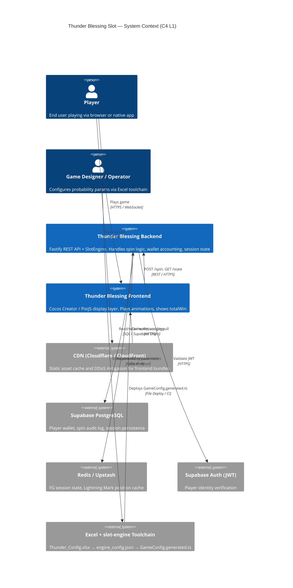

### 2.2 C4 Level 2 — Container Diagram

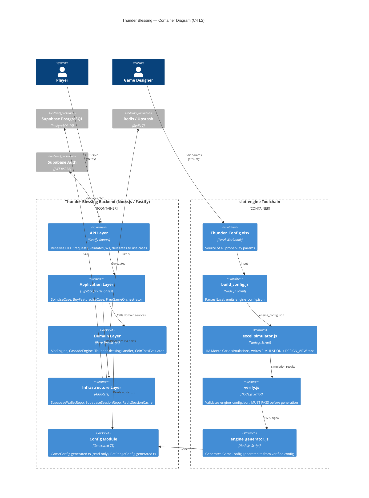

---

## §3 Architecture Design

### 3.1 Clean Architecture Pattern

```
┌─────────────────────────────────────────────────────────┐
│  Interface Layer (Fastify routes, DTOs, error mappers)  │
├─────────────────────────────────────────────────────────┤
│  Application Layer (Use Cases, Orchestrators, Guards)   │
├─────────────────────────────────────────────────────────┤
│  Domain Layer (Engine, Entities, Value Objects, Ports)  │
├─────────────────────────────────────────────────────────┤
│  Infrastructure Layer (Repos, Cache, Auth adapters)     │
└─────────────────────────────────────────────────────────┘
         Dependency arrows point INWARD only
```

**Dependency Rule:** Each layer depends only on layers inside it. The Domain layer has zero external dependencies.

### 3.2 Architecture Decision Records (ADRs)

| ADR-ID | Decision | Rationale | Alternatives Rejected |
|--------|----------|-----------|----------------------|
| ADR-001 | Fastify over Express | 30–50% faster throughput, native TypeScript types, built-in schema validation | Express (slower), NestJS (heavyweight for pure API) |
| ADR-002 | Single-trip API for FG | Eliminates client-server round trips during FG; simplifies state management | Multi-trip (adds latency, reconnect risk) |
| ADR-003 | Redis for FG session | Sub-millisecond read/write; TTL-based expiry; atomic operations for floor guard | PostgreSQL session table (higher latency) |
| ADR-004 | Excel as config source | Non-engineers can edit params; single source of truth; audit trail via file diff | YAML/JSON (requires developer to edit) |
| ADR-005 | verify.js hard gate | Prevents broken configs from reaching production engine | Soft warning (insufficient quality gate) |
| ADR-006 | Generated TS immutable | Prevents config drift between Excel and code | Mutable config (drift risk, hard to audit) |
| ADR-007 | Clean Architecture | Enables independent testing of domain logic | MVC (domain/infra coupling), Anemic model |
| ADR-008 | totalWin as sole authority | Single source of truth for accounting; prevents double-counting | Summing cascadeStep wins (error-prone) |

### 3.3 Technology Stack

| Layer | Technology | Version | Purpose |
|-------|------------|---------|---------|
| Runtime | Node.js | 20 LTS | Server runtime |
| Language | TypeScript | 5.4+ | Type-safe development |
| HTTP Framework | Fastify | 4.x | REST API server |
| Database | Supabase PostgreSQL | 15 | Wallet, logs, session |
| Cache | Redis / Upstash | 7.x | FG session state |
| Auth | Supabase Auth (JWT RS256) | — | Player authentication |
| ORM / Query | Supabase JS Client | 2.x | Type-safe DB queries |
| Testing | Vitest + Supertest | — | Unit + Integration tests |
| Config Gen | Node.js scripts | — | build_config.js, verify.js, engine_generator.js |
| Excel Parsing | xlsx / exceljs | — | Thunder_Config.xlsx parsing |
| Container | Docker | 24+ | Containerization |
| Orchestration | Kubernetes | 1.29+ | Production deployment |
| CI/CD | GitHub Actions | — | Automated pipeline |
| Observability | OpenTelemetry + Grafana | — | Metrics, traces, logs |

### 3.4 Bounded Contexts

| Bounded Context | Responsibility | Key Aggregates |
|----------------|---------------|----------------|
| **Spin** | Reel spin, grid generation, payline evaluation | `SpinRound`, `Grid`, `Payline` |
| **Cascade** | Chain elimination, Lightning Mark tracking, row expansion | `CascadeSequence`, `CascadeStep`, `LightningMarkSet` |
| **FreeGame** | Multiplier sequence management, FG round orchestration | `FreeGameSession`, `FGRound`, `FGBonusMultiplier` |
| **Wallet** | Debit baseBet, credit totalWin, balance query | `PlayerWallet`, `WalletTransaction` |
| **Session** | In-flight state, floor guard, concurrency lock | `SpinSession`, `SessionFloor` |
| **Config** | Game parameters, bet ranges, currency | `GameConfig`, `BetRangeConfig` |

### 3.5 Environment Matrix

| Environment | K8s Namespace | Replicas (API) | CPU Request/Limit | Memory Request/Limit | PostgreSQL | Redis | DB Host | HPA Min/Max | Notes |
|------------|---------------|---------------|-------------------|----------------------|-----------|-------|---------|-------------|-------|
| Local | N/A (docker-compose) | 1 | 250m / 1000m | 256Mi / 512Mi | Supabase local (docker) | localhost:6379 | localhost:54322 | N/A | `NODE_ENV=development`; `docker compose up` |
| Development | `thunder-dev` | 1 | 250m / 1000m | 256Mi / 512Mi | Supabase Free | Upstash Hobby | db.xxx.supabase.co | N/A | CI deploy on `staging` branch push |
| Staging | `thunder-staging` | 2 | 250m / 1000m | 256Mi / 512Mi | Supabase Pro | Upstash Hobby | db.yyy.supabase.co | 2/4 | Mirror prod config; Blue-Green deploy |
| Production | `thunder-prod` | 3 | 250m / 1000m | 256Mi / 512Mi | Supabase Pro | Upstash Standard | db.zzz.supabase.co | 3/10 | PDB minAvailable=2; Canary deploy |

---

## §4 Module / Component Design

### 4.1 Module Map

```
src/
├── domain/
│   ├── engine/
│   │   ├── SlotEngine.ts
│   │   ├── CascadeEngine.ts
│   │   ├── ThunderBlessingHandler.ts
│   │   ├── CoinTossEvaluator.ts
│   │   ├── FreeGameOrchestrator.ts
│   │   └── NearMissSelector.ts
│   ├── entities/
│   │   ├── Grid.ts
│   │   ├── SpinRound.ts
│   │   ├── CascadeStep.ts
│   │   ├── FreeGameSession.ts
│   │   └── PlayerWallet.ts
│   ├── value-objects/
│   │   ├── Symbol.ts
│   │   ├── Payline.ts
│   │   ├── LightningMarkSet.ts
│   │   └── WinLine.ts
│   └── ports/
│       ├── IWalletRepository.ts
│       ├── ISessionRepository.ts
│       └── ISessionCache.ts
├── application/
│   ├── use-cases/
│   │   ├── SpinUseCase.ts
│   │   ├── BuyFeatureUseCase.ts
│   │   └── GetSessionStateUseCase.ts
│   └── guards/
│       ├── SessionFloorGuard.ts
│       └── ConcurrencyLockGuard.ts
├── infrastructure/
│   ├── repositories/
│   │   ├── SupabaseWalletRepository.ts
│   │   └── SupabaseSessionRepository.ts
│   ├── cache/
│   │   └── RedisSessionCache.ts
│   └── auth/
│       └── JwtAuthGuard.ts
├── interface/
│   ├── routes/
│   │   ├── spin.route.ts
│   │   └── session.route.ts
│   ├── dto/
│   │   ├── SpinRequest.dto.ts
│   │   └── SpinResponse.dto.ts
│   └── error-mappers/
│       └── DomainErrorMapper.ts
└── config/
    ├── GameConfig.generated.ts   ← NEVER EDIT MANUALLY
    └── BetRangeConfig.generated.ts ← NEVER EDIT MANUALLY
```

### 4.2 Domain Events

| Event | Trigger | Payload | Consumer |
|-------|---------|---------|---------|
| `SpinStarted` | Player initiates spin | `{ sessionId, playerId, baseBet, extraBet, timestamp }` | AuditLogger, ConcurrencyLock |
| `GridGenerated` | Reel stop determined | `{ sessionId, grid, rows }` | CascadeEngine |
| `WinLineDetected` | Payline evaluation | `{ sessionId, winLines[], cascadeDepth }` | CascadeEngine, WalletAccumulator |
| `CascadeStepCompleted` | One cascade step done | `{ sessionId, step, lightningMarks[], newRows }` | ThunderBlessingHandler |
| `ThunderBlessingTriggered` | SC + Lightning Marks present | `{ sessionId, markedCells[], selectedSymbol }` | CascadeEngine (re-evaluate) |
| `CoinTossResolved` | Max rows + cascade win | `{ sessionId, result: "Heads" or "Tails", fgMultiplier? }` | FreeGameOrchestrator |
| `FGRoundStarted` | FG sequence begins | `{ sessionId, roundNumber, multiplier }` | SlotEngine |
| `FGBonusGranted` | FG bonus multiplier drawn | `{ sessionId, bonusMultiplier }` | WalletAccumulator |
| `SpinCompleted` | Full outcome resolved | `{ sessionId, outcome: FullSpinOutcome }` | WalletRepository, AuditLogger |
| `WalletCredited` | totalWin posted to wallet | `{ playerId, amount, currency }` | AuditLogger |
| `SessionFloorApplied` | Buy Feature floor activated | `{ sessionId, floor, currentTotal }` | WalletAccumulator |

### 4.3 Dependency Injection Container

All dependencies are wired at startup via a lightweight DI container (e.g., `tsyringe` or manual factory functions). The domain layer receives only interfaces (ports); concrete adapters are injected by the infrastructure layer.

---

## §4.5 UML Diagrams

### 4.5.1 Use Case Diagram

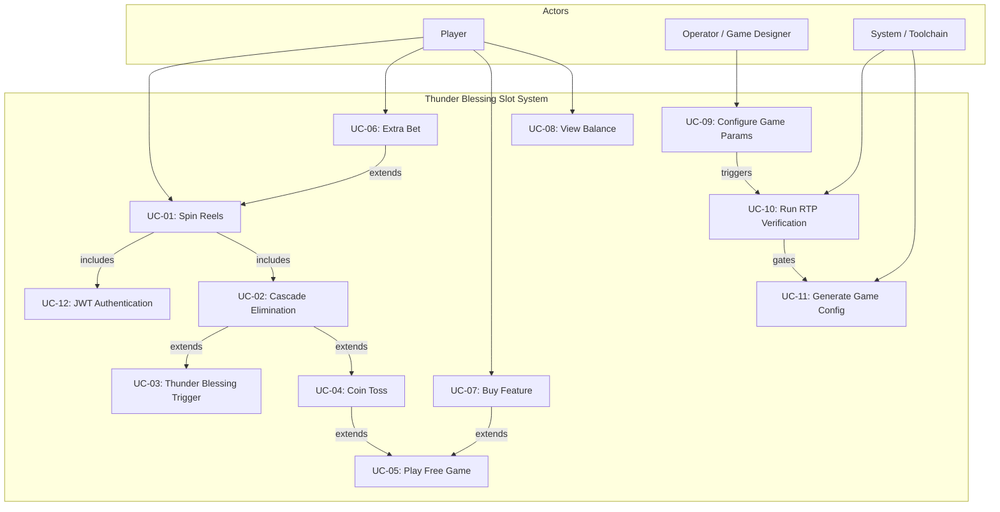

### 4.5.2 Class Diagram

```mermaid
classDiagram
    class SlotEngine {
        <<service>>
        +spin(request: SpinRequest): FullSpinOutcome
        +generateGrid(config: GameConfig, extraBet: boolean): Grid
        -selectSymbols(weights: SymbolWeight[]): Symbol[][]
    }

    class CascadeEngine {
        <<service>>
        +runCascade(grid: Grid, config: GameConfig): CascadeSequence
        +detectWinLines(grid: Grid, paylines: Payline[]): WinLine[]
        +eliminateSymbols(grid: Grid, winLines: WinLine[]): Grid
        +expandRows(grid: Grid): Grid
        -generateLightningMarks(positions: Position[]): LightningMarkSet
    }

    class ThunderBlessingHandler {
        <<service>>
        +evaluate(grid: Grid, marks: LightningMarkSet, hasScatter: boolean): ThunderBlessingResult
        +applyFirstHit(grid: Grid, marks: LightningMarkSet): Grid
        +applySecondHit(grid: Grid, marks: LightningMarkSet, rng: number): Grid
        -upgradeSymbol(symbol: Symbol): Symbol
    }

    class CoinTossEvaluator {
        <<service>>
        +evaluate(rng: number, config: CoinTossConfig, stage: number): CoinTossResult
        +isHeads(rng: number, prob: number): boolean
    }
    %% stage: 0=entry(coinProbs[0]=0.80), 1=×7(0.68), 2=×17(0.56), 3=×27(0.48), 4=×77(0.40)
    %% evaluate() performs coinProbs[stage] lookup from GameConfig to get per-stage probability

    class FreeGameOrchestrator {
        <<service>>
        +runSequence(session: FreeGameSession, config: GameConfig): FGSequenceResult
        +runSingleRound(round: FGRound, config: GameConfig): FGRoundResult
        +drawBonusMultiplier(weights: FGBonusWeight[]): number
    }

    class BaseUseCase {
        <<abstract>>
        #logger: ILogger
        +execute(input: unknown): Promise~unknown~
    }

    class SpinUseCase {
        <<service>>
        +execute(request: SpinRequest): FullSpinOutcome
        -validateBalance(playerId: string, cost: number): void
        -debitWallet(playerId: string, cost: number): void
        -creditWallet(playerId: string, totalWin: number): void
    }

    class BuyFeatureUseCase {
        <<service>>
        +execute(request: BuyFeatureRequest): FullSpinOutcome
        -validateFloor(session: SpinSession, baseBet: number): void
        -ensureHeads(session: SpinSession): void
    }

    class GetSessionStateUseCase {
        <<service>>
        +execute(sessionId: string): SpinSession
    }

    class SessionFloorGuard {
        <<service>>
        +applyFloor(session: SpinSession, baseBet: number): number
        +isFloorActive(session: SpinSession): boolean
    }

    class ConcurrencyLockGuard {
        <<service>>
        +acquire(sessionId: string): string
        +release(sessionId: string, lockToken: string): void
    }

    class NearMissSelector {
        <<service>>
        +select(grid: Grid, config: NearMissConfig): Grid
    }

    class JwtAuthGuard {
        <<service>>
        +verify(token: string): PlayerClaims
    }

    class IWalletRepository {
        <<interface>>
        +getBalance(playerId: string): number
        +debit(playerId: string, amount: number): void
        +credit(playerId: string, amount: number): void
    }

    class ISessionRepository {
        <<interface>>
        +findById(sessionId: string): SpinSession
        +save(session: SpinSession): void
    }

    class ISessionCache {
        <<interface>>
        +get(sessionId: string): SpinSession
        +set(sessionId: string, session: SpinSession): void
        +del(sessionId: string): void
        +acquireLock(sessionId: string): boolean
    }

    class SupabaseWalletRepository {
        <<service>>
        +getBalance(playerId: string): number
        +debit(playerId: string, amount: number): void
        +credit(playerId: string, amount: number): void
    }

    class SupabaseSessionRepository {
        <<service>>
        +findById(sessionId: string): SpinSession
        +save(session: SpinSession): void
    }

    class RedisSessionCache {
        <<service>>
        +get(sessionId: string): SpinSession
        +set(sessionId: string, session: SpinSession): void
        +del(sessionId: string): void
        +acquireLock(sessionId: string): boolean
    }

    class Grid {
        <<valueobject>>
        +cells: Symbol[][]
        +rows: number
        +cols: number
        +withCell(row: int, col: int, symbol: Symbol): Grid
        +withRows(rows: int): Grid
    }

    class CascadeSequence {
        <<valueobject>>
        +steps: CascadeStep[]
        +totalWin: number
        +finalGrid: Grid
        +finalRows: number
        +lightningMarks: LightningMarkSet
    }

    class CascadeStep {
        <<valueobject>>
        +index: number
        +grid: Grid
        +winLines: WinLine[]
        +stepWin: number
        +newLightningMarks: Position[]
        +rows: number
    }

    class FreeGameSession {
        <<entity>>
        +sessionId: string
        +rounds: FGRound[]
        +currentMultiplier: number
        +totalFGWin: number
        +bonusMultiplier: number
        +lightningMarks: LightningMarkSet
        +isComplete(): boolean
    }

    class FGRound {
        <<entity>>
        +index: number
        +grid: Grid
        +win: number
        +multiplier: number
        +lightningMarksBefore: LightningMarkSet
        +lightningMarksAfter: LightningMarkSet
    }

    class GameConfig {
        <<valueobject>>
        +symbols: SymbolDefinition[]
        +paylines: Payline[]
        +coinToss: CoinTossConfig
        +fgMultipliers: number[]
        +fgBonusWeights: FGBonusWeight[]
        +nearMiss: NearMissConfig
        +maxWinMain: number
        +maxWinEBBuyFG: number
    }

    class SpinEntity {
        <<entity>>
        +sessionId: string
        +playerId: string
        +baseBet: number
        +totalWin: number
        +cascadeSequence: CascadeSequence
    }

    %% Inheritance / Realization
    SupabaseWalletRepository ..|> IWalletRepository
    SupabaseSessionRepository ..|> ISessionRepository
    RedisSessionCache ..|> ISessionCache
    BaseUseCase <|-- SpinUseCase
    BaseUseCase <|-- BuyFeatureUseCase
    BaseUseCase <|-- GetSessionStateUseCase

    %% Composition
    FreeGameSession *-- FGRound
    CascadeSequence *-- CascadeStep

    %% Aggregation
    SpinEntity o-- CascadeStep

    %% Association
    SlotEngine --> CascadeEngine
    SlotEngine --> ThunderBlessingHandler
    SlotEngine --> CoinTossEvaluator
    SlotEngine --> FreeGameOrchestrator
    SlotEngine --> NearMissSelector
    SlotEngine --> GameConfig
    SpinUseCase --> SlotEngine
    SpinUseCase --> IWalletRepository
    SpinUseCase --> ISessionCache
    SpinUseCase --> SessionFloorGuard
    SpinUseCase --> ConcurrencyLockGuard
    BuyFeatureUseCase --> SpinUseCase
    BuyFeatureUseCase --> SessionFloorGuard
    GetSessionStateUseCase --> ISessionRepository
    CascadeEngine --> Grid
    CascadeEngine --> CascadeSequence
    FreeGameOrchestrator --> FreeGameSession
    JwtAuthGuard --> SpinUseCase

    %% Dependency
    SpinUseCase ..> SupabaseWalletRepository
    GetSessionStateUseCase ..> SupabaseSessionRepository
```

#### Class Inventory Table

| Class | Layer | Responsibility | Key Methods | Inferred src/ path | Inferred test/ path |
|-------|-------|---------------|-------------|---------------------|----------------------|
| `SlotEngine` | Domain | Top-level spin orchestration | `spin()`, `generateGrid()` | `src/domain/engine/SlotEngine.ts` | `src/domain/engine/__tests__/SlotEngine.test.ts` |
| `CascadeEngine` | Domain | Chain elimination, row expansion, Lightning Mark generation | `runCascade()`, `detectWinLines()`, `eliminateSymbols()`, `expandRows()` | `src/domain/engine/CascadeEngine.ts` | `src/domain/engine/__tests__/CascadeEngine.test.ts` |
| `ThunderBlessingHandler` | Domain | SC + mark upgrade logic (first hit + second hit) | `evaluate()`, `applyFirstHit()`, `applySecondHit()` | `src/domain/engine/ThunderBlessingHandler.ts` | `src/domain/engine/__tests__/ThunderBlessingHandler.test.ts` |
| `CoinTossEvaluator` | Domain | RNG-based stage-aware Heads/Tails determination (coinProbs[stage]) | `evaluate(rng, config, stage)`, `isHeads()` | `src/domain/engine/CoinTossEvaluator.ts` | `src/domain/engine/__tests__/CoinTossEvaluator.test.ts` |
| `FreeGameOrchestrator` | Domain | FG multiplier sequence (×3→×7→×17→×27→×77), round management | `runSequence()`, `runSingleRound()`, `drawBonusMultiplier()` | `src/domain/engine/FreeGameOrchestrator.ts` | `src/domain/engine/__tests__/FreeGameOrchestrator.test.ts` |
| `NearMissSelector` | Domain | Near-miss grid adjustment per config | `select()` | `src/domain/engine/NearMissSelector.ts` | `src/domain/engine/__tests__/NearMissSelector.test.ts` |
| `IWalletRepository` | Domain/Ports | Port interface for wallet persistence | `getBalance()`, `debit()`, `credit()` | `src/domain/ports/IWalletRepository.ts` | `src/domain/ports/__tests__/IWalletRepository.test.ts` |
| `ISessionRepository` | Domain/Ports | Port interface for session persistence | `findById()`, `save()` | `src/domain/ports/ISessionRepository.ts` | `src/domain/ports/__tests__/ISessionRepository.test.ts` |
| `ISessionCache` | Domain/Ports | Port interface for session cache | `get()`, `set()`, `del()`, `acquireLock()` | `src/domain/ports/ISessionCache.ts` | `src/domain/ports/__tests__/ISessionCache.test.ts` |
| `BaseUseCase` | Application | Abstract base for all use cases; provides logger and execute contract | `execute()` | `src/application/use-cases/BaseUseCase.ts` | `src/application/use-cases/__tests__/BaseUseCase.test.ts` |
| `SpinUseCase` | Application | Wallet debit/credit, orchestrate full spin | `execute()`, `debitWallet()`, `creditWallet()` | `src/application/use-cases/SpinUseCase.ts` | `src/application/use-cases/__tests__/SpinUseCase.test.ts` |
| `BuyFeatureUseCase` | Application | Buy Feature with guaranteed Heads×5 | `execute()`, `ensureHeads()` | `src/application/use-cases/BuyFeatureUseCase.ts` | `src/application/use-cases/__tests__/BuyFeatureUseCase.test.ts` |
| `GetSessionStateUseCase` | Application | Retrieve current FG session state for reconnect | `execute()` | `src/application/use-cases/GetSessionStateUseCase.ts` | `src/application/use-cases/__tests__/GetSessionStateUseCase.test.ts` |
| `SessionFloorGuard` | Application | Buy Feature session floor ≥ 20× baseBet | `applyFloor()`, `isFloorActive()` | `src/application/guards/SessionFloorGuard.ts` | `src/application/guards/__tests__/SessionFloorGuard.test.ts` |
| `ConcurrencyLockGuard` | Application | Redis optimistic lock acquire/release | `acquire()`, `release()` | `src/application/guards/ConcurrencyLockGuard.ts` | `src/application/guards/__tests__/ConcurrencyLockGuard.test.ts` |
| `JwtAuthGuard` | Interface | JWT RS256 verification | `verify()` | `src/interface/auth/JwtAuthGuard.ts` | `src/interface/auth/__tests__/JwtAuthGuard.test.ts` |
| `SupabaseWalletRepository` | Infrastructure | PostgreSQL wallet CRUD; implements IWalletRepository | `getBalance()`, `debit()`, `credit()` | `src/infrastructure/repositories/SupabaseWalletRepository.ts` | `src/infrastructure/repositories/__tests__/SupabaseWalletRepository.test.ts` |
| `SupabaseSessionRepository` | Infrastructure | PostgreSQL session CRUD; implements ISessionRepository | `findById()`, `save()` | `src/infrastructure/repositories/SupabaseSessionRepository.ts` | `src/infrastructure/repositories/__tests__/SupabaseSessionRepository.test.ts` |
| `RedisSessionCache` | Infrastructure | Redis FG session state + concurrency lock; implements ISessionCache | `get()`, `set()`, `del()`, `acquireLock()` | `src/infrastructure/cache/RedisSessionCache.ts` | `src/infrastructure/cache/__tests__/RedisSessionCache.test.ts` |
| `Grid` | Domain Value Object | Immutable 5×N grid | `withCell()`, `withRows()` | `src/domain/entities/Grid.ts` | `src/domain/entities/__tests__/Grid.test.ts` |
| `CascadeSequence` | Domain Value Object | Sequence of cascade steps + totalWin | — | `src/domain/entities/CascadeSequence.ts` | `src/domain/entities/__tests__/CascadeSequence.test.ts` |
| `CascadeStep` | Domain Value Object | Single cascade step state snapshot | — | `src/domain/entities/CascadeStep.ts` | `src/domain/entities/__tests__/CascadeStep.test.ts` |
| `SpinEntity` | Domain Entity | Single spin record (sessionId, playerId, baseBet, totalWin, cascadeSequence) | — | `src/domain/entities/SpinEntity.ts` | `src/domain/entities/__tests__/SpinEntity.test.ts` |
| `FreeGameSession` | Domain Entity | FG session state (rounds, multiplier, marks) | `isComplete()` | `src/domain/entities/FreeGameSession.ts` | `src/domain/entities/__tests__/FreeGameSession.test.ts` |
| `FGRound` | Domain Entity | Single FG round snapshot (grid, win, multiplier, marks before/after) | — | `src/domain/entities/FGRound.ts` | `src/domain/entities/__tests__/FGRound.test.ts` |
| `GameConfig` | Config | Generated game configuration | — | `src/config/GameConfig.generated.ts` | — (generated; verified by toolchain) |

### 4.5.3 Object Diagram — Example Spin State

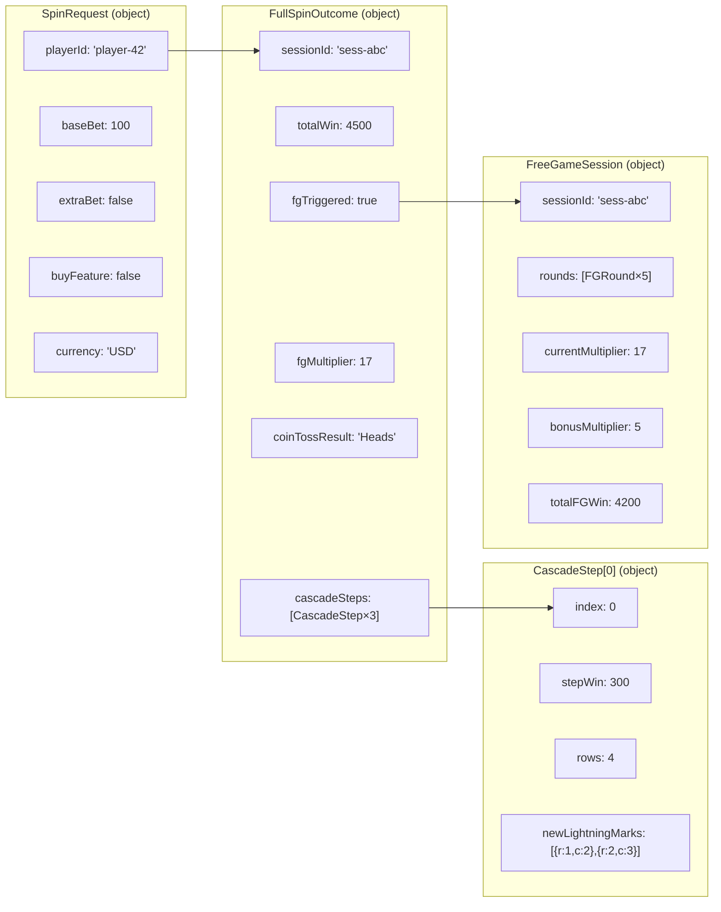

### 4.5.4 Sequence Diagram — Base Spin (No FG)

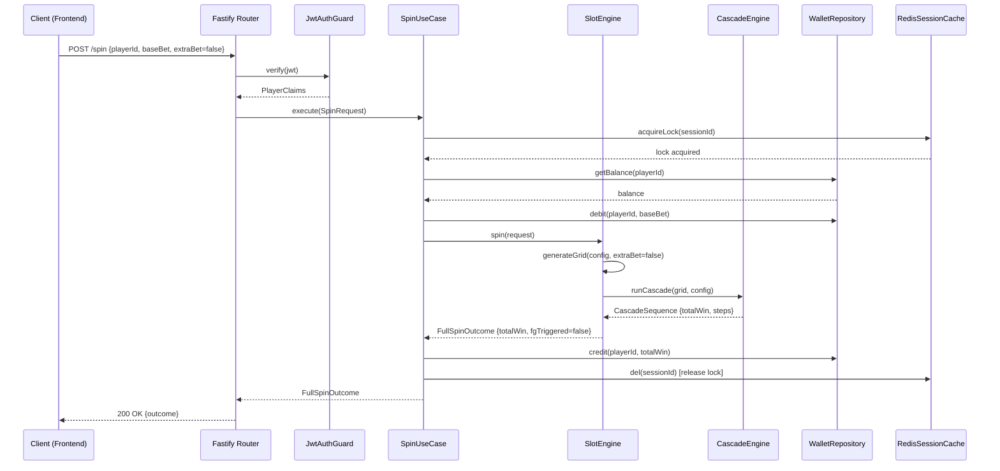

### 4.5.5 Sequence Diagram — Coin Toss → Free Game Sequence

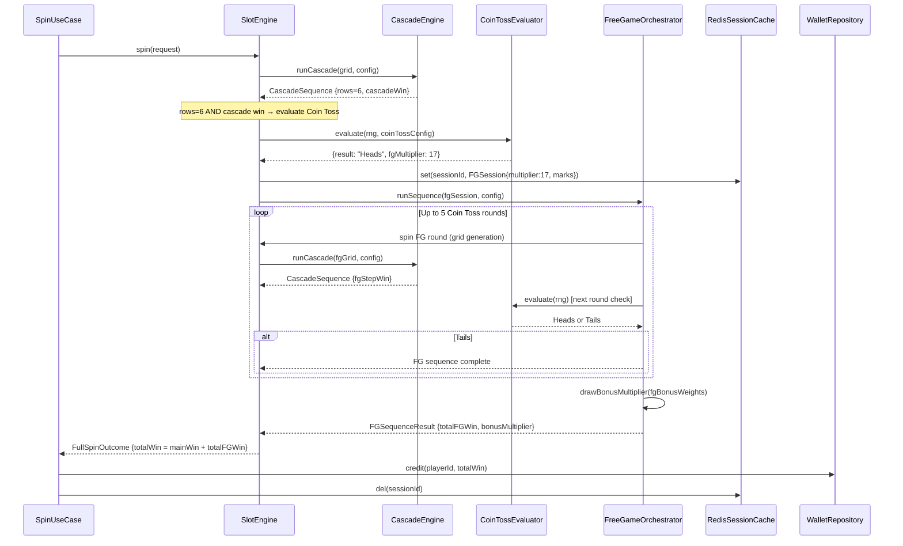

### 4.5.6 Sequence Diagram — Buy Feature with Session Floor

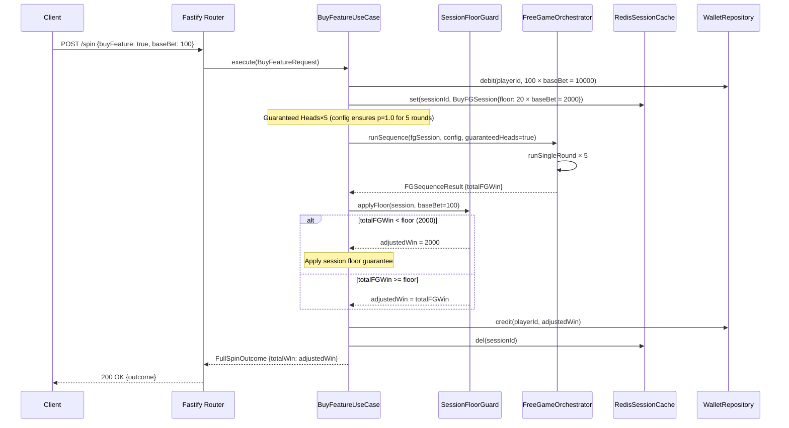

### 4.5.7 Communication Diagram

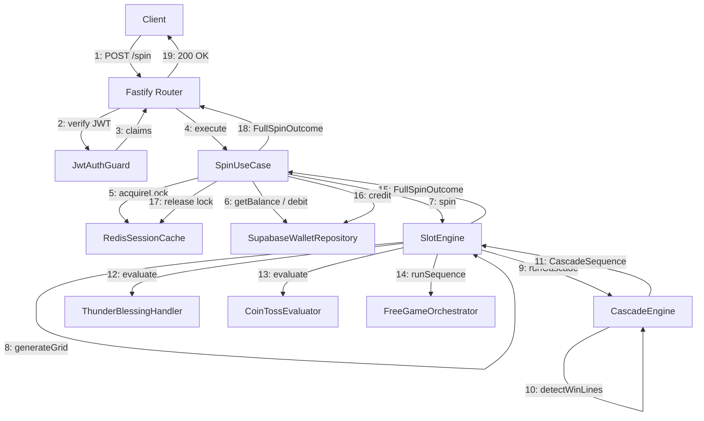

### 4.5.8 State Machine Diagram — Spin Session Lifecycle

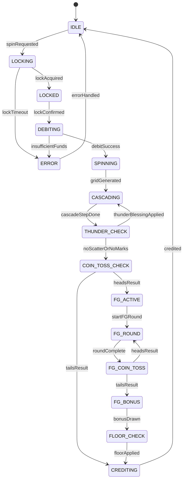

### 4.5.9 Activity Diagram — Full Spin Flow

```mermaid
flowchart TD
    Start([Player clicks Spin]) --> ValidateJWT{JWT valid?}
    ValidateJWT -->|No| Return401[Return 401 Unauthorized]
    ValidateJWT -->|Yes| AcquireLock{Acquire session lock}
    AcquireLock -->|Timeout| Return409[Return 409 Conflict]
    AcquireLock -->|Acquired| CheckBalance{Balance >= cost?}
    CheckBalance -->|No| Return400[Return 400 Insufficient Funds]
    CheckBalance -->|Yes| DebitWallet[Debit wallet]
    DebitWallet --> GenerateGrid[Generate 5×3 grid]
    GenerateGrid --> NearMiss{Near miss applicable?}
    NearMiss -->|Yes| ApplyNearMiss[Adjust grid for near miss]
    NearMiss -->|No| EvalPaylines
    ApplyNearMiss --> EvalPaylines[Evaluate paylines]
    EvalPaylines --> AnyWin{Win lines detected?}
    AnyWin -->|No| CheckFGActive{FG session active?}
    AnyWin -->|Yes| EliminateSymbols[Eliminate winning symbols]
    EliminateSymbols --> MarkLightning[Generate Lightning Marks]
    MarkLightning --> ExpandRows[Expand rows if < 6]
    ExpandRows --> CheckScatter{SC in new symbols AND marks exist?}
    CheckScatter -->|Yes| ApplyTB1[Apply Thunder Blessing 1st hit]
    ApplyTB1 --> CheckTB2{RNG < tbSecondHit?}
    CheckTB2 -->|Yes| ApplyTB2[Apply Thunder Blessing 2nd hit]
    CheckTB2 -->|No| ReEvalPaylines
    ApplyTB2 --> ReEvalPaylines[Re-evaluate paylines]
    ReEvalPaylines --> AnyWin2{Win lines detected?}
    AnyWin2 -->|Yes| EliminateSymbols
    CheckScatter -->|No| CheckRows{rows = 6?}
    AnyWin2 -->|No| CheckRows
    CheckRows -->|No| CheckFGActive
    CheckRows -->|Yes| CoinToss[Coin Toss evaluation]
    CoinToss --> HeadsOrTails{Heads? p=0.80}
    HeadsOrTails -->|Tails| AccumWin[Accumulate cascade win]
    HeadsOrTails -->|Heads| RunFGSequence[Run FG sequence]
    RunFGSequence --> DrawBonus[Draw FG Bonus multiplier]
    DrawBonus --> ApplyFloor[Apply session floor if BuyFeature]
    ApplyFloor --> FinalizeWin
    AccumWin --> CheckFGActive
    CheckFGActive -->|No| FinalizeWin[Finalize totalWin]
    CheckFGActive -->|Yes| RunFGRound[Run FG round]
    RunFGRound --> CheckFGActive
    FinalizeWin --> CreditWallet[Credit wallet with totalWin]
    CreditWallet --> ReleaseLock[Release session lock]
    ReleaseLock --> Return200[Return 200 FullSpinOutcome]
    Return200 --> End([End])
```

### 4.5.10 Activity Diagram — Cascade Chain Elimination

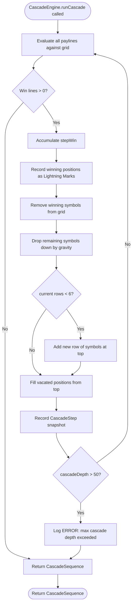

### 4.5.11 Activity Diagram — Toolchain Execution

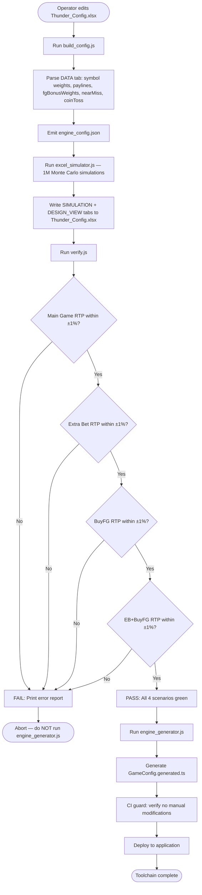

### 4.5.12 Component Diagram

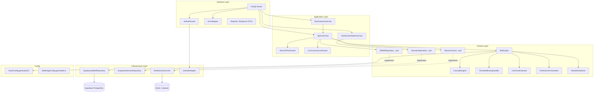

### 4.5.13 Deployment Diagram

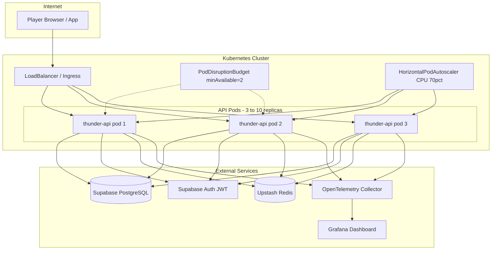

---

## §5 Game Engine Design

### 5.1 SlotEngine Algorithm

```
SlotEngine.spin(request):
  1. generateGrid(config, extraBet)
     - If extraBet: inject guaranteed SC symbol per config
     - Apply symbol weights per column from GameConfig.generated.ts
  2. applyNearMiss(grid, config) if applicable
  3. runCascade(grid, config):
     a. detectWinLines(grid, paylines) → winLines[]
     b. while winLines.length > 0 AND cascadeDepth <= 50:
        i.  accumulateCascadeWin(winLines)
        ii. recordLightningMarks(winningPositions)
        iii.eliminateSymbols(grid, winLines)
        iv. applyGravity(grid)
        v.  if rows < 6: expandRows(grid)
        vi. detectWinLines(grid, paylines) → winLines[]
        vii.checkThunderBlessing(grid, lightningMarks)
           - if SC present AND lightningMarks > 0: applyFirstHit(); if RNG < tbSecondHit: applySecondHit()
           - continue loop after upgrade
        viii.cascadeDepth++
     c. if rows = 6 AND lastCascadeHadWin: evaluateCoinToss(stage)
           - stage is the current FG multiplier index (0=entry p=0.80, 1=×7 p=0.68, 2=×17 p=0.56, 3=×27 p=0.48, 4=×77 p=0.40)
           - CoinTossEvaluator.evaluate(rng, config, stage) looks up coinProbs[stage] from GameConfig
  4. if CoinToss = Heads: runFGSequence(); advance stage by 1 for next Coin Toss in sequence
  5. computeTotalWin() = mainCascadeWin + fgWin (× fgMultiplier × bonusMultiplier)
  6. enforce maxWin cap (30,000× main; 90,000× EB+BuyFG)
  7. return FullSpinOutcome
```

### 5.2 FullSpinOutcome Schema

```typescript
interface FullSpinOutcome {
  sessionId: string;
  playerId: string;
  baseBet: number;
  extraBet: boolean;
  buyFeature: boolean;
  currency: "USD" | "TWD";

  // Grid state
  initialGrid: Grid;
  finalGrid: Grid;
  finalRows: number;         // 3–6

  // Cascade
  cascadeSteps: CascadeStep[];
  lightningMarks: Position[]; // accumulated across all steps

  // Thunder Blessing
  thunderBlessingTriggered: boolean;
  thunderBlessingFirstHit: boolean;
  thunderBlessingSecondHit: boolean;
  upgradedSymbol?: SymbolId;

  // Coin Toss
  coinTossTriggered: boolean;
  coinTossResult?: "Heads" | "Tails";

  // Free Game
  fgTriggered: boolean;
  fgMultiplier?: number;      // 3 | 7 | 17 | 27 | 77
  fgRounds?: FGRound[];
  fgBonusMultiplier?: number; // 1 | 5 | 20 | 100
  totalFGWin?: number;

  // Session Floor (Buy Feature)
  sessionFloorApplied: boolean;
  sessionFloorValue?: number;  // 20 × baseBet

  // Accounting — SOLE AUTHORITY
  totalWin: number;            // outcome.totalWin is the ONLY source for wallet credit

  // Near Miss
  nearMiss: boolean;

  // Metadata
  rngSeed?: string;            // for audit/replay
  engineVersion: string;
  timestamp: string;           // ISO 8601
}
```

### 5.3 Redis Session Schema

```
KEY:   session:{sessionId}
TYPE:  Hash
TTL:   300s (5 minutes; auto-renewed on each FG round)

Fields:
  playerId       string
  status         "SPINNING" | "FG_ACTIVE" | "COMPLETE"
  baseBet        number
  extraBet       boolean
  buyFeature     boolean
  fgRound        number (current FG round index, 0-based)
  fgMultiplier   number
  fgBonusMultiplier number
  totalFGWin     number
  lightningMarks JSON (Position[])
  floorValue     number (0 if not BuyFeature)
  lockToken      string (UUID, for optimistic concurrency)
  lockedAt       number (Unix ms)
```

**Concurrency Lock:**
- `acquireLock`: SET session:{sessionId}:lock {lockToken} NX EX 10 — returns OK only if no existing lock
- `releaseLock`: DEL session:{sessionId}:lock — only by holder of lockToken
- If lock acquisition fails → HTTP 409 Conflict

### 5.4 Toolchain Integration in Engine Startup

```typescript
// At server startup (not per-request):
import config from './config/GameConfig.generated.ts';
import betConfig from './config/BetRangeConfig.generated.ts';

// Validate config shape at runtime
assertValidGameConfig(config);
assertValidBetRangeConfig(betConfig);

// Inject into SlotEngine (constructor injection via DI)
const engine = new SlotEngine(config, rng);
```

### 5.5 Four-Scenario Isolation

| Scenario | Extra Bet | Buy Feature | Max Win Cap | RTP Target |
|----------|-----------|-------------|-------------|------------|
| Main Game | false | false | 30,000× baseBet | 97.5% ±1% |
| Extra Bet (EB) | true | false | 30,000× baseBet | 97.5% ±1% |
| Buy Feature (BuyFG) | false | true | 90,000× baseBet | 97.5% ±1% |
| EB + BuyFG | true | true | 90,000× baseBet | 97.5% ±1% |

Each scenario is validated independently in `verify.js` using 1,000,000 simulated spins.

### 5.6 Free Game (FG) Bonus Multiplier

FG Bonus multiplier is drawn **once per FG sequence** (not per round) from the `fgBonusWeights` table in `GameConfig.generated.ts`:

| Bonus Multiplier | Weight |
|-----------------|--------|
| ×1 | High (config-defined) |
| ×5 | Medium |
| ×20 | Low |
| ×100 | Very Low |

The FG multiplier sequence (×3→×7→×17→×27→×77) advances with each consecutive Heads result:

| Coin Toss Round | FG Multiplier Applied |
|----------------|----------------------|
| 1st Heads | ×3 |
| 2nd Heads | ×7 |
| 3rd Heads | ×17 |
| 4th Heads | ×27 |
| 5th Heads | ×77 |

### 5.7 Buy Feature Session Floor

- Floor value: `max(totalFGWin, 20 × baseBet)`
- Floor is applied **once** at the end of the entire FG sequence — **never per-spin**.
- Floor activation check: `if (totalFGWin < floorValue) → credit floorValue`
- The `sessionFloorApplied: true` flag is set in `FullSpinOutcome` when the floor is used.
- Floor is stored in Redis session under `floorValue` field.

### 5.8 Max Win Enforcement

```typescript
function enforceMaxWin(rawWin: number, baseBet: number, scenario: Scenario): number {
  const cap = (scenario === 'EB_BUYFG' || scenario === 'BUYFG')
    ? 90_000 * baseBet
    : 30_000 * baseBet;
  return Math.min(rawWin, cap);
}
```

Max Win is enforced **before** `totalWin` is written to `FullSpinOutcome`.

---

## §6 API Design

### 6.1 Endpoints

| Method | Path | Auth | Description |
|--------|------|------|-------------|
| POST | `/v1/spin` | JWT (Bearer) | Execute spin, returns complete FullSpinOutcome |
| GET | `/v1/session/:sessionId` | JWT (Bearer) | Get current FG session state (for reconnect) |
| GET | `/v1/config` | JWT (Bearer) | Get bet ranges and currency config |
| GET | `/health` | None | Liveness probe |
| GET | `/ready` | None | Readiness probe (checks DB + Redis connectivity) |

### 6.2 POST /v1/spin

**Request Body:**

```typescript
interface SpinRequest {
  playerId: string;       // UUID
  betLevel: number;       // mapped to baseBet via BetRangeConfig
  extraBet: boolean;
  buyFeature: boolean;
  currency: "USD" | "TWD";
  sessionId?: string;     // provided only for FG resume
}
```

**Response (200 OK):** `FullSpinOutcome` (see §5.2)

**TWD Bet Level Constraint:** `betLevel` max = **320** for TWD currency.

**Rate Limit:** 5 requests/second per player (`X-Player-Id` header). Excess → HTTP 429 with `Retry-After` header.

### 6.3 Error Codes

| HTTP Status | Code | Description |
|-------------|------|-------------|
| 400 | `INSUFFICIENT_FUNDS` | Balance < spin cost |
| 400 | `INVALID_BET_LEVEL` | betLevel out of configured range |
| 400 | `INVALID_CURRENCY` | Currency not USD or TWD |
| 401 | `UNAUTHORIZED` | Missing or invalid JWT |
| 403 | `FORBIDDEN` | JWT valid but player account suspended |
| 409 | `SPIN_IN_PROGRESS` | Concurrent spin detected (lock held) |
| 429 | `RATE_LIMITED` | Exceeds 5 req/s per player |
| 504 | `ENGINE_TIMEOUT` | Spin took > 2000ms; wallet IS debited before engine; compensating credit issued (see ARCH §6 Partial Failure Compensation) |
| 500 | `INTERNAL_ERROR` | Unexpected engine error |

**Error Response Envelope:**

```typescript
interface ErrorResponse {
  success: false;
  code: string;
  message: string;
  requestId: string;
  timestamp: string;
}
```

**Success Response Envelope:**

```typescript
interface SuccessResponse<T> {
  success: true;
  data: T;
  requestId: string;
  timestamp: string;
}
```

### 6.4 FullSpinOutcome TypeScript Interface (Complete)

See §5.2 for the complete definition. The interface is exported from `src/domain/types/FullSpinOutcome.ts` and re-exported by the API response DTO.

### 6.5 Currency Formatting

Currency display values are read from `BetRangeConfig.generated.ts`:

```typescript
interface BetRangeConfig {
  USD: { minBetLevel: number; maxBetLevel: number; betStep: number; display: string };
  TWD: { minBetLevel: number; maxBetLevel: 320; betStep: number; display: string };
}
```

The `CurrencyFormatter` service formats `totalWin` based on the `currency` field in `SpinRequest`.

---

## §7 Database Design

### 7.1 Entity-Relationship Diagram

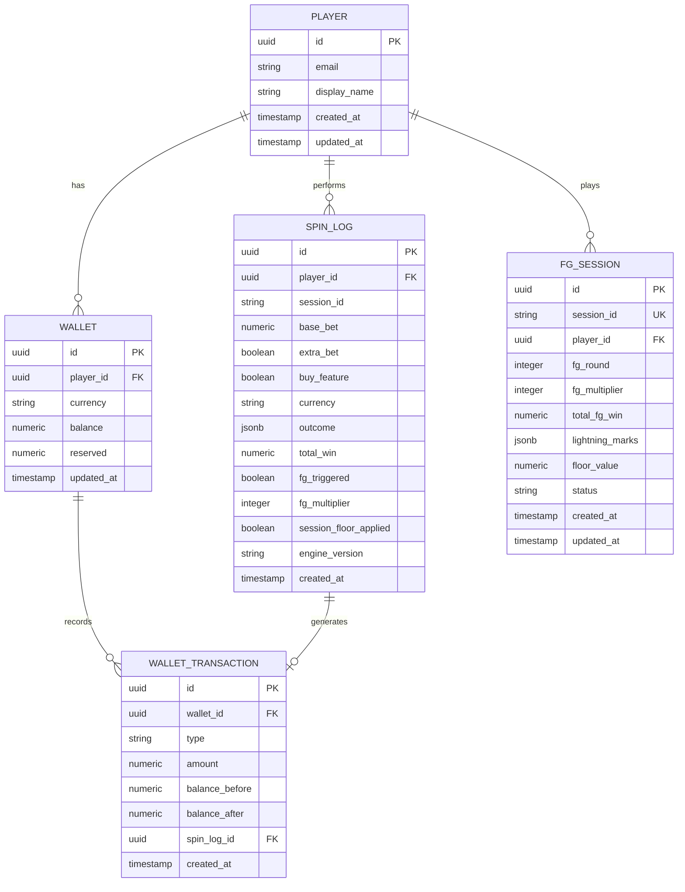

### 7.2 Table Schemas

#### players

```sql
CREATE TABLE players (
    id UUID PRIMARY KEY DEFAULT gen_random_uuid(),
    email TEXT UNIQUE NOT NULL,
    display_name TEXT NOT NULL,
    created_at TIMESTAMPTZ NOT NULL DEFAULT NOW(),
    updated_at TIMESTAMPTZ NOT NULL DEFAULT NOW()
);
```

#### wallets

```sql
CREATE TABLE wallets (
    id UUID PRIMARY KEY DEFAULT gen_random_uuid(),
    player_id UUID NOT NULL REFERENCES players(id),
    currency TEXT NOT NULL CHECK (currency IN ('USD', 'TWD')),
    balance NUMERIC(18, 8) NOT NULL DEFAULT 0 CHECK (balance >= 0),
    reserved NUMERIC(18, 8) NOT NULL DEFAULT 0 CHECK (reserved >= 0),
    updated_at TIMESTAMPTZ NOT NULL DEFAULT NOW(),
    UNIQUE (player_id, currency)
);
```

#### wallet_transactions

```sql
CREATE TABLE wallet_transactions (
    id UUID PRIMARY KEY DEFAULT gen_random_uuid(),
    wallet_id UUID NOT NULL REFERENCES wallets(id),
    type TEXT NOT NULL CHECK (type IN ('DEBIT', 'CREDIT')),
    amount NUMERIC(18, 8) NOT NULL,
    balance_before NUMERIC(18, 8) NOT NULL,
    balance_after NUMERIC(18, 8) NOT NULL,
    spin_log_id UUID REFERENCES spin_logs(id),
    created_at TIMESTAMPTZ NOT NULL DEFAULT NOW()
);
```

#### spin_logs

```sql
CREATE TABLE spin_logs (
    id UUID PRIMARY KEY DEFAULT gen_random_uuid(),
    player_id UUID NOT NULL REFERENCES players(id),
    session_id TEXT NOT NULL,
    base_bet NUMERIC(18, 8) NOT NULL,
    extra_bet BOOLEAN NOT NULL DEFAULT FALSE,
    buy_feature BOOLEAN NOT NULL DEFAULT FALSE,
    currency TEXT NOT NULL CHECK (currency IN ('USD', 'TWD')),
    outcome JSONB NOT NULL,
    total_win NUMERIC(18, 8) NOT NULL DEFAULT 0,
    fg_triggered BOOLEAN NOT NULL DEFAULT FALSE,
    fg_multiplier INTEGER,
    session_floor_applied BOOLEAN NOT NULL DEFAULT FALSE,
    engine_version TEXT NOT NULL,
    created_at TIMESTAMPTZ NOT NULL DEFAULT NOW()
);
```

#### fg_sessions

```sql
CREATE TABLE fg_sessions (
    id UUID PRIMARY KEY DEFAULT gen_random_uuid(),
    session_id TEXT UNIQUE NOT NULL,
    player_id UUID NOT NULL REFERENCES players(id),
    fg_round INTEGER NOT NULL DEFAULT 0,
    fg_multiplier INTEGER NOT NULL DEFAULT 3,
    total_fg_win NUMERIC(18, 8) NOT NULL DEFAULT 0,
    lightning_marks JSONB NOT NULL DEFAULT '[]',
    floor_value NUMERIC(18, 8) NOT NULL DEFAULT 0,
    status TEXT NOT NULL CHECK (status IN ('ACTIVE', 'COMPLETE')),
    created_at TIMESTAMPTZ NOT NULL DEFAULT NOW(),
    updated_at TIMESTAMPTZ NOT NULL DEFAULT NOW()
);
```

### 7.3 Row-Level Security (RLS)

All tables use Supabase RLS. Players may only read their own rows:

```sql
-- Example for spin_logs
ALTER TABLE spin_logs ENABLE ROW LEVEL SECURITY;

CREATE POLICY "Players can read own spin logs"
  ON spin_logs FOR SELECT
  USING (auth.uid() = player_id);

CREATE POLICY "Service role full access"
  ON spin_logs FOR ALL
  USING (auth.role() = 'service_role');
```

Same pattern applied to `wallets`, `wallet_transactions`, `fg_sessions`.

### 7.4 Indexes

```sql
-- Performance-critical indexes
CREATE INDEX idx_spin_logs_player_id ON spin_logs(player_id);
CREATE INDEX idx_spin_logs_created_at ON spin_logs(created_at DESC);
CREATE INDEX idx_spin_logs_session_id ON spin_logs(session_id);
CREATE INDEX idx_wallet_tx_wallet_id ON wallet_transactions(wallet_id);
CREATE INDEX idx_fg_sessions_session_id ON fg_sessions(session_id);
CREATE INDEX idx_fg_sessions_player_id ON fg_sessions(player_id);
```

### 7.5 Wallet Debit/Credit Atomicity

Wallet debit and credit use PostgreSQL transactions with optimistic locking:

```sql
-- Atomic debit with balance check
BEGIN;
SELECT balance FROM wallets WHERE player_id = $1 AND currency = $2 FOR UPDATE;
-- check balance >= cost
UPDATE wallets SET balance = balance - $cost, updated_at = NOW() WHERE player_id = $1;
INSERT INTO wallet_transactions (...) VALUES (...);
COMMIT;
```

---

## §8 Security Design

### 8.1 JWT Authentication

- Algorithm: **RS256** (asymmetric; private key held by Supabase Auth, public key verified by backend)
- Every request to `/v1/spin` and `/v1/session/*` requires `Authorization: Bearer <token>`
- `JwtAuthGuard` is a Fastify `preHandler` that runs before route handlers
- Token claims include: `sub` (player UUID), `role`, `exp`, `iat`
- Expired tokens → HTTP 401 with `code: "UNAUTHORIZED"`
- Tokens are never stored; only the public key is held by the backend

**Token TTLs:**

| Token Type | TTL | Notes |
|------------|-----|-------|
| Access Token | 3600s (1 hour) | Supabase default; configurable via Supabase Auth settings |
| Refresh Token | 604800s (7 days) | Rotated on each refresh; single-use |

**Role Definitions:**

| Role | Description |
|------|-------------|
| `player` | End user; can spin, view own session/balance |
| `operator` | Game designer / admin; can read aggregate stats, manage config |
| `service_role` | Backend service account; full DB access via RLS bypass |

**Role × Permission × Endpoint Matrix:**

| Endpoint | `player` | `operator` | `service_role` | Notes |
|----------|----------|------------|----------------|-------|
| `POST /v1/spin` | ✅ | ❌ | ✅ | Players and service role only |
| `GET /v1/session/:sessionId` | ✅ (own) | ❌ | ✅ | Players see own sessions only (RLS) |
| `GET /v1/config` | ✅ | ✅ | ✅ | Public bet/currency config |
| `GET /health` | ✅ | ✅ | ✅ | No auth required |
| `GET /ready` | ✅ | ✅ | ✅ | No auth required |
| `GET /v1/admin/stats` | ❌ | ✅ | ✅ | Operator analytics only |
| Direct DB (spin_logs, wallets) | ❌ | ❌ | ✅ | service_role bypasses RLS |

### 8.2 OWASP Top 10 Mitigations

| OWASP | Threat | Mitigation |
|-------|--------|-----------|
| A01 Broken Access Control | Player accessing other players' spin logs | Supabase RLS + JWT `sub` claim enforcement |
| A02 Cryptographic Failures | Weak session tokens | RS256 JWT; TLS 1.3 in transit; AES-256 at rest (Supabase managed) |
| A03 Injection | SQL injection via spin parameters | Parameterized queries via Supabase JS Client; no raw SQL with user input |
| A04 Insecure Design | Double-spending (debit race condition) | Redis optimistic lock (NX); PostgreSQL `FOR UPDATE` on wallet |
| A05 Security Misconfiguration | Default credentials, open ports | K8s NetworkPolicy; Secrets in K8s Secret objects; no default passwords |
| A06 Vulnerable Components | Outdated npm dependencies | `npm audit` in CI; Dependabot alerts; weekly dependency updates |
| A07 Auth Failures | Brute-force JWT bypass | Rate limit 5 req/s per player; failed auth counter in Redis; lockout after 10 failures |
| A08 Software Integrity | Tampered GameConfig.generated.ts | CI checksum verification of generated files; `git diff` guard |
| A09 Logging & Monitoring | Missed anomalies | Structured JSON logs; OpenTelemetry traces; Grafana alerts on anomalous win patterns |
| A10 SSRF | Backend fetching external URLs | No user-controlled URLs; all external calls are pre-configured Supabase/Redis endpoints |

### 8.3 Secret Management

All secrets are managed via **Kubernetes Secrets** (or Supabase environment variables in dev):

| Secret | Storage | Rotation |
|--------|---------|---------|
| `SUPABASE_SERVICE_KEY` | K8s Secret | 90 days |
| `SUPABASE_JWT_SECRET` (public key) | K8s Secret | On key rotation |
| `REDIS_URL` | K8s Secret | On credential change |
| `DATABASE_URL` | K8s Secret | 90 days |

**K8s Secret Path Reference (secretKeyRef format):**

| Secret Name | K8s Secret Name | Key | Used By |
|-------------|-----------------|-----|---------|
| `SUPABASE_SERVICE_KEY` | `thunder-secrets` | `supabase-service-key` | API service (Supabase client init) |
| `SUPABASE_JWT_SECRET` | `thunder-secrets` | `supabase-jwt-secret` | Auth middleware (JWT public key verification) |
| `REDIS_URL` | `thunder-secrets` | `redis-url` | Redis adapter (session cache, rate limiter) |
| `DATABASE_URL` | `thunder-secrets` | `database-url` | Supabase client (wallet, spin_logs, fg_sessions) |

**K8s ConfigMap Reference (configMapKeyRef format):**

| Env Var | K8s ConfigMap Name | Key | Used By |
|---------|--------------------|-----|---------|
| `SUPABASE_URL` | `thunder-config` | `supabase-url` | Supabase client (public project URL; not a secret) |

> **RBAC Note:** K8s RBAC restricts Secret reads to only the `thunder-api` ServiceAccount. No other service accounts or pods in the namespace may read from `thunder-secrets`.

Example `secretKeyRef` usage in pod spec:
```yaml
env:
  - name: SUPABASE_SERVICE_KEY
    valueFrom:
      secretKeyRef:
        name: thunder-secrets
        key: supabase-service-key
```

**No secrets in source code, `.env` files committed to git, or environment variable logs.**

### 8.4 Rate Limiting

- **Strategy:** Token bucket, 5 requests/second per player (keyed by JWT `sub`)
- **Implementation:** Redis-based rate limiter (`fastify-rate-limit` with Redis store)
- **Response on exceed:** HTTP 429, `Retry-After: 1` header
- **Extra Bet / Buy Feature:** Same rate limit applies (not excluded)

### 8.5 STRIDE Threat Model

| Threat | Asset | Mitigation |
|--------|-------|-----------|
| **S**poofing | Player identity | RS256 JWT; cannot forge without Supabase private key |
| **T**ampering | GameConfig.generated.ts | CI checksum guard; file is read-only at runtime |
| **T**ampering | Spin outcome in transit | TLS 1.3; HTTPS-only; HSTS header |
| **R**epudiation | Spin audit trail | Immutable `spin_logs` table; wallet transactions logged |
| **I**nformation Disclosure | Player balance / spin history | RLS; error messages never include raw DB errors |
| **D**enial of Service | Spin endpoint flooding | Rate limit 5 req/s; K8s HPA; circuit breaker |
| **E**levation of Privilege | Player accessing admin endpoints | Role-based JWT claims; service_role only for admin paths |

---

## §9 Performance & Capacity Planning

### 9.1 SLO / SLI Table

| SLI | Metric | SLO Target |
|-----|--------|-----------|
| Base Spin Latency | P99 end-to-end response time (no FG) | ≤ 500ms |
| FG Sequence Latency | P99 end-to-end response time (full FG) | ≤ 800ms |
| Availability | Successful responses / total requests | ≥ 99.5% |
| Error Rate | 5xx responses / total requests | < 0.5% |
| Wallet Accuracy | Debit/credit discrepancy events | 0 per day |
| Config Integrity | CI build failures from manual config edits | 0 |

### 9.2 Capacity Calculation

**Assumptions:**
- Peak load: **100 RPS** (concurrent players spinning simultaneously)
- Average spin duration: 200ms (no FG), 600ms (with FG)
- FG rate: ~15% of spins trigger FG

**Per-replica capacity:**
- Node.js single thread: ~300 RPS for I/O-bound tasks
- With 3 replicas: ~900 RPS headroom (9× peak capacity)

**Database:**
- Supabase Pro: up to 1,000 connections with PgBouncer pooling
- Each spin: ~3 DB queries (balance check, debit, credit + log)
- At 100 RPS: ~300 DB queries/second — within Supabase Pro limits

**Redis:**
- Upstash Standard: 10,000 req/s — ample for session state at 100 RPS
- Session keys TTL 300s: max ~30,000 active session keys at steady state

### 9.3 Caching Strategy

| Data | Cache Layer | TTL | Invalidation |
|------|------------|-----|-------------|
| FG Session State | Redis Hash | 300s (renewed per round) | Explicit DEL on session complete |
| Concurrency Lock | Redis String | 10s | Explicit DEL on spin complete |
| GameConfig | In-memory (startup load) | Forever (restart to refresh) | Deploy new generated config |
| Player Balance | NOT cached | — | Always read from DB (financial accuracy) |
| JWT Public Key | In-memory | 1 hour | Auto-refresh from Supabase |

### 9.4 Connection Pooling

- **PostgreSQL:** PgBouncer (Supabase managed), pool size 20 per replica
- **Redis:** redis client pool size 10 per replica

---

## §10 Reliability & Disaster Recovery

### 10.1 RTO / RPO Targets

| Metric | Target |
|--------|--------|
| RTO (Recovery Time Objective) | 30 minutes |
| RPO (Recovery Point Objective) | 5 minutes |

### 10.2 Circuit Breaker Pattern

Circuit breakers protect the spin endpoint from cascading failures:

```
State: CLOSED → OPEN (after 5 consecutive failures) → HALF_OPEN (after 30s) → CLOSED
```

| Dependency | Timeout | Circuit Breaker Threshold |
|-----------|---------|--------------------------|
| Supabase DB | 2000ms | 5 failures in 10s window |
| Redis | 500ms | 10 failures in 10s window |
| Supabase Auth | 1000ms | 5 failures in 10s window |

**On circuit open:** Return cached response or HTTP 503 with `Retry-After`.

### 10.3 Error Handling Strategy

| Failure | Detection | Recovery |
|---------|-----------|---------|
| Wallet debit failure | DB error on UPDATE | Rollback; return 400 |
| Engine timeout (>2000ms) | Fastify `requestTimeout` | Return 504; wallet IS debited before engine call; compensating credit issued immediately (see ARCH §6 Partial Failure Compensation — engine failure path) |
| Redis lock timeout | TTL expiry | Auto-release after 10s; next spin can proceed |
| Concurrent spin detected | NX lock fail | Return 409 |
| FG session TTL expiry | Redis key not found | Return 404 from GET /session; player must restart |
| Config load failure | Runtime validation at startup | Fatal crash; K8s restarts pod |

### 10.4 Backup Strategy

- **PostgreSQL:** Supabase daily automated backups (Pro tier); point-in-time recovery (PITR) with 5-minute granularity
- **Redis:** Upstash AOF persistence; RDB snapshots every 5 minutes
- **GameConfig:** Stored in git; any commit is recoverable

### 10.5 Graceful Shutdown

On SIGTERM:
1. Stop accepting new connections (Fastify `close()`)
2. Wait for in-flight requests to complete (up to 30s)
3. Release all Redis locks
4. Close DB connections
5. Exit

---

## §11 Observability

### 11.1 Structured Logging

All logs use JSON format with OpenTelemetry trace correlation:

```json
{
  "level": "info",
  "timestamp": "2026-04-26T12:00:00.000Z",
  "service": "thunder-blessing-api",
  "traceId": "abc123",
  "spanId": "def456",
  "playerId": "player-42",
  "sessionId": "sess-abc",
  "event": "spin.completed",
  "totalWin": 4500,
  "fgTriggered": true,
  "durationMs": 287
}
```

**Log Levels:**
- `debug`: RNG values, grid state (dev/staging only; never in production)
- `info`: Spin start/complete, FG trigger, wallet operations
- `warn`: Rate limit hit, circuit breaker HALF_OPEN
- `error`: Engine errors, DB failures, unexpected exceptions
- `fatal`: Config load failure, unrecoverable startup error

### 11.2 Metrics (Prometheus)

| Metric | Type | Labels | Alert |
|--------|------|--------|-------|
| `spin_duration_seconds` | Histogram | `scenario`, `fg_triggered` | P99 > 500ms |
| `spin_total` | Counter | `scenario`, `result` | — |
| `spin_error_total` | Counter | `error_code` | > 0.5% of spins |
| `fg_triggered_total` | Counter | `multiplier` | — |
| `wallet_credit_total` | Counter | `currency` | — |
| `redis_lock_failures_total` | Counter | — | > 10/min |
| `circuit_breaker_state` | Gauge | `dependency` | OPEN state |

### 11.3 Distributed Tracing

OpenTelemetry traces with spans for:
- `http.server` (Fastify request)
- `spin.usecase` (SpinUseCase.execute)
- `engine.spin` (SlotEngine.spin)
- `cascade.run` (CascadeEngine.runCascade)
- `fg.sequence` (FreeGameOrchestrator.runSequence)
- `db.wallet.debit` / `db.wallet.credit`
- `redis.lock.acquire` / `redis.lock.release`

Trace exporter: OpenTelemetry Collector → Grafana Tempo.

**Sampling strategy (head-based):**
- **5%** of normal traffic (random sampling)
- **100%** for all error traces (status code 4xx/5xx or `error` span attribute set)
- **100%** for requests with latency > 500ms (tail-based via Tempo tail sampling processor)
- Configurable via environment variable: `OTEL_TRACES_SAMPLER=parentbased_traceidratio`, `OTEL_TRACES_SAMPLER_ARG=0.05`

### 11.4 Alerting Rules

| Alert | Condition | Severity | Action |
|-------|-----------|---------|--------|
| High Spin Latency | P99 > 500ms for 2min | Warning | Investigate engine bottleneck |
| Spin Error Rate | > 0.5% for 1min | Critical | PagerDuty on-call |
| Circuit Breaker Open | Any dependency OPEN | Critical | PagerDuty on-call |
| Wallet Discrepancy | debit != credit for any spin | Critical | Freeze affected player account |
| Rate Limit Flood | > 1000 rate-limit hits/min | Warning | Review IP for ban |
| Config Integrity Failure | CI checksum mismatch | Critical | Halt deployment |

---

## §12 CI/CD Pipeline

### 12.1 Pipeline Stages

```
Push to branch
  ↓
1. Lint & Type Check (TypeScript strict)
  ↓
2. Unit Tests (Vitest, target ≥ 80% coverage)
  ↓
3. Integration Tests (Supertest against local Supabase + Redis)
  ↓
4. Security Scan — SAST (semgrep/CodeQL; block on CRITICAL findings)
  ↓
5. Toolchain Verification:
   a. build_config.js (parse Excel, emit engine_config.json)
   b. excel_simulator.js (100万次 Monte Carlo simulation)
   c. verify.js (4-scenario RTP check — MUST PASS)
   d. engine_generator.js (generate GameConfig.generated.ts)
   e. CI checksum guard (diff generated file vs committed)
  ↓
6. Docker Build & Push (tagged with git SHA)
  ↓
7. Dev Deploy — namespace: thunder-dev [Rolling strategy]
  ↓
8. Staging Deploy — namespace: thunder-staging [Blue-Green strategy]
  ↓
9. Smoke Tests (E2E against staging)
  ↓
10. Production Deploy — namespace: thunder-prod [Canary strategy, manual gate on main branch]
    (traffic: 5% → 25% → 100%, with automated rollback on error rate > 1%)
  ↓
11. Production Smoke Tests
```

### 12.2 Branch Strategy

| Branch | Purpose | Deploy Target |
|--------|---------|--------------|
| `main` | Production-ready | Production (manual) |
| `staging` | Pre-production | Staging (auto) |
| `feature/*` | Feature development | No auto-deploy |
| `fix/*` | Bug fixes | No auto-deploy |

### 12.3 Quality Gates

| Gate | Threshold | Action on Fail |
|------|-----------|----------------|
| TypeScript compilation | 0 errors | Block merge |
| Unit test coverage | ≥ 80% | Block merge |
| SAST scan (semgrep/CodeQL) | No CRITICAL findings | Block merge |
| verify.js (4 scenarios) | All PASS | Block deploy |
| GameConfig checksum | No diff | Block deploy |
| Docker image scan | No CRITICAL CVEs | Block deploy |

---

## §13 Infrastructure / Kubernetes

### 13.1 Deployment Manifest (key excerpts)

```yaml
apiVersion: apps/v1
kind: Deployment
metadata:
  name: thunder-blessing-api
spec:
  replicas: 3
  selector:
    matchLabels:
      app: thunder-blessing-api
  template:
    spec:
      containers:
        - name: api
          image: thunder-blessing-api:latest
          ports:
            - containerPort: 3000
          resources:
            requests:
              cpu: "250m"
              memory: "256Mi"
            limits:
              cpu: "1000m"
              memory: "512Mi"
          livenessProbe:
            httpGet:
              path: /health
              port: 3000
            initialDelaySeconds: 10
            periodSeconds: 15
          readinessProbe:
            httpGet:
              path: /ready
              port: 3000
            initialDelaySeconds: 5
            periodSeconds: 10
          env:
            - name: SUPABASE_URL
              valueFrom:
                configMapKeyRef:
                  name: thunder-config
                  key: supabase-url
            - name: SUPABASE_SERVICE_KEY
              valueFrom:
                secretKeyRef:
                  name: thunder-secrets
                  key: supabase-service-key
            - name: SUPABASE_JWT_SECRET
              valueFrom:
                secretKeyRef:
                  name: thunder-secrets
                  key: supabase-jwt-secret
            - name: REDIS_URL
              valueFrom:
                secretKeyRef:
                  name: thunder-secrets
                  key: redis-url
            - name: DATABASE_URL
              valueFrom:
                secretKeyRef:
                  name: thunder-secrets
                  key: database-url
```

### 13.2 HorizontalPodAutoscaler

```yaml
apiVersion: autoscaling/v2
kind: HorizontalPodAutoscaler
metadata:
  name: thunder-blessing-hpa
spec:
  scaleTargetRef:
    apiVersion: apps/v1
    kind: Deployment
    name: thunder-blessing-api
  minReplicas: 3
  maxReplicas: 10
  metrics:
    - type: Resource
      resource:
        name: cpu
        target:
          type: Utilization
          averageUtilization: 70
```

### 13.3 PodDisruptionBudget

```yaml
apiVersion: policy/v1
kind: PodDisruptionBudget
metadata:
  name: thunder-blessing-pdb
spec:
  minAvailable: 2
  selector:
    matchLabels:
      app: thunder-blessing-api
```

### 13.4 Health Endpoints

| Endpoint | Purpose | Response |
|----------|---------|---------|
| GET `/health` | Liveness (always returns 200 if process is up) | `{"status": "ok"}` |
| GET `/ready` | Readiness (checks DB + Redis) | `{"status": "ready", "db": "ok", "redis": "ok"}` |

---

## §14 slot-engine Toolchain Integration

### 14.1 Toolchain Pipeline

```
Thunder_Config.xlsx
    │
    ├── DATA tab: symbol definitions, payline weights, fgBonusWeights
    ├── COIN_TOSS tab: Heads probability (0.80), multiplier sequence
    ├── EXTRA_BET tab: SC injection config
    ├── BUY_FEATURE tab: session floor factor (20×), guaranteed Heads
    ├── NEAR_MISS tab: near-miss grid rules
    └── BET_RANGE tab: USD/TWD bet levels (TWD maxLevel = 320)
         │
    build_config.js
         │  Parses all tabs, validates schema, emits:
         ▼
    engine_config.json
         │
    excel_simulator.js
         │  Runs 100万次 (1,000,000) Monte Carlo simulations:
         │  Writes results to Thunder_Config.xlsx:
         │    → SIMULATION tab (raw RTP, win-frequency, max-win data)
         │    → DESIGN_VIEW tab (formatted summary for Game Designer review)
         │
    verify.js ←── HARD GATE (must PASS before next step)
         │  Reads SIMULATION tab output from excel_simulator.js
         │  Checks: RTP ±1% tolerance for all 4 scenarios
         │  [Main, EB, BuyFG, EB+BuyFG]
         │  Checks: max win cap, no floor violations
         │  Output: PASS (all 4 green) or FAIL (with error report)
         │  (only proceeds if PASS)
         │
    engine_generator.js ←── Only runs after verify.js PASS
         │  Generates TypeScript from verified config:
         ▼
    src/config/GameConfig.generated.ts      ← NEVER EDIT MANUALLY
    src/config/BetRangeConfig.generated.ts  ← NEVER EDIT MANUALLY
```

### 14.2 build_config.js Responsibilities

- Parse `Thunder_Config.xlsx` using `exceljs`
- Validate required tabs and column headers (fail fast with clear error if missing)
- Compute derived values: payline path arrays, normalized weights, bet level arrays
- Emit `engine_config.json` with schema version tag
- Log: `[build_config] engine_config.json written (schema v{X})`

### 14.3 excel_simulator.js Responsibilities

`excel_simulator.js` runs immediately after `build_config.js` emits `engine_config.json` and **before** `verify.js` runs. It bridges the simulation results back into the Excel workbook so Game Designers can review outcomes in a familiar spreadsheet environment.

**Responsibilities:**

- Load `engine_config.json` (emitted by `build_config.js`)
- Execute **100万次 (1,000,000) Monte Carlo spin simulations** for each of the 4 scenarios (Main, EB, BuyFG, EB+BuyFG) using the same RNG interface as the production engine
- Write simulation output back to `Thunder_Config.xlsx` in two tabs:
  - **SIMULATION tab**: Raw per-scenario data: actual RTP, win-frequency distribution, max win observed, session floor compliance rate, FG trigger rate, Coin Toss Heads rate per stage
  - **DESIGN_VIEW tab**: Human-readable summary table formatted for Game Designer review (scenario name, target RTP, actual RTP, delta, PASS/FAIL status per scenario)
- Does **not** make a PASS/FAIL decision — that is `verify.js`'s responsibility
- Log: `[excel_simulator] Simulation complete. Results written to Thunder_Config.xlsx (SIMULATION, DESIGN_VIEW tabs)`

**Position in pipeline:**

```
build_config.js → engine_config.json
     ↓
excel_simulator.js (100万次 Monte Carlo → SIMULATION tab + DESIGN_VIEW tab)
     ↓
verify.js (reads SIMULATION output, checks ±1% tolerance)
     ↓ (only if PASS)
engine_generator.js → GameConfig.generated.ts
```

### 14.4 verify.js Responsibilities

- Load `engine_config.json` and read SIMULATION tab results written by `excel_simulator.js`
- For each of 4 scenarios (Main, EB, BuyFG, EB+BuyFG):
  - Validate: `|actual_RTP - target_RTP| <= 0.01` (±1%)
  - Validate: `max_win_observed <= max_win_cap_configured`
  - Validate: Buy Feature floor applied correctly in all BuyFG simulations
- Output on PASS: `✅ All 4 scenarios passed. RTP: [Main: X%, EB: Y%, BuyFG: Z%, EB+BuyFG: W%]`
- Output on FAIL: `❌ FAIL [scenario]: actual RTP X%, expected Y% ±1%`; exit code 1

### 14.5 engine_generator.js Responsibilities

- Only invoked after `verify.js` exits with code 0
- Read `engine_config.json`
- Generate `GameConfig.generated.ts` with:
  - All symbol definitions and weights
  - Payline definitions (full `rowPath` arrays — see Payline Definition Document)
  - Coin Toss config (`coinProbs` array: [0.80, 0.68, 0.56, 0.48, 0.40] indexed by stage)
  - FG multiplier sequence [3, 7, 17, 27, 77]
  - FG Bonus weights table
  - Near Miss config
  - Max Win caps (30,000× main; 90,000× EB+BuyFG)
- Generate `BetRangeConfig.generated.ts` with:
  - USD bet ranges and steps
  - TWD bet ranges with `maxLevel: 320`
- Embed schema version and toolchain run timestamp in generated file header comment

### 14.6 CI Guard for Generated Files

CI pipeline step (runs after code generation):

```bash
# Fail if generated files differ from committed versions
git diff --exit-code src/config/GameConfig.generated.ts
git diff --exit-code src/config/BetRangeConfig.generated.ts
```

If diff detected → pipeline fails with message: `ERROR: Generated config files modified manually. Re-run toolchain.`

### 14.7 Near Miss Configuration

Near Miss parameters are defined in the `NEAR_MISS` tab of `Thunder_Config.xlsx` and encoded into `GameConfig.generated.ts`. The `NearMissSelector` reads:
- `nearMissFrequency`: probability of near-miss presentation (0–1)
- `nearMissSymbols`: which symbols trigger near-miss visual
- `nearMissPositions`: grid positions eligible for near-miss adjustment

Near Miss is a **display-only** mechanic — it does not affect RTP or actual payline outcomes.

---

## §15 Feature Flags

| Flag | Default | Purpose | Owner |
|------|---------|---------|-------|
| `ENABLE_EXTRA_BET` | `true` | Enable/disable Extra Bet option | Game Designer |
| `ENABLE_BUY_FEATURE` | `true` | Enable/disable Buy Feature | Game Designer |
| `ENABLE_NEAR_MISS` | `true` | Enable/disable Near Miss mechanic | Game Designer |
| `ENABLE_FG_BONUS_MULTIPLIER` | `true` | Enable FG Bonus multiplier draw | Game Designer |
| `ENFORCE_MAX_WIN_CAP` | `true` | Enforce 30,000×/90,000× max win | Compliance (must not disable) |
| `LOG_RNG_VALUES` | `false` | Log RNG seed per spin (dev only, never prod) | Engineering |
| `CIRCUIT_BREAKER_ENABLED` | `true` | Enable Redis/DB circuit breakers | Engineering |

Feature flags are stored as environment variables (K8s ConfigMap). Changes require redeployment; no runtime flag toggling to prevent mid-session state inconsistency.

---

## §16 Appendix: Data Model & Migration Notes

### 16.1 Initial DB Seed (Development Environment)

For the development environment, seed test player wallets before running integration tests:

```sql
-- Seed test players and wallets for dev environment
INSERT INTO players (id, email, display_name) VALUES
  ('00000000-0000-0000-0000-000000000001', 'testplayer1@dev.local', 'Test Player 1'),
  ('00000000-0000-0000-0000-000000000002', 'testplayer2@dev.local', 'Test Player 2');

INSERT INTO wallets (player_id, currency, balance) VALUES
  ('00000000-0000-0000-0000-000000000001', 'USD', 10000.00),
  ('00000000-0000-0000-0000-000000000001', 'TWD', 320000.00),
  ('00000000-0000-0000-0000-000000000002', 'USD', 10000.00);
```

Seed script is located at `toolchain/db/seed-dev.sql` and is executed automatically in the `docker-compose.dev.yml` startup sequence.

### 16.2 GameConfig.generated.ts Checksum Verification in CI

The CI pipeline enforces that `GameConfig.generated.ts` is never modified manually. After each toolchain run, a SHA-256 checksum of the generated file is embedded in its header comment and stored in `toolchain/.gameconfig.checksum`:

```bash
# CI verification step
EXPECTED=$(cat toolchain/.gameconfig.checksum)
ACTUAL=$(sha256sum src/config/GameConfig.generated.ts | awk '{print $1}')
if [ "$EXPECTED" != "$ACTUAL" ]; then
  echo "ERROR: GameConfig.generated.ts checksum mismatch — file may have been manually edited"
  exit 1
fi
```

This runs as a pre-deploy quality gate (see §12.3).

### 16.3 Near Miss Configuration Flow (Excel → GameConfig)

Near Miss parameters flow from the `NEAR_MISS` tab of `Thunder_Config.xlsx` through the toolchain to `GameConfig.generated.ts`:

```
Thunder_Config.xlsx (NEAR_MISS tab)
  │  nearMissFrequency, nearMissSymbols[], nearMissPositions[]
  ▼
build_config.js
  │  Parses NEAR_MISS tab, validates frequency 0–1, validates symbol IDs exist
  ▼
engine_config.json  (nearMiss: { frequency, symbols, positions })
  ▼
excel_simulator.js
  │  Confirms near-miss does NOT alter RTP (display-only assertion)
  ▼
verify.js
  │  Asserts nearMiss has zero impact on any of the 4 scenario RTPs
  ▼
engine_generator.js
  │  Emits nearMiss config block into GameConfig.generated.ts
  ▼
NearMissSelector.ts reads GameConfig.nearMiss at runtime
```

**Important:** Near Miss is a display-only mechanic. The `NearMissSelector` adjusts grid presentation only after the RTP-determining outcome has already been computed by `SlotEngine`. It must never alter `totalWin` or any win-line computation.

---

## §17 Compliance

### 17.1 RNG Compliance

- RNG implementation must use a cryptographically secure PRNG (e.g., Node.js `crypto.randomBytes`)
- RNG seed is logged per spin (in `spin_logs.outcome` JSONB) for audit replay
- `verify.js` Monte Carlo simulations use the same RNG interface as production engine

### 17.2 RTP Compliance

- Target RTP: **97.5%** for all four scenarios
- Tolerance: **±1%** (verified by `verify.js` with 1,000,000 simulations)
- `verify.js` output is the auditable artifact for compliance submission

### 17.3 Max Win Compliance

| Scenario | Max Win Cap |
|----------|------------|
| Main Game | 30,000× baseBet |
| Extra Bet | 30,000× baseBet |
| Buy Feature | 90,000× baseBet |
| EB + Buy Feature | 90,000× baseBet |

Max Win enforcement is in `SlotEngine` (not the API layer) — it cannot be bypassed by API clients.

### 17.4 Buy Feature Compliance

- Buy Feature cost: **100× baseBet** (deducted atomically before FG sequence)
- Session floor: **≥ 20× baseBet** (applied at end of FG sequence, not per-spin)
- Guaranteed Heads×5: engine config ensures `coinToss.heads_probability = 1.0` for Buy Feature scenario

### 17.5 TWD Currency Compliance

- TWD max bet level: **320** (encoded in `BetRangeConfig.generated.ts`)
- Currency display follows TWD formatting conventions (no decimal display for TWD amounts)

### 17.6 Audit Trail

- Every spin is recorded in `spin_logs` with full `outcome` JSONB (immutable after write)
- Every wallet operation is recorded in `wallet_transactions` (immutable after write)
- Logs are retained for minimum 3 years (configurable via Supabase data retention policy)

### 17.7 Data Protection

- Player PII (email, display_name) is stored in Supabase with AES-256 encryption at rest
- No PII is included in `spin_logs.outcome` JSONB
- Player balance is never exposed in error messages or logs

---

## §18 Open Items & Gates

| Item | Owner | Due | Status |
|------|-------|-----|--------|
| Payline Definition Document (§4.5.2 / US-CASC-001) | Game Designer | Before development start | Open — **Hard Gate** |
| RNG certification (PRNG source selection) | Engineering Lead | Sprint 1 | Open |
| TWD currency display spec (formatting rules) | Game Designer | Sprint 1 | Open |
| Near Miss frequency tuning (NEAR_MISS tab values) | Game Designer | Sprint 2 | Open |
| FG Bonus weight table final values | Game Designer | Sprint 1 | Open |
| Supabase Pro tier provisioning | DevOps | Before staging deploy | Open |
| Upstash Redis Standard tier provisioning | DevOps | Before staging deploy | Open |
| K8s cluster provisioning | DevOps | Before staging deploy | Open |

---

## §19 References

| Document | Location | Notes |
|----------|----------|-------|
| PRD | [docs/PRD.md](PRD.md) | Upstream requirements |
| PDD | [docs/PDD.md](PDD.md) | Project delivery plan |
| BRD | [docs/BRD.md](BRD.md) | Business requirements |
| VDD | [docs/VDD.md](VDD.md) | Validation and verification |
| Payline Definition Document | TBD (Hard Gate — must exist before development) | Full rowPath arrays for 57 paylines |
| Thunder_Config.xlsx | `toolchain/Thunder_Config.xlsx` | Master probability config (source of truth) |
| engine_config.json | `toolchain/engine_config.json` | Generated by build_config.js |
| GameConfig.generated.ts | `src/config/GameConfig.generated.ts` | Generated by engine_generator.js — DO NOT EDIT |
| BetRangeConfig.generated.ts | `src/config/BetRangeConfig.generated.ts` | Generated by engine_generator.js — DO NOT EDIT |
| C4 Model | https://c4model.com | Diagram notation reference |
| Clean Architecture | Martin, R.C. (2017) | Architecture pattern reference |
| IEEE 1016 | IEEE Standard 1016-2009 | SDD standard |
