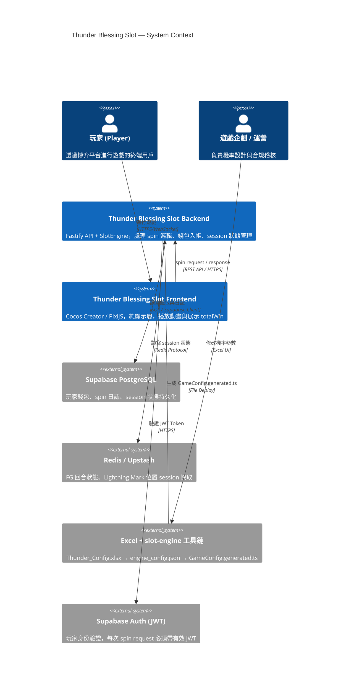
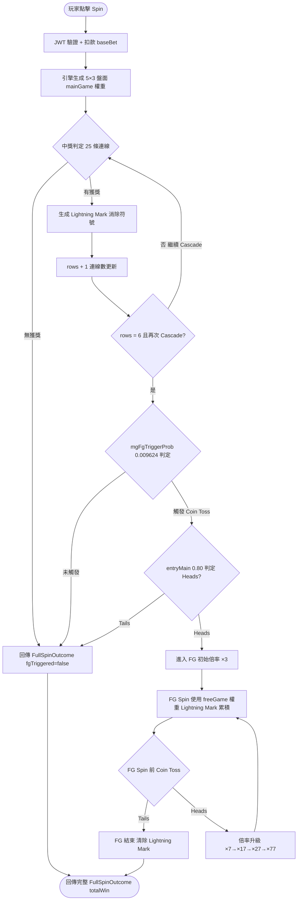
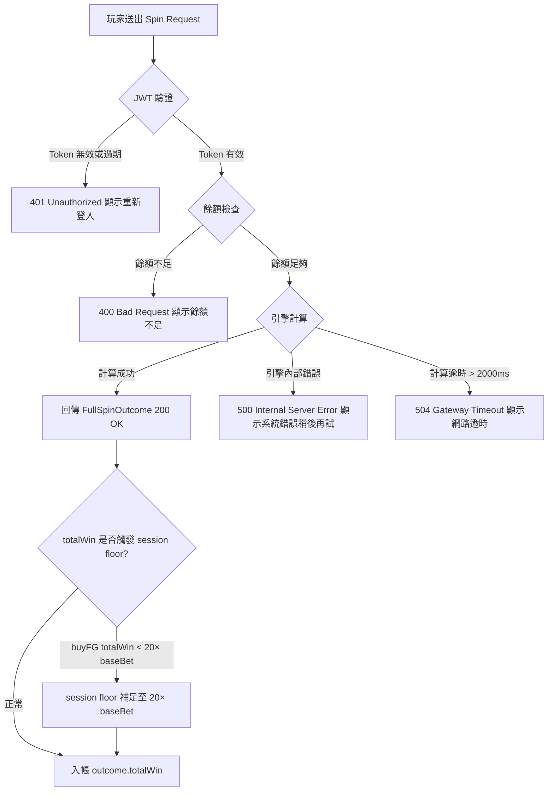
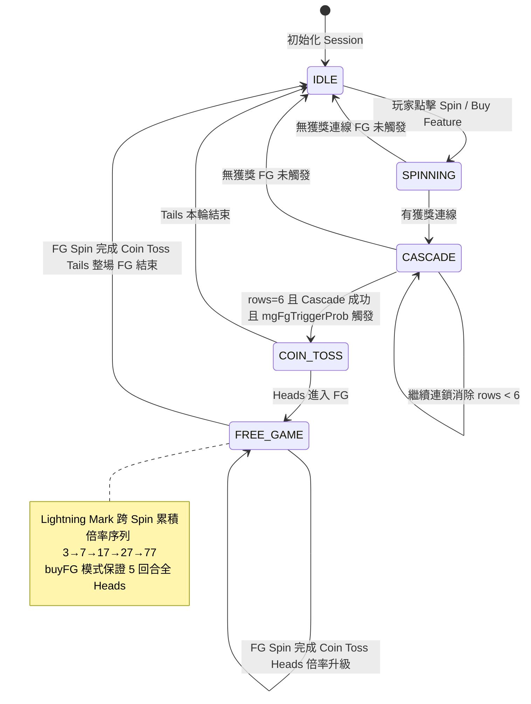

# PRD — Product Requirements Document
<!-- 對應學術標準：IEEE 830 (SRS)，對應業界：Google PRD / Amazon PRFAQ -->

---

## Document Control

| 欄位 | 內容 |
|------|------|
| **DOC-ID** | PRD-THUNDERBLESSING-20260426 |
| **產品名稱** | Thunder Blessing Slot Game |
| **文件版本** | v0.1 |
| **狀態** | DRAFT |
| **作者（PM）** | AI Generated (gendoc-gen-prd) |
| **日期** | 2026-04-26 |
| **上游 BRD** | [BRD.md](BRD.md) §3～§9 |
| **審閱者** | 遊戲企劃, QA Lead |
| **核准者** | Engineering Lead |

---

## Change Log

| 版本 | 日期 | 作者 | 變更摘要 |
|------|------|------|---------|
| v0.1 | 20260426 | AI Generated (gendoc-gen-prd) | 初始生成 |

---

## 1. Executive Summary

Thunder Blessing 是一款希臘神話主題的高爆發老虎機遊戲，以「滾輪持續擴展 × 符號鍊式消除 × 閃電能量蓄積」為核心遊戲循環，面向 B2B 線上博弈平台市場。核心問題在於：現有市場缺乏工程可執行等級的完整 GDD，導致前後端規格不一致、機率錯誤難以追蹤。本產品以 RTP 97.5%（四情境獨立驗收）、最大獎金 30,000× baseBet（Main Game）為設計目標；啟用 Extra Bet + Buy Feature 情境下最大獎金上限為 90,000× baseBet。通過 Excel 驅動工具鏈（禁止人工調參）確保規格即文件即程式，供前後端工程師、遊戲企劃與 QA 均能 100% 按規格交付。

---

## 2. Problem Statement

### 2.1 現狀痛點

線上博弈產業常見問題：GDD（遊戲設計文件）與工程實作脫節，機率參數散落於多個文件、電子表格和程式碼中，導致：
- 前後端工程師因規格不一致，頻繁需要溝通確認，每版迭代溝通成本超過 30%
- 機率錯誤（RTP 偏差）在 QA 末期才被發現，修正成本高
- 無統一驗收流程，Monte Carlo 模擬結果難以稽核
- Cascade 擴展邏輯、Lightning Mark 位置跨步驟追蹤，複雜度高，現有文件無法完整描述

### 2.2 根本原因分析

1. **技術限制**：機率設計與程式碼解耦不足，調參需同步修改 Excel 與程式碼兩處，容易不同步
2. **流程缺失**：無自動化驗收管道（`verify.js` → 四情境 RTP ±1%），依賴人工比對
3. **規格缺口**：FG 完整序列（最多 5 回合 Coin Toss）需一次往返 API，現有設計未明定邊界

### 2.3 機會假設

- 假設 1：若提供工程可執行 GDD 套件，則前後端開發效率將提升 ≥ 40%（以規格問題溝通次數衡量）
- 假設 2：若以 Excel 工具鏈自動化 RTP 驗收，則機率錯誤逃逸率將從 >10% 降至 <1%
- 假設 3：若 RTP 透明可稽核（verify.js 輸出），則 B2B 合規上架週期將縮短 ≥ 20%

### 2.4 System Context Diagram



---

## 3. Stakeholders & Users

### 3.1 Stakeholder Map

| 角色 | 關係 | 主要關切 | 溝通頻率 |
|------|------|---------|---------|
| 遊戲企劃 | 機率設計 / 規格定義 | 四情境 RTP 各自通過 verify.js、機制邊界正確性 | 每日 |
| 後端工程師 | 技術實作 | slot-engine 工具鏈整合、API 單次往返設計、Supabase / Redis 架構 | 每日 |
| 前端工程師 | 視覺實作 | 動畫流程時序、Cascade 擴展 / Lightning Mark 動畫、幣種顯示 | 每週 |
| QA 工程師 | 品質保證 | Unit Test + 100 萬次 Monte Carlo 模擬、四情境 RTP ±1% 容許 | 每週 |
| 營運 / 合規 | 稽核與合規 | RTP 透明（verify.js 可稽核）、最大獎金上限明確（30,000×）、幣種合規顯示 | 月 |
| 平台運營商（B2B） | 出資 / 核准 | 上市時間、ROI、合規認證 | 月 |

### 3.2 User Personas

#### Persona A：高波動追求者「Max」

| 欄位 | 內容 |
|------|------|
| **背景** | 28–40 歲，資深線上博弈玩家，每週遊戲 3–5 次，偏好高峰值爆發機型 |
| **目標** | 在有限時間內追求大獎（Max Win 30,000×），享受 Cascade 連鎖與 FG 的緊張感 |
| **痛點** | 現有低波動機型缺乏爆發力；Buy Feature 費用高但保底保障不夠清晰 |
| **技術熟悉度** | 中（了解 RTP 概念、Scatter 機制） |
| **使用頻率** | 每週 3–5 次，每次 session 30–60 分鐘 |
| **成功樣貌** | 成功觸發 ×77 Free Game，連鎖消除至 57 條連線，獲得接近 30,000× 的總獎金 |

#### Persona B：遊戲企劃「Alex」

| 欄位 | 內容 |
|------|------|
| **背景** | 25–35 歲，線上博弈遊戲設計師，負責機率設計與 Excel 工具鏈維護 |
| **目標** | 快速調整符號權重並驗收四情境 RTP，確保新版上線前通過 verify.js |
| **痛點** | 調參後需手動比對多份文件，容易遺漏；Monte Carlo 模擬耗時，缺乏即時視覺化 |
| **技術熟悉度** | 高（熟悉 Excel 公式與 Monte Carlo 概念） |
| **使用頻率** | 每週 2–3 次（版本迭代時密集使用） |
| **成功樣貌** | 修改 DATA tab → 執行工具鏈 → DESIGN_VIEW 自動呈現 RTP 綠燈 → verify.js 通過 → 無需手動介入 |

#### Persona C：QA 工程師「Sam」

| 欄位 | 內容 |
|------|------|
| **背景** | 25–35 歲，遊戲 QA 工程師，負責驗收引擎行為與前端動畫正確性 |
| **目標** | 確保所有 P0 AC 通過自動化測試，四情境 RTP 在 100 萬次模擬後均在 ±1% 容許範圍 |
| **痛點** | 缺乏完整 BDD scenario，需從 GDD PDF 手動推斷邊界條件；Cascade + Lightning Mark 跨步驟追蹤驗收困難 |
| **技術熟悉度** | 高（熟悉 unit test、E2E、Monte Carlo 驗收流程） |
| **使用頻率** | 每次版本交付前密集使用 |
| **成功樣貌** | `pnpm test:unit` + `pnpm test:integration` 全部通過，verify.js 輸出四情境 ✅，無 P0 Bug |

---

## 4. Scope

### 4.1 In Scope（P0 — MVP 必做）

- 基礎滾輪系統（5×3 初始，Cascade 擴展至 5×6，25→57 條連線）
- Cascade 連鎖消除機制（含 Lightning Mark 生成與跨步驟追蹤）
- 雷霆祝福 Scatter（Thunder Blessing）— 雙擊制符號升階
- Coin Toss 硬幣翻轉（Main Game 觸發，Heads 機率 0.80）
- Free Game 免費遊戲（×3→×7→×17→×27→×77 倍率序列，整局 Lightning Mark 累積）
- Extra Bet 額外投注（×3 費用，保證 SC 出現）
- Buy Feature 購買功能（100× baseBet，保證 Heads × 5，session floor ≥ 20× baseBet）
- Near Miss 視覺張力機制（Excel 定義，工具鏈自動配置）
- slot-engine 工具鏈完整自動化（Excel → engine_config.json → GameConfig.generated.ts）
- RTP 驗收流程（100 萬次 Monte Carlo，四情境各 ±1%）
- 後端 API（Fastify + Supabase + Redis，單次 spin 往返含完整 FG 序列）
- JWT 認證（每次 spin request 必須驗證）
- 幣種支援（USD / TWD，從 BetRangeConfig.generated.ts 讀取）
- FG Bonus 額外倍數抽取（×1/×5/×20/×100，對應 fgBonus 權重表）

### 4.2 In Scope（P1 — Phase 2）

- 前端遊戲邏輯實作（Cocos Creator 或 PixiJS）
- Cascade 擴展動畫、Lightning Mark 特效、Coin Toss 動畫
- DESIGN_VIEW tab 視覺化（企劃參數調整後即時預覽 RTP 分佈）
- 完整 BDD scenario 自動化測試套件

### 4.3 In Scope（P2 — 未來版本）

- 多語系支援（i18n）— 目前排除
- 行動裝置原生 App 打包
- 進階分析 Dashboard（玩家行為熱圖、Cascade 深度分佈）

### 4.4 Out of Scope（明確排除）

- 實際前端視覺資產製作（美術圖檔、音效製作）— 排除原因：美術外包，非本 GDD 套件範圍
- 真實金流系統整合（Payment Gateway、真實錢包對接）— 排除原因：由博弈平台運營商負責
- 實體合規申請（RNG 認證、監管機構送審）— 排除原因：認證為運營商義務，本產品提供 verify.js 輸出可稽核材料
- 多語系本地化（i18n）— 排除原因：Phase 1 僅需英文/中文介面
- 行動裝置原生 App 打包 — 排除原因：以 Web 為主，App 為後續延伸

### 4.5 Future Scope（非承諾）

- 第三幣種支援（EUR、JPY）
- 進階 Anti-Fraud 玩家行為監控
- 自訂化近失效果（UI 層 Near Miss 動畫編輯器）

### 4.6 MoSCoW 表

| 功能 | Must | Should | Could | Won't |
|------|:----:|:------:|:-----:|:-----:|
| 基礎滾輪系統 | ✅ | | | |
| Cascade 連鎖消除 + Lightning Mark | ✅ | | | |
| 雷霆祝福 Scatter（雙擊制）| ✅ | | | |
| Coin Toss | ✅ | | | |
| Free Game（×77 倍率）| ✅ | | | |
| Extra Bet | ✅ | | | |
| Buy Feature | ✅ | | | |
| Near Miss | ✅ | | | |
| slot-engine 工具鏈 | ✅ | | | |
| RTP 驗收（100 萬次 Monte Carlo）| ✅ | | | |
| 後端 API（Fastify + Supabase）| ✅ | | | |
| JWT 認證 | ✅ | | | |
| USD / TWD 幣種 | ✅ | | | |
| 前端動畫（Cocos / PixiJS）| | ✅ | | |
| BDD 自動化測試 | | ✅ | | |
| i18n 多語系 | | | | ✅ |
| 真實金流整合 | | | | ✅ |
| 實體合規申請 | | | | ✅ |

---

## 5. User Stories & Acceptance Criteria

### 5.1 基礎滾輪旋轉（P0）

**REQ-ID：** US-SPIN-001（對應 BRD §3 BR-01）

**User Story：**
> 作為 **玩家（Max）**，我希望每次點擊 Spin 後，系統在 500ms 內回傳完整旋轉結果，以便我能即時看到滾輪停止後的盤面與獎金。

**優先度：** P0（Must Have）
**關聯 BRD 目標：** BR-01、KPI-05
**活動圖（Activity Diagram）：** [待生成：/gendoc-gen-diagrams] activity-spin-basic.md

**Acceptance Criteria：**

| REQ-ID / AC# | Given（前提） | When（行動） | Then（結果） | 測試類型 |
|--------------|-------------|------------|------------|---------|
| US-SPIN-001 / AC-1 | 玩家已登入，餘額 ≥ baseBet，Extra Bet OFF，無 FG 觸發 | 點擊 Spin | API 回傳完整 FullSpinOutcome，基礎 Spin P99 ≤ 500ms，盤面 5×3 初始顯示 | E2E |
| US-SPIN-001 / AC-2 | 玩家餘額 < baseBet | 點擊 Spin | 顯示「餘額不足」錯誤，不發起 spin request | Unit |
| US-SPIN-001 / AC-3 | JWT Token 過期或缺失 | 點擊 Spin | 返回 HTTP 401，顯示「請重新登入」提示 | Integration |
| US-SPIN-001 / AC-4 | 玩家正在進行一次 spin | 再次點擊 Spin | Spin 按鈕鎖定，忽略重複請求，不重複扣款 | E2E |
| US-SPIN-001 / AC-5 | Wild（W）出現在連線 | 判定中獎連線 | Wild 代替除 SC 外所有符號，獎金依賠率表計算 | Unit |

**邊界條件：**
- 最小投注：USD $0.10（betLevel 1）→ 正常扣款，回傳 FullSpinOutcome
- 最大投注：USD $10.00（betLevel 1000）→ 正常扣款，回傳 FullSpinOutcome
- 並發：同一 session 同時發送 2 個 spin request → 第 2 個返回 409 Conflict
- 超時：API > 2000ms → 返回 504 Gateway Timeout，不扣款

---

### 5.2 Cascade 連鎖消除 + Lightning Mark（P0）

**REQ-ID：** US-CASC-001（對應 BRD §3 BR-02）

**User Story：**
> 作為 **後端工程師**，我希望 Cascade 邏輯在每次中獎後自動消除符號、生成 Lightning Mark、擴展滾輪列數，直到無獲獎連線為止，以便引擎輸出完整且自洽的 `cascadeSteps` 陣列供前端播放。

**優先度：** P0（Must Have）
**關聯 BRD 目標：** BR-02、KPI-03
**活動圖（Activity Diagram）：** [待生成：/gendoc-gen-diagrams] activity-cascade-flow.md

**Acceptance Criteria：**

| REQ-ID / AC# | Given（前提） | When（行動） | Then（結果） | 測試類型 |
|--------------|-------------|------------|------------|---------|
| US-CASC-001 / AC-1 | 本輪 spin 有中獎連線，當前 rows = 3 | 引擎執行 Cascade | 中獎位置生成 Lightning Mark，消除符號，rows 擴展至 4，連線數更新為 33 條 | Unit |
| US-CASC-001 / AC-2 | 連續中獎，rows 已達 6（MAX_ROWS） | 再次觸發 Cascade | rows 維持 6，連線數保持 57 條，Cascade 繼續消除符號並累積獎金（Coin Toss 判定由 US-COIN-001 處理） | Unit |
| US-CASC-001 / AC-3 | Main Game：新 SPIN 開始前 | 初始化盤面 | Lightning Mark 清除，rows 重置為 3，連線數重置為 25 | Unit |
| US-CASC-001 / AC-4 | Cascade 步驟中同一格多次中獎 | 計算獎金 | 同一連線只計最高獎金，不重複計算 | Unit |
| US-CASC-001 / AC-5 | Cascade 深度測試 | 引擎執行 3 次以上連鎖消除 | 每步 CascadeStep 正確記錄 grid、wins、lightningMarks 位置 | Integration |

**邊界條件：**
- rows 上限 6：達到後繼續 Cascade 不再擴展，但繼續消除累積
- Lightning Mark 位置：每個 CascadeStep 的 grid[row][col] 有中獎時標記，不重複覆蓋
- 0 獲獎時：Cascade 立即停止，不生成 Mark，不擴展
- Cascade 最大深度上限：50 步；若超過，引擎強制終止該 Cascade 序列並寫入 ERROR log，視為異常 spin
- Paylines 1-25：適用於 3 列（滾輪未擴展）的標準連線走法。Paylines 26-57：每新增一列（第 4/5/6 列），原有連線路徑在新增列中延伸一格，具體 rowPath 定義見 Payline Definition Document（§14 References，開發啟動前硬性 Gate）。

---

### 5.3 雷霆祝福 Scatter 觸發（P0）

**REQ-ID：** US-TBSC-001（對應 BRD §3 BR-03）

**User Story：**
> 作為 **玩家（Max）**，我希望當盤面存在 Lightning Mark 且落下 Scatter 時，系統自動觸發雷霆祝福，將所有標記格升級為高賠符號，以便獲得高爆發獎金。

**優先度：** P0（Must Have）
**關聯 BRD 目標：** BR-03、KPI-02
**活動圖（Activity Diagram）：** [待生成：/gendoc-gen-diagrams] activity-thunder-blessing.md

**Acceptance Criteria：**

| REQ-ID / AC# | Given（前提） | When（行動） | Then（結果） | 測試類型 |
|--------------|-------------|------------|------------|---------|
| US-TBSC-001 / AC-1 | 盤面有 Lightning Mark，新符號中有 SC 落下 | 引擎觸發雷霆祝福第一擊 | 所有 Lightning Mark 格的符號統一替換為同一種隨機高賠符號，重新計算全盤連線與獎金 | Unit |
| US-TBSC-001 / AC-2 | 第一擊完成後，隨機數 < 0.40（tbSecondHit） | 引擎觸發第二擊 | 標記格符號依升階路徑再升一級（L1/L2/L3/L4 → P4；P4 → P3；P3 → P2；P2 → P1；P1 維持） | Unit |
| US-TBSC-001 / AC-3 | 盤面無 Lightning Mark | SC 落下 | 不觸發雷霆祝福，SC 視為普通非中獎符號 | Unit |
| US-TBSC-001 / AC-4 | P1 符號進行第二擊升階 | 執行符號升級 | P1 維持 P1（不再升，無越界） | Unit |
| US-TBSC-001 / AC-5 | 雷霆祝福觸發後 | Cascade 流程繼續 | 若新組合有獲獎連線，Cascade 繼續執行（消除 → 擴展） | Integration |

**邊界條件：**
- 標記格全為 P1：第二擊後仍全為 P1（升階路徑 P1 → P1）
- 無高賠符號可選：系統從 P1/P2/P3/P4 中隨機選取，需有明確隨機策略定義
- 同時多個 SC 落下：觸發一次雷霆祝福（不因 SC 數量多次觸發）

---

### 5.4 Coin Toss 硬幣翻轉（P0）

**REQ-ID：** US-COIN-001（對應 BRD §3 BR-04）

**User Story：**
> 作為 **玩家（Max）**，我希望當滾輪達到 6 列且 Cascade 再次成功後觸發 Coin Toss，透過 Heads/Tails 結果決定是否進入 Free Game，以便獲得 ×3 起的 FG 倍率加成。

**優先度：** P0（Must Have）
**關聯 BRD 目標：** BR-04
**活動圖（Activity Diagram）：** [待生成：/gendoc-gen-diagrams] activity-coin-toss.md

**Acceptance Criteria：**

| REQ-ID / AC# | Given（前提） | When（行動） | Then（結果） | 測試類型 |
|--------------|-------------|------------|------------|---------|
| US-COIN-001 / AC-1 | rows = 6，Cascade 再次成功，mode = 'main' | 引擎執行 Coin Toss | 以 mgFgTriggerProb（0.009624）判定是否進入 Coin Toss；進入後以 entryMain（0.80）判定 Heads | Unit |
| US-COIN-001 / AC-2 | Coin Toss 結果為 Heads（main game） | 進入 FG | 初始倍率設為 ×3，fgTriggered = true，FG 序列開始 | Unit |
| US-COIN-001 / AC-3 | Coin Toss 結果為 Tails | 本輪結束 | fgTriggered = false，FG 序列不啟動，本輪 SPIN 結束 | Unit |
| US-COIN-001 / AC-4 | mode = 'buyFG' | Buy Feature 觸發 Coin Toss | 完全繞過 mgFgTriggerProb，直接進入 FG，entryBuy = 1.00（保證 Heads） | Unit |
| US-COIN-001 / AC-5 | Coin Toss 邊界 | rows < 6 時不應觸發 | rows < MAX_ROWS 時絕對不觸發 Coin Toss | Unit |

**邊界條件：**
- rows = 5 時不觸發 Coin Toss，必須是 rows = 6 + Cascade 再次成功
- Buy Feature：entryBuy = 1.00，不判定 mgFgTriggerProb

---

### 5.5 Free Game 免費遊戲（P0）

**REQ-ID：** US-FGAM-001（對應 BRD §3 BR-05）

**User Story：**
> 作為 **玩家（Max）**，我希望 Free Game 期間 Lightning Mark 跨 Spin 累積不清除、每 Spin 前翻一次 Coin Toss 決定倍率升級，直到 Tails 結束，以便在高倍率下（最高 ×77）累積巨額獎金。

**優先度：** P0（Must Have）
**關聯 BRD 目標：** BR-05、KPI-02
**活動圖（Activity Diagram）：** [待生成：/gendoc-gen-diagrams] activity-free-game.md

**Acceptance Criteria：**

| REQ-ID / AC# | Given（前提） | When（行動） | Then（結果） | 測試類型 |
|--------------|-------------|------------|------------|---------|
| US-FGAM-001 / AC-1 | FG 剛觸發（Heads，倍率 ×3） | 第一回合 FG Spin | 以 FG 符號權重（freeGame）生成盤面，Lightning Mark 從主遊戲繼承，獎金 × 3 | Unit |
| US-FGAM-001 / AC-2 | 第 2 次 FG Coin Toss Heads（coinProbs[1] = 0.68，入場 coinProbs[0] = 0.80 已在 BR-04 完成），當前倍率 ×3 | 下一回合 FG Spin 開始前 | 倍率升至 ×7，繼續下一回合 | Unit |
| US-FGAM-001 / AC-3 | 倍率 ×77，Coin Toss Heads（機率 0.40） | 下一回合 FG Spin 開始前 | 倍率維持 ×77（已最高），繼續下一回合 | Unit |
| US-FGAM-001 / AC-4 | 任意 FG 回合，Coin Toss Tails | 下一回合 FG Spin 開始前 | FG 結束，Lightning Mark 清除，回到主遊戲，totalWin 已計算 | Unit |
| US-FGAM-001 / AC-5 | FG 全程（buyFG mode，5 回合保證 Heads） | 執行完整 FG 序列 | FullSpinOutcome.fgSpins 包含 5 個 FGSpin，每個 multiplier 依序為 3/7/17/27/77 | Integration |
| US-FGAM-001 / AC-6 | FG 觸發時 | 抽取 FG Bonus 倍數 | 從 fgBonus 表（×1/×5/×20/×100，權重 900/80/15/5）抽取一個倍數，套用於整局 FG 總獎金 | Unit |
| US-FGAM-001 / AC-7 | 當前 FG 倍率 ×77 | 下一回合 FG Spin 開始前 Coin Toss Tails | FG 立即結束，所有 Lightning Mark 清除（`grid.lightningMarks = []`），totalWin 回傳至 FullSpinOutcome，回到主遊戲 | Unit |

**邊界條件：**
- FG Bonus ×100（機率 5/1000 = 0.5%）：整局 FG 總獎金 × 100，不超過 30,000× baseBet（Main Game）或 90,000× baseBet（EBBuyFG）上限
- Lightning Mark 跨 Spin 累積：FG 第 2 回合前，前一回合標記保留在 grid 中
- FG 結束後 Lightning Mark 清除：`grid.lightningMarks = []`，不帶入下一次主遊戲 SPIN

---

### 5.5.1 Free Game 斷線恢復（P1）

**REQ-ID：** US-FGREC-001（對應 US-FGAM-001 斷線恢復情境）

**User Story：**
> 作為 **玩家（Max）**，當我的 FG 進行中連線中斷並重新連線時，我希望系統自動還原我的 FG 進度（倍率、閃電標記、Bonus 倍數），讓我從中斷點繼續遊戲，而不是損失正在進行的 FG。

**優先度：** P1（Should Have）
**關聯 BRD 目標：** BR-05

**Acceptance Criteria：**

| REQ-ID / AC# | Given（前提） | When（行動） | Then（結果） | 測試類型 |
|--------------|-------------|------------|------------|---------|
| US-FGREC-001 / AC-1 | 玩家 FG 進行中（fg_in_progress = true）連線中斷，JWT 仍在有效期內 | 玩家重新連線並送出 reconnect / spin 請求 | 後端從 Redis player_sessions 讀取還原 FG 狀態（fg_multiplier、lightning_marks、fg_bonus_mult），回傳 pending FG resume response | Integration |
| US-FGREC-001 / AC-2 | FG 狀態已還原（fg_multiplier、lightning_marks、fg_bonus_mult 均正確） | 前端收到 pending FG resume response | 前端從中斷點繼續播放 FG 動畫，不重置倍率，Lightning Mark 標記位置正確顯示 | E2E |
| US-FGREC-001 / AC-3 | 玩家 JWT 已過期（reconnect 時 token invalid） | 玩家嘗試重新連線 | 後端返回 401 Unauthorized，不允許恢復 FG；FG 狀態不清除（等待有效 JWT 後可再恢復）| Unit |
| US-FGREC-001 / AC-4 | 玩家 FG 未在進行中（fg_in_progress = false） | 玩家重新連線 | 後端不觸發 FG 恢復流程，正常初始化 session | Unit |

**邊界條件：**
- Redis player_sessions 保留 FG 狀態至 FG 正式結束（Coin Toss Tails 或 buyFG 5 回合完成）
- FG 結束後 fg_in_progress 設為 false，fg_multiplier / lightning_marks / fg_bonus_mult 清除
- 斷線期間 FG 結算不自動執行，必須等玩家重新連線後繼續正常 Coin Toss 流程

---

### 5.6 Extra Bet 額外投注（P0）

**REQ-ID：** US-EXBT-001（對應 BRD §3 BR-06）

**User Story：**
> 作為 **玩家（Max）**，我希望開啟 Extra Bet 後，每次 Spin 保證出現至少 1 個 SC（Scatter），以便以 3 倍費用換取更高的雷霆祝福觸發率與 FG 觸發頻率。

**優先度：** P0（Must Have）
**關聯 BRD 目標：** BR-06
**活動圖（Activity Diagram）：** [待生成：/gendoc-gen-diagrams] activity-extra-bet.md

**Acceptance Criteria：**

| REQ-ID / AC# | Given（前提） | When（行動） | Then（結果） | 測試類型 |
|--------------|-------------|------------|------------|---------|
| US-EXBT-001 / AC-1 | Extra Bet ON，baseBet = $0.25 | 點擊 Spin | 實際扣款 $0.75（baseBet × 3），使用 extraBet 符號權重表，可見 3 列中保證至少 1 個 SC | Unit |
| US-EXBT-001 / AC-2 | Extra Bet ON，生成盤面可見 3 列自然含 SC | SC 保證邏輯執行 | 不強制插入（自然 SC 保留），可見格維持原有符號 | Unit |
| US-EXBT-001 / AC-3 | Extra Bet ON，可見 3 列（row 0-2）無自然 SC | SC 保證邏輯執行 | 從 15 格中隨機選 1 格，強制置入 SC | Unit |
| US-EXBT-001 / AC-4 | Extra Bet OFF | 點擊 Spin | 使用 mainGame 符號權重表，SC 依正常機率出現，扣款為 baseBet（不乘 3） | Unit |
| US-EXBT-001 / AC-5 | Extra Bet ON + Buy Feature | 費用計算 | 費用 = 100 × baseBet × extraBetMult（3）= 300 × baseBet | Unit |

**邊界條件：**
- 最大投注 + Extra Bet：$10.00 × 3 = $30.00，需確認 Supabase 錢包扣款正確
- Extra Bet 開關需在 Spin 進行中鎖定，不可中途切換

---

### 5.7 Buy Feature 購買功能（P0）

**REQ-ID：** US-BUYF-001（對應 BRD §3 BR-07）

**User Story：**
> 作為 **玩家（Max）**，我希望支付 100× baseBet 直接購入 Free Game（5 回合 Coin Toss 保證 Heads），以便跳過主遊戲直接進入高倍率 FG，且享有 session totalWin ≥ 20× baseBet 的保底保障。

**優先度：** P0（Must Have）
**關聯 BRD 目標：** BR-07、KPI-04
**活動圖（Activity Diagram）：** [待生成：/gendoc-gen-diagrams] activity-buy-feature.md

**Acceptance Criteria：**

| REQ-ID / AC# | Given（前提） | When（行動） | Then（結果） | 測試類型 |
|--------------|-------------|------------|------------|---------|
| US-BUYF-001 / AC-1 | 玩家餘額 ≥ 100 × baseBet，Extra Bet OFF | 點擊 Buy Feature | 扣款 100 × baseBet，mode = 'buyFG'，5 回合 FG Coin Toss 均保證 Heads，entryBuy = 1.00 | E2E |
| US-BUYF-001 / AC-2 | Buy Feature 觸發，所有 FG Spin 完成後 totalWin < 20 × baseBet | 引擎計算 totalWin | session floor 介入，totalWin 補至 ≥ 20 × baseBet（buyFGMinWin = 20） | Unit |
| US-BUYF-001 / AC-3 | Extra Bet ON + Buy Feature | 費用計算 | 費用 = 300 × baseBet，session floor = 60 × baseBet（20 × extraBetMult 3） | Unit |
| US-BUYF-001 / AC-4 | 玩家餘額 < 100 × baseBet | 點擊 Buy Feature | 顯示「餘額不足」錯誤，不發起 buyFG request | Unit |
| US-BUYF-001 / AC-5 | Buy Feature 使用 buyFG 符號權重表 | 引擎生成盤面 | 嚴格使用 weights.buyFG，不混用 mainGame 或 freeGame 符號權重 | Unit |
| US-BUYF-001 / AC-6 | 玩家 Extra Bet ON 且餘額 < 300 × baseBet | 點擊 Buy Feature | 顯示「餘額不足」錯誤，不發起 buyFG request | Unit |

**邊界條件：**
- Per-spin floor 已移除（EDD §5.2）：只有 session floor（整場 ≥ 20× baseBet），不做每 spin 保底
- Buy Feature 最大獎金：30,000× baseBet（Extra Bet + Buy FG 最高 90,000×）

---

### 5.8 Near Miss 視覺張力（P0）

**REQ-ID：** US-NRMS-001（對應 BRD §3 BR-08）

**User Story：**
> 作為 **遊戲企劃（Alex）**，我希望 Near Miss 排列在 Excel DATA tab 中獨立定義，工具鏈自動寫入 GameConfig，引擎只讀取配置，不在程式碼中客製，以便維持 RTP 數學正確性並增加遊戲緊張感。

**優先度：** P0（Must Have）
**關聯 BRD 目標：** BR-08
**活動圖（Activity Diagram）：** [待生成：/gendoc-gen-diagrams] activity-near-miss.md

**Acceptance Criteria：**

| REQ-ID / AC# | Given（前提） | When（行動） | Then（結果） | 測試類型 |
|--------------|-------------|------------|------------|---------|
| US-NRMS-001 / AC-1 | Near Miss 定義在 Excel DATA tab | 執行 build_config.js | Near Miss 配置自動寫入 ENG_TOOLS tab 及 GameConfig.generated.ts | Unit |
| US-NRMS-001 / AC-2 | Near Miss 排列觸發 | 引擎判定 | 實際獲獎為 0（win = 0），Near Miss 不產生任何 win，不計入 RTP | Unit |
| US-NRMS-001 / AC-3 | 程式碼審查 | 檢查 SlotEngine.ts | SlotEngine 中無客製 Near Miss 排列邏輯，所有 Near Miss 僅來自 GameConfig | Code Review |
| US-NRMS-001 / AC-4 | 四情境模擬 | verify.js 執行 | Near Miss 不影響 RTP 通過（±1% 容許），DESIGN_VIEW 顯示正確 Near Miss 頻率（%） | Integration |

**邊界條件：**
- Near Miss 優先填充 0 獎名額（EDD §3.3），剩餘才用一般 0 獎填充
- 若 Near Miss 數量超過 0 獎名額，工具鏈應拋出錯誤並阻止生成

---

### 5.9 slot-engine 工具鏈自動化（P0）

**REQ-ID：** US-TOOL-001（對應 BRD §5 §5.1）

**User Story：**
> 作為 **遊戲企劃（Alex）**，我希望修改 Excel DATA tab 後，依序執行工具鏈即可自動生成 engine_config.json 與 GameConfig.generated.ts，無需人工介入，以便每次參數迭代都有可稽核的驗收流程。

**優先度：** P0（Must Have）
**關聯 BRD 目標：** KPI-06
**活動圖（Activity Diagram）：** [待生成：/gendoc-gen-diagrams] activity-toolchain.md

**Acceptance Criteria：**

| REQ-ID / AC# | Given（前提） | When（行動） | Then（結果） | 測試類型 |
|--------------|-------------|------------|------------|---------|
| US-TOOL-001 / AC-1 | Excel DATA tab 已修改 | 執行 build_config.js | engine_config.json 更新，ENG_TOOLS tab 自動寫入，無人工介入 | Integration |
| US-TOOL-001 / AC-2 | engine_config.json 已生成 | 執行 excel_simulator.js | 四情境各跑 100 萬次 Monte Carlo，結果寫入 SIMULATION tab 和 DESIGN_VIEW tab | Integration |
| US-TOOL-001 / AC-3 | SIMULATION tab 已寫入 | 執行 verify.js | 四情境 RTP 各在 ±1% 容許範圍內，輸出 verify_report.txt（通過） | Integration |
| US-TOOL-001 / AC-4 | verify.js 通過 | 執行 engine_generator.js | GameConfig.generated.ts 生成，禁止手動修改標記寫入檔案頭部 | Integration |
| US-TOOL-001 / AC-5 | verify.js 未通過（RTP 超出 ±1%） | 嘗試執行 engine_generator.js | 工具鏈阻止執行，輸出錯誤訊息，GameConfig.generated.ts 不更新 | Unit |

**邊界條件：**
- 工具鏈步驟順序不可顛倒（BRD §5.1 gating rule）
- GameConfig.generated.ts 手動修改後，下次執行工具鏈會覆蓋（需 CI checksum 比對）

---

### 5.10 RTP 驗收（四情境，P0）

**REQ-ID：** US-RTPV-001（對應 BRD §4 §8）

**User Story：**
> 作為 **QA 工程師（Sam）**，我希望 verify.js 自動驗收四情境 RTP，每情境在 100 萬次 Monte Carlo 模擬後均在目標 ±1% 容許範圍，以便確保引擎機率正確、合規上架。

**優先度：** P0（Must Have）
**關聯 BRD 目標：** KPI-01
**活動圖（Activity Diagram）：** [待生成：/gendoc-gen-diagrams] activity-rtp-verify.md

**Acceptance Criteria：**

| REQ-ID / AC# | Given（前提） | When（行動） | Then（結果） | 測試類型 |
|--------------|-------------|------------|------------|---------|
| US-RTPV-001 / AC-1 | 情境 1（Main Game，Extra Bet Off）| 100 萬次模擬 | 模擬 RTP 在 96.5%～98.5% 之間，verify_report.txt 標記 ✅ | Integration |
| US-RTPV-001 / AC-2 | 情境 2（Main Game，Extra Bet On）| 100 萬次模擬 | 模擬 RTP 在 96.5%～98.5% 之間，verify_report.txt 標記 ✅ | Integration |
| US-RTPV-001 / AC-3 | 情境 3（Free Game，Buy FG Off）| 100 萬次模擬 | 模擬 RTP 在 96.5%～98.5% 之間，verify_report.txt 標記 ✅ | Integration |
| US-RTPV-001 / AC-4 | 情境 4（Buy Free Game，Buy FG On）| 100 萬次模擬 | 模擬 RTP 在 96.5%～98.5% 之間，verify_report.txt 標記 ✅ | Integration |
| US-RTPV-001 / AC-5 | 任一情境 RTP 超出容許範圍 | verify.js 執行 | 輸出具體差距數值，標記 ❌，阻止 engine_generator.js 執行 | Unit |

**邊界條件：**
- 四情境各自獨立驗收，不合併正規化
- 每個情境 target RTP = 100%（工具鏈內部設計值）；整體產品目標 RTP = 97.5%

---

### 5.11 幣種支援（USD / TWD，P0）

**REQ-ID：** US-CURR-001（對應 BRD §5.3）

**User Story：**
> 作為 **營運 / 合規**，我希望幣種投注範圍從 BetRangeConfig.generated.ts 動態讀取（禁止硬編碼），以便確保幣種規格修改只需更新 Excel，不需改動程式碼。

**優先度：** P0（Must Have）
**關聯 BRD 目標：** §5.3 Bet Range 規格
**活動圖（Activity Diagram）：** [待生成：/gendoc-gen-diagrams] activity-currency.md

**Acceptance Criteria：**

| REQ-ID / AC# | Given（前提） | When（行動） | Then（結果） | 測試類型 |
|--------------|-------------|------------|------------|---------|
| US-CURR-001 / AC-1 | 幣種 USD | 客戶端呼叫 fetchBetRange() | 返回 USD bet range：min $0.25 / max $10.00 / step $0.25（40 個等級） | Integration |
| US-CURR-001 / AC-2 | 幣種 TWD | 客戶端呼叫 fetchBetRange() | 返回 TWD bet range：min TWD 10 / max TWD 320 / step TWD 10 | Integration |
| US-CURR-001 / AC-3 | BetRangeService.ts 審查 | 程式碼檢查 | 無硬編碼 bet range 數值，所有數值來自 BetRangeConfig.generated.ts | Code Review |
| US-CURR-001 / AC-4 | BET_MAX_LEVEL 修改（Excel）| 工具鏈執行 | BetRangeConfig.generated.ts 更新，BetRangeService 自動套用新值 | Integration |

**邊界條件：**
- TWD maxLevel = 320（以 engine_config.json 為準，BRD §5.3 明定；EDD §10.3 表格 TWD 300 為舊值待修正）
- 不支援的幣種代碼：返回 400 Bad Request

---

### 5.12 後端 API 單次往返（P0）

**REQ-ID：** US-APIV-001（對應 BRD §6.2）

**User Story：**
> 作為 **後端工程師**，我希望單次 spin request/response 涵蓋完整 FG 序列（最多 5 回合），所有結果一次性回傳，以便前端只需播放動畫，不需在 FG 期間多次請求引擎。

**優先度：** P0（Must Have）
**關聯 BRD 目標：** KPI-05、§6.2
**活動圖（Activity Diagram）：** [待生成：/gendoc-gen-diagrams] activity-api-spin.md

**Acceptance Criteria：**

| REQ-ID / AC# | Given（前提） | When（行動） | Then（結果） | 測試類型 |
|--------------|-------------|------------|------------|---------|
| US-APIV-001 / AC-1 | Main Game，FG 觸發（×3→×7→Tails 停止）| POST /api/v1/spin | 一次 response 包含 baseSpins、entryCoinToss、fgSpins（2 個 FGSpin），totalWin 已計算 | E2E |
| US-APIV-001 / AC-2 | buyFG mode（5 回合保證）| POST /api/v1/spin | fgSpins 陣列包含 5 個 FGSpin，multiplier 依序 3/7/17/27/77 | E2E |
| US-APIV-001 / AC-3 | spin request P99 回應時間 | 壓測（100 RPS） | 基礎 Spin（無 FG）P99 ≤ 500ms；FG 完整序列（最多 5 回合）P99 ≤ 800ms | Performance |
| US-APIV-001 / AC-4 | 無效 JWT Token | POST /api/v1/spin | 返回 401 Unauthorized，不執行任何遊戲邏輯 | Security |
| US-APIV-001 / AC-5 | totalWin 計算 | 引擎輸出 FullSpinOutcome | UI 只顯示 outcome.totalWin，不得以 session.roundWin 作為入帳依據 | Unit |

**邊界條件：**
- FG 最多 5 回合（buyFG 保證），Main Game FG 最少 0 回合（Tails 直接結束）
- 單次 response 最大 payload 估算：5 FGSpin × 6 CascadeStep × 5×6 grid ≈ 較大 JSON，需確認 Fastify 回應大小限制

---

### 5.13 前端動畫播放介面（P1）

**REQ-ID：** US-FEND-001（對應 BRD §6.2）

**User Story：**
> 作為 **前端工程師**，我希望後端 API 回傳完整的 FullSpinOutcome JSON（含 cascadeSteps、lightningMarks、fgSpins），以便前端可以無狀態播放所有動畫序列，不需在動畫播放中途再次請求引擎。

**優先度：** P1（Should Have）
**關聯 BRD 目標：** §6.2、KPI-05
**活動圖（Activity Diagram）：** [待生成：/gendoc-gen-diagrams] activity-frontend-animation.md

**Acceptance Criteria：**

| REQ-ID / AC# | Given（前提） | When（行動） | Then（結果） | 測試類型 |
|--------------|-------------|------------|------------|---------|
| US-FEND-001 / AC-1 | 後端回傳 FullSpinOutcome | 前端解析 response | FullSpinOutcome 包含 `cascadeSteps`（每步 grid、wins、lightningMarks）、`lightningMarks`（最終位置）、`fgSpins`（FGSpin 陣列，含 multiplier 與每 FG 回合的 cascadeSteps）| Unit |
| US-FEND-001 / AC-2 | FG 觸發且有 3 回合 fgSpins | 前端依序播放 fgSpins | 前端按 fgSpins 陣列順序播放每回合動畫（Cascade → Lightning Mark → Coin Toss），不需額外 API 請求 | E2E |
| US-FEND-001 / AC-3 | FullSpinOutcome.totalWin 已計算 | 前端顯示獎金 | UI 顯示 outcome.totalWin 數值，不得以前端累加各 step win 的方式計算 totalWin | Unit |
| US-FEND-001 / AC-4 | 無 FG 觸發的普通 Spin | 前端播放 baseSpins | `fgSpins` 為空陣列（`[]`），前端正確處理空 fgSpins 不播放 FG 動畫 | Unit |
| US-FEND-001 / AC-5 | FullSpinOutcome 欄位格式 | OpenAPI spec 驗證 | FullSpinOutcome JSON schema 符合 OpenAPI spec，所有必填欄位（totalWin、cascadeSteps、fgSpins、lightningMarks）均存在且型別正確 | Integration |

**邊界條件：**
- 前端在動畫播放中不可修改 lightningMarks 位置（只讀）
- fgSpins 為空陣列時，FG 相關動畫模組不得初始化，以免報錯

---

## 6. User Flows

### 6.1 主流程（Happy Path：Main Game → Cascade → FG）



### 6.2 錯誤流程



### 6.3 狀態機（Spin Session State Machine）



---

## 7. Non-Functional Requirements (NFR)

### 7.1 效能（Performance）

| 指標 | 目標值 | 量測方式 | 降級策略 |
|------|--------|---------|---------|
| API 回應時間 P50 | < 150ms | APM（Datadog 或同等工具） | Redis session cache |
| API 回應時間 P99（基礎 Spin，無 FG）| < 500ms @ 100 RPS | APM 壓測 | Circuit Breaker + 降級模式 |
| FG 完整序列（最多 5 回合）單次往返 P99 | < 800ms @ 100 RPS | APM 壓測（buyFG 場景） | 非同步預計算 |
| 頁面 LCP（前端） | < 2.5s | Lighthouse / RUM | CDN + 靜態資源預載 |
| Monte Carlo 模擬（100 萬次，四情境）| < 30 分鐘 | 工具鏈計時 | 分批平行模擬 |

> **參考值標注**：Monte Carlo 30 分鐘為工程評估值，需 Engineering 確認。

### 7.2 安全（Security）

| 項目 | 規格 |
|------|------|
| 認證機制 | Supabase Auth JWT，每次 spin request Header 攜帶 Bearer Token |
| JWT 驗證 | 後端每次 spin 前驗證 JWT 簽名、過期時間（exp）、iss 欄位 |
| 傳輸加密 | TLS 1.3+（禁止 TLS 1.0 / 1.1） |
| 靜態加密 | Supabase PostgreSQL AES-256 at rest |
| 權限隔離 | 玩家只能查詢自己的 spin 日誌（Row Level Security，RLS） |
| 入帳唯一權威 | outcome.totalWin（引擎輸出），UI 顯示值不得作為入帳依據 |
| Rate Limiting | spin endpoint：每秒 5 次 / 每玩家（超過返回 429） |
| 禁止行為清單 | 見 BRD §5.2：禁止 retry loop 保底、禁止 UI 層 win 修改、禁止手動修改 GameConfig.generated.ts |

### 7.3 可用性（Availability）

| 環境 | SLA | RTO | RPO |
|------|-----|-----|-----|
| Production | 99.5%（≤ 43.8h/year）| 30 分鐘 | 5 分鐘 |
| Staging | 99.0% | 4 小時 | 1 小時 |

> **維護視窗**：每週日凌晨 02:00–04:00 UTC（低峰期），提前 72 小時公告。

### 7.4 擴展性（Scalability）

- 短期基準：支援 100 RPS（並發 spin requests）
- 長期目標：支援 1000 RPS（10× 增長），無需重構核心架構（Fastify 水平擴展 + Redis Cluster）
- 資料量：每日 spin 日誌估算 10 萬筆，PostgreSQL 查詢效能不退化（索引：session_id, player_id, created_at）

### 7.5 維護性（Maintainability）

- 單元測試覆蓋率：≥ 80%（核心引擎邏輯 SlotEngine.ts 目標 100%）
- 程式碼複雜度：Cyclomatic Complexity ≤ 10
- 所有公開 API 有 OpenAPI spec（由 Fastify schema 自動生成）
- 部署頻率目標：每週 1 次（Staging），每月 1 次（Production）

### 7.6 國際化（i18n）

- 第一版支援語系：英文（en）、繁體中文（zh-TW）
- 幣種：USD、TWD（第一版），依規格讀取 BetRangeConfig.generated.ts
- 日期格式：ISO 8601（API 層）；前端依幣種地區顯示
- 時區：API 時間戳均以 UTC 儲存，前端按玩家時區顯示

> **注意**：多語系 i18n 實作（文案翻譯流程）在 Out of Scope（BRD §9），本版本僅保證基礎雙語支援。

### 7.7 可觀測性（Observability）

#### 7.7.1 Logging 規格

| 欄位 | 要求 |
|------|------|
| 格式 | 結構化 JSON（含 timestamp, level, service, trace_id, span_id, message） |
| 等級 | ERROR / WARN / INFO / DEBUG（Production 預設 INFO） |
| 必含欄位 | `request_id`、`player_id`（遮罩 PII，顯示前 4 碼）、`duration_ms`、`http_status`、`spin_mode`、`total_win` |
| 禁止記錄 | 明文密碼、完整 JWT token、未遮罩 player_id |
| 保留期 | Production：90 天；Staging：14 天 |
| 收集工具 | 待 Engineering 確認（Datadog / ELK / CloudWatch 均可） |

#### 7.7.2 Metrics 必須項目

| 指標名稱 | 類型 | 說明 | 告警觸發條件 |
|---------|------|------|------------|
| `slot_spin_request_total` | Counter | 所有 spin requests 總數（含 status_code label） | — |
| `slot_spin_duration_seconds` | Histogram | Spin 請求延遲分佈（P50/P99）。建議加入 `spin_mode` label（值：`base` / `fg`），HighLatency（P99 > 500ms）僅適用於 spin_mode=base；FG spin 由 FGHighLatency（P99 > 800ms）獨立覆蓋，以避免 FG spin 耗時 501-800ms 觸發假警報。 | P99 > 500ms（spin_mode=base）|
| `slot_error_rate` | Gauge | 5xx 錯誤比率 | > 1% 持續 5 分鐘 |
| `slot_fg_trigger_rate` | Gauge | FG 觸發率（每 1000 spin 中觸發次數） | < 5 或 > 20（異常偏離）|
| `slot_rtp_deviation` | Gauge | 即時 RTP 偏差監控（每 1 萬 spin 計算一次）| 偏差 > 2% |
| `slot_buy_feature_count` | Counter | Buy Feature 購買次數 | — |
| `slot_max_win_hit_count` | Counter | 達到 30,000×（Main Game）或 90,000×（EBBuyFG）上限次數 | — |
| `toolchain_run_status` | Counter | 記錄每次工具鏈執行結果（label: step=build_config/engine_generator/verify, result=pass/fail）| — |

#### 7.7.3 Distributed Tracing 需求

- 所有跨服務呼叫傳遞 `trace_id` / `span_id`（W3C TraceContext）
- Sampling Rate：Production 10%（錯誤請求 100% 採樣），Staging 100%
- 工具：待 Engineering 確認（Jaeger / Zipkin / AWS X-Ray）
- Trace 保留期：7 天

#### 7.7.4 Alert 閾值定義

| 告警名稱 | 觸發條件 | 嚴重度 | 通知管道 | 處置 SLA |
|---------|---------|--------|---------|---------|
| HighErrorRate | error_rate > 1% 持續 5 分鐘 | P1 | PagerDuty + Slack | 回應 15 分鐘 |
| HighLatency | P99 > 500ms 持續 3 分鐘 | P2 | Slack | 回應 30 分鐘 |
| ServiceDown | health check 連續失敗 3 次 | P0 | PagerDuty（電話）| 回應 5 分鐘 |
| RTPAnomaly | slot_rtp_deviation > 2%（每 1 萬 spin）| P1 | PagerDuty + Slack | 回應 15 分鐘 |
| DiskSpaceWarning | 磁碟使用率 > 80% | P3 | Slack | 回應 4 小時 |
| FGHighLatency | FG sequence P99 > 800ms 持續 3 分鐘 | P2 | Slack | 回應 30 分鐘 |
| ToolchainBuildFail | build_config.js 執行失敗 | P2 | Slack（遊戲企劃頻道）| 回應 1 小時 |
| ToolchainGenFail | engine_generator.js 失敗或被 verify.js 攔截 | P1 | PagerDuty + Slack | 回應 30 分鐘 |

#### 7.7.5 Dashboard 要求

| Dashboard 名稱 | 受眾 | 必含面板 |
|--------------|------|---------|
| Slot Service Health | On-Call 工程師 | Spin Request Rate、Error Rate、P99 Latency、Active Sessions |
| Business KPI | PM / 運營 | FG Trigger Rate、Buy Feature Count、Max Win Hit Count、RTP 偏差 |
| Toolchain Monitor | 遊戲企劃 | Monte Carlo 模擬狀態、verify.js 最新結果、四情境 RTP 顯示 |

### 7.8 Analytics Event Instrumentation Map

| 功能 | Event Name | 觸發動作 | 必要 Payload 欄位 | 關聯 KPI | 實作狀態 |
|------|-----------|---------|-----------------|---------|:-------:|
| 基礎 Spin | `spin_initiated` | 玩家點擊 Spin | `{player_id, session_id, bet_amount, currency, extra_bet_on}` | Spin 頻率 | 🔲 |
| Spin 完成 | `spin_completed` | FullSpinOutcome 回傳 | `{player_id, session_id, total_win, fg_triggered, cascade_depth, spin_mode}` | 整體 RTP 監控 | 🔲 |
| Cascade 觸發 | `cascade_triggered` | 中獎消除觸發 Cascade | `{player_id, session_id, cascade_step, rows_count, lightning_mark_count}` | Cascade 深度分佈 | 🔲 |
| 雷霆祝福觸發 | `thunder_blessing_triggered` | SC 落下且有 Lightning Mark | `{player_id, session_id, mark_count, symbol_upgraded, second_hit}` | TB 觸發率 | 🔲 |
| FG 觸發 | `free_game_triggered` | Coin Toss Heads 進入 FG | `{player_id, session_id, entry_mode, initial_multiplier, fg_bonus_mult}` | FG 觸發率 | 🔲 |
| FG 結束 | `free_game_ended` | FG 全程結束 | `{player_id, session_id, final_multiplier, fg_total_win, rounds_played}` | FG 獎金分佈 | 🔲 |
| Buy Feature | `buy_feature_initiated` | 玩家點擊 Buy Feature | `{player_id, session_id, cost, currency, extra_bet_on}` | Buy Feature 使用率 | 🔲 |
| Extra Bet 切換 | `extra_bet_toggled` | 玩家切換 Extra Bet 開關 | `{player_id, session_id, extra_bet_enabled}` | Extra Bet 使用率 | 🔲 |
| Max Win 達成 | `max_win_reached` | totalWin ≥ 30000× baseBet | `{player_id, session_id, bet_amount, trigger_path}` | 最高獎金達成率 | 🔲 |
| 錯誤發生 | `spin_error_encountered` | API 返回非 200 | `{player_id, session_id, error_code, error_type, spin_mode}` | 錯誤率 | 🔲 |

---

## 8. Constraints & Dependencies

### 8.1 Constraints（限制）

**硬性限制（Hard Constraints）：**

| # | 限制 | 類別 | 來源 |
|---|------|------|------|
| C-01 | GameConfig.generated.ts 禁止手動修改，只能透過工具鏈生成 | 技術 | BRD §5.2 |
| C-02 | PAYTABLE_SCALE（3.622）僅限工具鏈內部計算，禁止在程式碼中使用 | 技術 | BRD §5.2 |
| C-03 | 四情境符號權重絕對不可混用 | 技術 | BRD §5.2 |
| C-04 | 入帳依據唯一為引擎 outcome.totalWin，session.roundWin 僅供 UI 動畫計數 | 技術 | BRD §5.2, §6.3 |
| C-05 | verify.js 通過後才可執行 engine_generator.js（gating rule） | 流程 | BRD §5.1 |
| C-06 | per-spin floor 禁止（EDD §5.2 已移除 BUY_FG_SPIN_MIN_WIN_MULT）| 技術 | EDD §5.2 |
| C-07 | 幣種 bet range 禁止硬編碼，只從 BetRangeConfig.generated.ts 讀取 | 技術 | BRD §5.3 |
| C-08 | TWD maxLevel = 320（以 engine_config.json 為準） | 技術 | BRD §5.3 |
| C-09 | 最大獎金上限：Main Game 30,000× baseBet；Extra Bet + Buy FG 90,000× baseBet | 業務 | BRD §7 |
| C-10 | RTP 驗收標準：100 萬次 Monte Carlo，四情境各 ±1% 容許 | 業務 | BRD §7 |
| C-11 | 禁止 retry loop 保底：後端不得以重試 spin 方式保證特定 totalWin 結果；每次 spin 均須為獨立隨機結果 | 技術 | BRD §5.2 |
| C-12 | 禁止 UI 層 win 計算：totalWin 唯一來源為引擎 outcome.totalWin；UI 不得自行計算、修改或覆蓋 win 數值 | 技術 | BRD §5.2 |

**軟性限制（Soft Constraints）：**

| # | 限制 | 類別 |
|---|------|------|
| S-01 | 前端框架待定（Cocos Creator 或 PixiJS，不影響後端 API） | 技術 |
| S-02 | Analytics 工具待 Engineering 確認（Mixpanel / Amplitude / 自建）| 技術 |
| S-03 | Tracing 工具待 Engineering 確認（Jaeger / Zipkin / AWS X-Ray）| 技術 |

### 8.2 技術依賴

| 技術棧 | 版本要求 | 說明 |
|--------|---------|------|
| TypeScript | ≥ 5.0 | 後端主語言 |
| Node.js | ≥ 20 LTS | 後端執行環境 |
| Fastify | ≥ 4.x | API 框架 |
| Supabase PostgreSQL | 最新穩定版 | 玩家錢包、spin 日誌 |
| Redis / Upstash | Redis 7.x | FG session 狀態快取 |
| Supabase Auth | 最新穩定版 | JWT 驗證 |
| Excel（Thunder_Config.xlsx）| Office 365 相容 | 機率設計唯一入口 |

### 8.3 外部依賴

| 依賴項 | 類型 | 負責方 | 風險等級 | 備援方案 |
|--------|------|--------|---------|---------|
| Supabase PostgreSQL | 外部 SaaS | Supabase Inc. | MEDIUM | 自建 PostgreSQL 備援（需 Engineering 評估）|
| Supabase Auth（JWT）| 外部 SaaS | Supabase Inc. | MEDIUM | 降級為本地 JWT 驗證（開發初期） |
| Redis / Upstash | 外部 SaaS | Upstash Inc. | MEDIUM | Session 狀態持久化至 PostgreSQL（降級模式）|
| Excel 工具鏈 | 內部工具 | 遊戲企劃 | LOW | 備份 engine_config.json，不依賴工具鏈執行期 |

### 8.4 關鍵假設（Assumptions）

| # | 假設內容 | 若假設錯誤的風險等級 | 驗證方式 | 驗證截止日 | 負責人 |
|---|---------|-------------------|---------|-----------|--------|
| A-1 | Supabase Auth JWT SLA ≥ 99.9%，API 回應 < 50ms，保障 spin request 整體 P99 ≤ 500ms | HIGH | Supabase SLA 合約確認 + 壓測 | 開發啟動前 | Engineering |
| A-2 | Upstash Redis 在東亞地區的延遲 < 10ms P99，確保 session 狀態讀寫不成為瓶頸 | HIGH | 地區壓測 | 開發啟動前 | Engineering |
| A-3 | 前端框架（Cocos Creator 或 PixiJS）能在 GA 前確定，不影響後端 API 設計 | MEDIUM | 企劃 + 前端架構師決策 | Sprint 1 結束前 | PM |
| A-4 | 玩家基礎投注行為以 baseBet = $0.25 為主（占比 > 60%），100 RPS 峰值足夠支撐上線初期 | MEDIUM | A/B 測試 + 玩家行為分析 | Beta 結束前 | PM |
| A-5 | 100 萬次 Monte Carlo 模擬（四情境）可在 30 分鐘內完成（單機執行），不阻礙開發迭代 | LOW | 工程 PoC 驗證 | 工具鏈開發完成後 | Engineering |

### 8.5 向後相容性宣告

| 欄位 | 內容 |
|------|------|
| **本版本是否有 Breaking Change** | 否（全新產品） |
| **受影響的 API 版本** | N/A |
| **Breaking Change 清單** | N/A |
| **Deprecation Timeline** | N/A |
| **Migration Guide 責任** | N/A |
| **向下相容保障期** | N/A（全新產品，無既有版本）|

---

## 9. Success Metrics & Launch Criteria

### 9.1 北極星指標（North Star）

**FG 觸發率驗收通過率**：四情境在 100 萬次 Monte Carlo 模擬後，RTP 均在目標 ±1% 內的達成比例 = 100%（全四情境通過）。

> 說明：本產品為 B2B 工程交付，核心價值在於「規格即文件即程式」的可驗收性，北極星指標聚焦引擎正確性而非玩家量（由博弈平台運營商負責）。

### 9.2 Guardrail Metrics（護欄指標）

| 指標 | 當前值（基準）| 可接受下限 / 上限 | 若違反的處置 |
|------|-------------|-----------------|------------|
| API P99 延遲 | 待壓測建立基準 | < 500ms | 降級模式（禁止 buyFG），立即告警 |
| 5xx 錯誤率 | 0%（初始）| < 1% | 立即 Rollback |
| RTP 偏差（即時監控）| 目標 97.5% | 偏差 < ±2% | 暫停 spin，通知遊戲企劃 |
| Buy Feature session floor 失效率 | 0% | < 0.1% | 立即停止 Buy Feature 功能，調查引擎 |
| 最大獎金超限率（> 30,000×，Main Game）| 0% | 0%（嚴格） | 立即停機，引擎緊急審查 |
| Extra Bet + Buy FG 最大獎金超限率（> 90,000×）| 0% | 0%（嚴格） | 立即停機，引擎緊急審查 |
| FG 完整序列 P99 延遲 | 待壓測建立基準 | < 800ms @ 100 RPS | 降級模式（buyFG 限制），立即告警 |

### 9.3 Go-No-Go Launch Criteria

**Go 條件（全部必須通過）：**
- [ ] 所有 P0 AC 通過 QA 驗收
- [ ] 單元測試覆蓋率 ≥ 80%（SlotEngine.ts 目標 100%）
- [ ] 四情境 Monte Carlo 模擬各通過 verify.js（RTP ±1%）
- [ ] API P99 < 500ms @ 100 RPS（壓測驗證）
- [ ] FG 完整序列（buyFG 場景）P99 ≤ 800ms @ 100 RPS（壓測驗證）
- [ ] 安全掃描無 CRITICAL / HIGH 漏洞
- [ ] JWT 認證驗收通過（401 測試案例通過）
- [ ] 幣種 USD / TWD 投注範圍正確（來自 BetRangeConfig.generated.ts）
- [ ] Buy Feature session floor 驗收通過（totalWin ≥ 20× baseBet）
- [ ] Monitoring Dashboard 就緒（Slot Service Health + Business KPI）
- [ ] Rollback 方案已驗證（Feature Flag kill switch 可在 5 分鐘內生效）
- [ ] verify_report.txt 四情境均標記 ✅

**No-Go 條件（任一存在就不上線）：**
- [ ] 任一情境 RTP 超出 ±1% 容許
- [ ] 最大獎金上限邏輯未實作（30,000× cap）
- [ ] JWT 驗證可被繞過（安全漏洞）
- [ ] session.roundWin 被用於入帳（違反 C-04）
- [ ] GameConfig.generated.ts 有手動修改標記

### 9.4 A/B Test Plan

| 實驗名稱 | 假說 | 對照組 | 實驗組 | 主要指標 | Guardrail Metrics | 最小樣本量 | 持續時間 |
|---------|------|-------|-------|---------|-----------------|-----------|---------|
| Extra Bet 費用說明文案優化 | 若 Extra Bet 說明更清晰（顯示預期 FG 觸發率提升），則 Extra Bet 採用率將提升 15% | 原始說明文案 | 含「預期觸發率 +X%」的動態說明 | Extra Bet 採用率 | Error Rate < 1%；P99 < 500ms | N = 10,000 sessions | 2 週 |
| Buy Feature 保底說明顯示 | 若 Buy Feature 顯示「至少 20× 返還保底」，則 Buy Feature 購買率提升 10% | 無保底說明 | 顯示「保底 20× baseBet」badge | Buy Feature 購買率 | 同上 | N = 5,000 sessions | 2 週 |

### 9.5 Definition of Done（DoD）

**Product DoD（PM 確認）：**

| # | 條件 | 負責方 |
|---|------|--------|
| 1 | 所有 P0 User Story AC 均有對應 BDD scenario 並通過 | PM + QA |
| 2 | Analytics Events 已在 Staging Dashboard 確認觸發 ≥ 5 次測試 | PM + Engineering |
| 3 | 所有已知 Edge Case（Lightning Mark 追蹤、FG 邊界）有對應 UX 設計與錯誤訊息 | PM + Design |
| 4 | BRD 禁止行為清單（§5.2）全部驗收通過 | PM + QA |
| 5 | verify_report.txt 四情境 ✅ 並存入版本控制 | 遊戲企劃 |

**Engineering DoD（Engineering Lead 確認）：**

| # | 條件 | 負責方 |
|---|------|--------|
| 1 | 單元測試覆蓋率 ≥ 80%（SlotEngine.ts 核心邏輯 100%）| Engineering |
| 2 | 所有 P0 AC 自動化測試通過（unit + integration）| QA |
| 3 | 無 P0 Bug（Bug 等級定義：影響 totalWin 計算、JWT 繞過、RTP 偏差 > 2%）| QA |
| 4 | Security Review 通過（無 CRITICAL / HIGH，無 CVE > 7.0）| Security |
| 5 | API P95 ≤ 350ms，P99 ≤ 500ms @ 100 RPS（壓測驗證）| Engineering |
| 6 | Feature Flag kill switch 驗證通過（5 分鐘內生效）| Engineering |
| 7 | Runbook 已加入 docs/runbooks/（含 Rollback 流程）| Engineering |
| 8 | 四情境 Monte Carlo 模擬 verify.js 通過 | 遊戲企劃 + Engineering |

---

## 10. Rollout Plan

| 階段 | 名稱 | 目標用戶 | 持續時間 | 成功指標 | 退出條件 |
|------|------|---------|---------|---------|---------|
| Alpha | 內測 | 內部工程師 + 遊戲企劃（5–10 人）| 1 週 | 無 P0 Bug，verify.js 全 ✅ | 出現 P0 Bug 立即停止 |
| Beta | 封閉測試 | 選定 B2B 平台夥伴（1–3 家）| 2 週 | API P99 < 500ms，Error Rate < 0.5%，RTP 監控偏差 < 1% | Error Rate > 1% 或 RTP 偏差 > 2% 立即 Rollback |
| GA | 全面上線 | 所有 B2B 合作平台 | 持續 | KPI-01～KPI-06 達標 | — |

> **Buy Feature 司法管轄區合規要求：** Buy Feature 功能需依各 B2B 平台夥伴所屬轄區合規要求動態啟停（由 `buy_feature_enabled` Feature Flag 控制），GA 前需確認各平台的適用市場白名單，部分轄區（如 UKGC）明確限制 Buy Feature。

### 10.2 Feature Flag 規格

| Flag 名稱 | 預設值 | 目標群組 | 啟用條件 | Kill Switch | 管理工具 | 預計移除日 |
|-----------|--------|---------|---------|------------|---------|-----------|
| `thunder_blessing_enabled` | OFF | Alpha / Beta 用戶 | Alpha 驗收通過後啟用 | 是（立即關閉，5 分鐘內生效）| 待 Engineering 確認 | GA + 2 週 |
| `buy_feature_enabled` | OFF | Beta 用戶 | Beta 第 1 週驗收後啟用 | 是（立即關閉，5 分鐘內生效）| 待 Engineering 確認 | GA + 2 週 |
| `extra_bet_enabled` | OFF | Beta 用戶 | Beta 驗收通過後啟用 | 是（立即關閉，5 分鐘內生效）| 待 Engineering 確認 | GA + 2 週 |
| `free_game_enabled` | OFF | Alpha / Beta 用戶 | FG 引擎驗收後啟用 | 是（立即關閉，5 分鐘內生效）| 待 Engineering 確認 | GA + 2 週 |
| `cascade_expansion_enabled` | OFF | Alpha / Beta 用戶 | Cascade 引擎驗收後啟用 | 是（立即關閉，5 分鐘內生效）| 待 Engineering 確認 | GA + 2 週 |

> **Flag 管理原則：**
> 1. 每個 Flag 必須指定移除截止日（GA + 2 週）
> 2. Flag 啟用 / 關閉操作記錄寫入 Audit Log
> 3. Flag 變更需通知 On-Call 工程師
> 4. GA 後 2 週內清除 Flag 程式碼

---

## 11. Data Requirements

### 11.1 新增資料需求

| 資料表名稱 | 操作類型 | 說明 | 關聯 PRD 功能 |
|-----------|---------|------|--------------|
| `spin_logs` | CREATE | 記錄每次 spin 結果（FullSpinOutcome 摘要）| §5.1, §5.12 |
| `player_sessions` | CREATE | 記錄玩家遊戲 session 狀態（Lightning Mark、FG 倍率）| §5.2, §5.5 |
| `player_wallets` | CREATE / ALTER | 玩家餘額、每次 spin 扣款與入帳 | §5.1, §5.7 |
| `buy_feature_logs` | CREATE | 記錄 Buy Feature 購買與結算 | §5.7 |
| `user_consents` | CREATE | 玩家隱私同意記錄（consent management）| §17 |

### 11.2 Data Dictionary

| 欄位名稱 | 型別 | 長度/精度 | 必填 | 說明 | 範例值 | PII |
|---------|------|---------|------|------|--------|-----|
| `spin_logs.id` | UUID | — | 是 | Spin 唯一識別碼 | "a1b2c3d4-..." | 否 |
| `spin_logs.player_id` | UUID | — | 是 | 玩家識別碼（FK → player_wallets）| "p1q2r3s4-..." | 是（遮罩）|
| `spin_logs.session_id` | UUID | — | 是 | Redis session 識別碼 | "s1t2u3v4-..." | 否 |
| `spin_logs.spin_mode` | VARCHAR | 10 | 是 | 'main' 或 'buyFG' | "main" | 否 |
| `spin_logs.bet_amount` | DECIMAL | 10,4 | 是 | 實際扣款金額（幣值）| 0.25 | 否 |
| `spin_logs.total_win` | DECIMAL | 15,4 | 是 | 引擎回傳 totalWin（唯一入帳依據）| 12.50 | 否 |
| `spin_logs.fg_triggered` | BOOLEAN | — | 是 | 本輪是否觸發 FG | true | 否 |
| `spin_logs.cascade_depth` | INTEGER | — | 是 | Cascade 最大深度（0–50，上限 50 步）| 3 | 否 |
| `spin_logs.extra_bet_on` | BOOLEAN | — | 是 | Extra Bet 是否開啟 | false | 否 |
| `spin_logs.created_at` | TIMESTAMPTZ | — | 是 | Spin 時間戳（UTC）| "2026-04-26T10:00:00Z" | 否 |
| `player_wallets.player_id` | UUID | — | 是 | 玩家識別碼（PK）| "p1q2r3s4-..." | 是（遮罩）|
| `player_wallets.balance` | DECIMAL | 15,4 | 是 | 當前餘額（幣值）| 1000.00 | 否 |
| `player_wallets.currency` | VARCHAR | 3 | 是 | 幣種代碼（ISO 4217）| "USD" | 否 |
| `player_sessions.session_id` | UUID | — | 是 | Redis session ID | "s1t2u3v4-..." | 否 |
| `player_sessions.lightning_marks` | JSONB | — | 否 | Lightning Mark 位置陣列（FG 期間累積）| `[[0,2],[1,4]]` | 否 |
| `player_sessions.fg_multiplier` | INTEGER | — | 否 | 當前 FG 倍率（3/7/17/27/77）| 17 | 否 |
| `player_sessions.fg_bonus_mult` | INTEGER | — | 否 | FG Bonus 額外倍數（1/5/20/100）| 1 | 否 |
| `player_sessions.fg_in_progress` | BOOLEAN | — | 是 | FG 是否正在進行中（用於斷線恢復判斷）| false | 否 |
| `buy_feature_logs.id` | UUID | — | 是 | 購買記錄唯一識別碼（PK）| "b1c2d3e4-..." | 否 |
| `buy_feature_logs.player_id` | UUID | — | 是 | 玩家識別碼（FK → player_wallets，PII）| "p1q2r3s4-..." | 是（遮罩）|
| `buy_feature_logs.session_id` | UUID | — | 是 | 對應 Redis session ID | "s1t2u3v4-..." | 否 |
| `buy_feature_logs.cost_amount` | DECIMAL | 10,4 | 是 | 購買費用（= baseBet × 100 或 × 300，視 Extra Bet 開關）| 25.0000 | 否 |
| `buy_feature_logs.extra_bet_on` | BOOLEAN | — | 是 | 購買時 Extra Bet 是否啟用 | false | 否 |
| `buy_feature_logs.total_win` | DECIMAL | 15,4 | 是 | 整場 Buy Feature FG 最終 totalWin | 150.0000 | 否 |
| `buy_feature_logs.session_floor_applied` | BOOLEAN | — | 是 | 是否觸發 20× baseBet 保底機制 | false | 否 |
| `buy_feature_logs.created_at` | TIMESTAMPTZ | — | 是 | 購買時間戳（UTC）| "2026-04-26T10:00:00Z" | 否 |

### 11.3 資料品質要求

| 要求項目 | 規格 |
|---------|------|
| 完整性 | 必填欄位空值率 < 0.1%（`total_win`、`bet_amount`、`player_id` 零容忍）|
| 準確性 | `spin_logs.total_win` 必須等於引擎 `outcome.totalWin`（100% 一致性，任何差異立即告警）|
| 時效性 | `spin_logs` 入帳延遲 < 1 秒（引擎計算完成到 DB 寫入）|
| 唯一性 | `spin_logs.id`（UUID）不允許重複；`player_wallets.player_id` 唯一 |
| 格式驗證 | `created_at` 必須符合 ISO 8601 UTC 格式；`currency` 必須在 ['USD', 'TWD'] 白名單內 |

### 11.4 PII 欄位清單

| 欄位 | PII 類型 | 處理方式 | 保留期限 |
|------|---------|---------|---------|
| `player_wallets.player_id` | 玩家唯一識別碼（間接識別）| 在 Log 中遮罩（顯示前 4 碼 + ****）| 帳號存活期 + 90 天 |
| `spin_logs.player_id` | 玩家唯一識別碼（間接識別）| 在 Log 中遮罩；DB 原值加密 | 90 天（滾動刪除）|
| `user_consents.ip_address` | 網路識別碼 | 不加密，僅用於安全分析，90 天後匿名化 | 90 天 |
| `user_consents.user_agent` | 裝置識別碼（準 PII）| 不加密，90 天後清除 | 90 天 |

> **注意**：本產品為 B2B 遊戲引擎，玩家帳號管理由博弈平台運營商負責，player_id 由運營商系統傳入，本系統不儲存玩家姓名、Email、電話等直接識別 PII。PII 範疇需 Legal 確認。

---

## 12. Testing Strategy

### 12.1 四情境 RTP 驗收目標

| 情境 | 說明 | 目標 RTP | 驗收容許範圍 |
|------|------|---------|------------|
| Main | 主遊戲（Extra Bet OFF，Buy Feature OFF）| 97.5% | 97.5% ±1%（96.5%–98.5%）|
| ExtraBet | 額外投注開啟（Extra Bet ON，Buy Feature OFF）| 97.5% | 97.5% ±1%（96.5%–98.5%）|
| BuyFG | 購買 FG（Extra Bet OFF，Buy Feature ON）| 97.5% | 97.5% ±1%（96.5%–98.5%）|
| EBBuyFG | Extra Bet + Buy Feature 同時啟用 | 97.5% | 97.5% ±1%（96.5%–98.5%）|

> 四情境獨立驗收，不可混算。任一情境超出 ±1% 容許即視為驗收失敗（No-Go）。

### 12.2 Monte Carlo 模擬規格

| 項目 | 規格 |
|------|------|
| 每情境模擬次數 | ≥ 100 萬次（1,000,000 spins）|
| 執行工具 | `verify.js`（slot-engine 工具鏈自動執行）|
| 隨機種子 | 每次執行使用不同種子，禁止固定種子（確保統計獨立性）|
| 執行頻率 | 每次 engine_generator.js 生成後必須執行；CI/CD pipeline 中自動觸發 |
| 輸出報告 | `verify_report.txt`，四情境各標記 ✅（通過）或 ❌（失敗）及實際 RTP 數值 |
| 時間預算 | 四情境合計 < 30 分鐘（單機執行，工程評估值） |

### 12.3 verify.js 通過標準

| 驗收項目 | 通過條件 | 失敗處置 |
|---------|---------|---------|
| RTP 偏差 | 四情境各自實際 RTP 偏差 < ±1%（絕對值）| 禁止執行 `engine_generator.js`，觸發 ToolchainGenFail 告警 |
| 強制 commit 禁止 | verify.js 不得以強制方式覆蓋 RTP 結果或跳過失敗情境 | 視為工具鏈安全性漏洞，立即停止並通知 Engineering Lead |
| 輸出格式 | verify_report.txt 必須含四情境結果 | Pipeline 自動拒絕部署 |
| 最大獎金上限 | 模擬中無單次 spin 超出 30,000× baseBet（Main/ExtraBet）或 90,000×（BuyFG/EBBuyFG）| 引擎緊急審查 |

### 12.4 測試層次架構

#### Unit Tests（機率邏輯層）

- 測試目標：`SlotEngine.ts` 核心機率邏輯（符號生成、賠率計算、Cascade 擴展、Thunder Blessing、Coin Toss、FG 倍率序列）
- 覆蓋率要求：SlotEngine.ts ≥ 100%；整體後端 ≥ 80%
- 工具：Jest / Vitest
- 關鍵測試案例：四情境符號權重邊界、Lightning Mark 累積與清除、FG Bonus 倍率分佈、session floor 觸發條件

#### Integration Tests（API Endpoints + Supabase）

- 測試目標：`POST /spin`（Main、ExtraBet、BuyFG、EBBuyFG 四情境）、Supabase spin_logs / player_sessions / buy_feature_logs 寫入正確性、JWT 驗證（401 測試案例）
- 工具：Supertest / Fastify inject
- 關鍵驗收點：spin_logs.total_win 與引擎 outcome.totalWin 100% 一致；buy_feature_logs.session_floor_applied 正確標記；player_sessions.fg_in_progress 斷線恢復正確更新

#### E2E Tests（完整 spin 流程）

- 測試目標：從玩家點擊 Spin 到 FullSpinOutcome 回傳的完整流程（含 FG 序列、Buy Feature、斷線恢復）
- 工具：Playwright（API 層 E2E）+ 前端框架 E2E（待框架確認）
- 關鍵場景：完整 FG 序列（5 回合 buyFG）、session floor 驗收（totalWin ≥ 20× baseBet）、US-FGREC-001 斷線恢復流程

#### Performance Tests（P99 基準）

| 場景 | P99 目標 | 工具 |
|------|---------|------|
| 基礎 Spin（無 FG）| < 500ms @ 100 RPS | k6 / Gatling |
| FG 完整序列（buyFG 5 回合）| < 800ms @ 100 RPS | k6 / Gatling |
| Monte Carlo 四情境合計 | < 30 分鐘 | verify.js 計時 |

---

## 13. Glossary

| 術語 | 定義 |
|------|------|
| **baseBet** | 玩家設定的基礎押注金額（如 $0.25），等同引擎 `totalBet` |
| **wagered** | 實際扣款金額：Main Game = baseBet；Buy FG = baseBet × 100；Extra Bet = baseBet × 3 |
| **Cascade** | 中獎後符號消除、上方符號下落、新符號補充的連鎖機制 |
| **Lightning Mark** | Cascade 中獎位置留下的標記，用於雷霆祝福觸發條件判斷 |
| **Thunder Blessing（雷霆祝福）** | SC 符號在有 Lightning Mark 時觸發，將標記格升級為同一高賠符號的特殊機制（雙擊制）|
| **SC（Scatter）** | Thunder Blessing Scatter 符號，無直接賠率，觸發雷霆祝福效果 |
| **W（Wild）** | 百搭符號，可代替除 SC 外所有符號 |
| **P1/P2/P3/P4** | 高賠符號層級（P1 最高：Zeus/宙斯；P2：Pegasus/天馬；P3：Athena/雅典娜；P4：Eagle/雄鷹）|
| **L1/L2/L3/L4** | 低賠符號（L1: Z；L2: E；L3: U；L4: S） |
| **Coin Toss** | 隨機 Heads/Tails 判定，決定是否進入 FG 或倍率是否升級 |
| **Free Game（FG）** | 免費遊戲回合，倍率 ×3 起，Lightning Mark 跨 Spin 累積 |
| **fgMults** | FG 倍率序列：[3, 7, 17, 27, 77] |
| **coinProbs** | Coin Toss Heads 機率序列：[0.80, 0.68, 0.56, 0.48, 0.40] |
| **entryMain** | Main Game 進入 FG 的 Coin Toss Heads 機率（0.80） |
| **entryBuy** | Buy Feature 進入 FG 的 Coin Toss Heads 機率（1.00，保證）|
| **mgFgTriggerProb** | Main Game 在 rows=6 且 Cascade 成功後，進入 Coin Toss 流程的觸發機率（0.009624）|
| **fgTriggerProb** | Buy FG 情境符號池設計用 Monte Carlo 參考值（0.009081），不用於 Buy Feature 入場判定 |
| **tbSecondHit** | 雷霆祝福第二擊觸發機率（0.40）|
| **Extra Bet** | 額外投注功能，費用 × 3，保證每 Spin 可見 3 列有至少 1 個 SC |
| **Buy Feature** | 購買功能，費用 100× baseBet，直接進入 Coin Toss（保證 5 回合 Heads）|
| **Near Miss** | 接近中獎但實際 0 獎的特殊視覺排列，僅在 Excel 定義，不計入 RTP |
| **FullSpinOutcome** | 一次 spin 的完整引擎輸出，含 baseSpins、fgSpins、totalWin 等所有資訊 |
| **session floor** | Buy Feature 整場 session 保底最低 totalWin（≥ 20× baseBet）|
| **PAYTABLE_SCALE** | 賠率表縮放係數（3.622），僅工具鏈內部計算使用，禁止在程式碼中引用 |
| **verify.js** | 工具鏈 RTP 驗收腳本，比對 Monte Carlo 模擬結果與目標 RTP，四情境各 ±1% 容許 |
| **GameConfig.generated.ts** | 工具鏈自動生成的遊戲配置 TypeScript 文件，禁止手動修改 |
| **RTP** | Return to Player，玩家期望回報率，本產品目標 97.5% |
| **Monte Carlo Simulation** | 隨機模擬方法，本產品每情境跑 100 萬次以驗收 RTP |
| **Clean Architecture** | 後端架構模式（Domain → Application → Infrastructure 三層）|
| **Row Level Security（RLS）** | Supabase PostgreSQL 的行級安全策略，確保玩家只能查詢自己的資料 |

---

## 14. References

- 上游 BRD：[docs/BRD.md](BRD.md)（包含 BR-01～BR-08、§4 機率設計、§5 工具鏈、§6 架構、§7 NFR、§8 KPI）
- 上游 IDEA：[docs/IDEA.md](IDEA.md)
- 機率設計文件：[docs/req/Probability_Design.md](req/Probability_Design.md)
- GDD 開發者版：[docs/req/GDD_Thunder_Blessing_Slot.md](req/GDD_Thunder_Blessing_Slot.md)
- GDD 原始 PDF：[docs/req/GDD-Thunder-Blessing-Slot-Game.pdf](req/GDD-Thunder-Blessing-Slot-Game.pdf)
- 工程設計文件（EDD）：[docs/req/slot-engine-EDD.md](req/slot-engine-EDD.md)
- 引擎配置參數：[docs/req/engine_config.json](req/engine_config.json)
- 既有實作 codebase：/Users/tobala/projects/thunder-blessing-slot
- 外部標準：IEEE 830（SRS）、WCAG 2.1
- Payline Definition Document — 開發啟動前必須完成（硬性 Gate：Not-Go if Undefined）

---

## 15. Requirements Traceability Matrix（RTM）

| REQ-ID | BRD 目標 | User Story 章節 | AC# | PDD 設計章節 | EDD 技術方案章節 | 測試案例 ID | 狀態 |
|--------|---------|---------------|-----|------------|---------------|-----------|------|
| US-SPIN-001 | BR-01, KPI-05 | §5.1 | AC-1, AC-2, AC-3, AC-4, AC-5 | 待 PDD 生成後補填 | EDD §4（SlotEngine 原子性 Spin） | TC-001～TC-005 | DRAFT |
| US-CASC-001 | BR-02, KPI-03 | §5.2 | AC-1, AC-2, AC-3, AC-4, AC-5 | 待 PDD 生成後補填 | EDD §4.2（Cascade 流程）| TC-006～TC-010 | DRAFT |
| US-TBSC-001 | BR-03, KPI-02 | §5.3 | AC-1, AC-2, AC-3, AC-4, AC-5 | 待 PDD 生成後補填 | EDD §4（TBStep 處理）| TC-011～TC-015 | DRAFT |
| US-COIN-001 | BR-04 | §5.4 | AC-1, AC-2, AC-3, AC-4, AC-5 | 待 PDD 生成後補填 | EDD §4.5（FG 流程）| TC-016～TC-020 | DRAFT |
| US-FGAM-001 | BR-05, KPI-02 | §5.5 | AC-1, AC-2, AC-3, AC-4, AC-5, AC-6, AC-7 | 待 PDD 生成後補填 | EDD §4.5（FG 流程）, §5（BuyFG 保底）| TC-021～TC-027 | DRAFT |
| US-FGREC-001 | BR-05 | §5.5.1 | AC-1, AC-2, AC-3, AC-4 | 待 PDD 生成後補填 | EDD §4.5 | TC-065～TC-068 | DRAFT |
| US-EXBT-001 | BR-06 | §5.6 | AC-1, AC-2, AC-3, AC-4, AC-5 | 待 PDD 生成後補填 | EDD §4.3（Input extraBet flag）| TC-028～TC-032 | DRAFT |
| US-BUYF-001 | BR-07, KPI-04 | §5.7 | AC-1, AC-2, AC-3, AC-4, AC-5, AC-6 | 待 PDD 生成後補填 | EDD §5（BuyFG 保底規則）| TC-032～TC-037 | DRAFT |
| US-NRMS-001 | BR-08 | §5.8 | AC-1, AC-2, AC-3, AC-4 | 待 PDD 生成後補填 | EDD §3.2（Near Miss）| TC-038～TC-041 | DRAFT |
| US-TOOL-001 | KPI-06 | §5.9 | AC-1, AC-2, AC-3, AC-4, AC-5 | 待 PDD 生成後補填 | EDD §8（工具鏈架構）| TC-041～TC-045 | DRAFT |
| US-RTPV-001 | KPI-01 | §5.10 | AC-1, AC-2, AC-3, AC-4, AC-5 | 待 PDD 生成後補填 | EDD §9（測試要求）| TC-046～TC-050 | DRAFT |
| US-CURR-001 | §5.3 BRD | §5.11 | AC-1, AC-2, AC-3, AC-4 | 待 PDD 生成後補填 | EDD §10（幣種 Bet Range）| TC-051～TC-054 | DRAFT |
| US-APIV-001 | KPI-05, §6.2 BRD | §5.12 | AC-1, AC-2, AC-3, AC-4, AC-5 | 待 PDD 生成後補填 | EDD §4.2（單次往返 API）| TC-055～TC-059 | DRAFT |
| US-FEND-001 | §6.2 BRD | §5.13 | AC-1, AC-2, AC-3, AC-4, AC-5 | 待 PDD 生成後補填 | EDD §4.2（FullSpinOutcome schema）| TC-060～TC-064 | DRAFT |

---

## 16. Approval Sign-off

| 角色 | 姓名 | 簽核狀態 | 日期 | 備注 |
|------|------|---------|------|------|
| PM | — | 🔲 待簽核 | — | |
| Engineering Lead | — | 🔲 待簽核 | — | |
| Design Lead | — | 🔲 待簽核 | — | |
| QA Lead | — | 🔲 待簽核 | — | |
| 遊戲企劃 | — | 🔲 待簽核 | — | 機率設計驗收（verify.js 通過）|
| Legal / Compliance | — | 🔲 待簽核 | — | PII 欄位範疇確認（見 §11.4 備注）|

---

## 17. Privacy by Design & Data Protection

### 17.1 Privacy by Design 七大原則合規檢查

| # | 原則 | 本產品實作方式 | 合規狀態 |
|---|------|------------|---------|
| 1 | Proactive not Reactive（預防而非補救）| 設計階段明定 PII 欄位清單（§11.4），Log 遮罩規則在架構設計時訂定 | 🔲 待確認 |
| 2 | Privacy as Default（預設隱私保護）| 僅收集業務必要欄位（player_id、bet_amount、total_win），不收集玩家姓名 / Email / 電話 | 🔲 待確認 |
| 3 | Privacy Embedded into Design（嵌入設計）| player_id 在 Log 中強制遮罩；spin_logs 90 天滾動刪除；Supabase RLS 隔離玩家資料 | 🔲 待確認 |
| 4 | Full Functionality（不以犧牲功能換隱私）| 遮罩不影響 spin 計算與 totalWin 正確性 | 🔲 待確認 |
| 5 | End-to-End Security（端到端保護）| TLS 1.3+ 傳輸加密；Supabase AES-256 靜態加密；JWT 每次驗證 | 🔲 待確認 |
| 6 | Visibility and Transparency（可見與透明）| verify_report.txt 公開可稽核；RTP 設計透明（Monte Carlo 驗收）| 🔲 待確認 |
| 7 | Respect for User Privacy（以用戶為中心）| spin_logs 90 天後刪除；session 狀態 FG 結束後清除（Redis TTL 設定）| 🔲 待確認 |

### 17.2 個人資料盤點（PII Inventory）

| 欄位名稱 | 資料表 | PII 類別 | 蒐集目的 | 法律依據（GDPR） | 保留期限 | 加密方式 |
|---------|--------|---------|---------|---------------|---------|---------|
| `player_id` | `spin_logs`, `player_wallets` | 間接識別碼（由運營商提供）| 玩家身份關聯、spin 日誌 | 合約必要（Art.6.1b）| 90 天（spin_logs）；帳號存活期（wallets）| Log 遮罩；DB Supabase 加密 |
| `ip_address` | `user_consents` | 網路識別碼 | 安全分析、同意記錄 | 合法利益（Art.6.1f）| 90 天後匿名化 | 不加密 |
| `user_agent` | `user_consents` | 準 PII（裝置識別）| 同意管理、安全分析 | 合法利益（Art.6.1f）| 90 天 | 不加密 |

> **Legal 確認事項**：本產品為 B2B 引擎，player_id 由博弈平台傳入，是否視為 GDPR 資料處理者（Processor）角色，以及 DPA（Data Processing Agreement）需求，需 Legal 確認。

### 17.3 使用者隱私權實作矩陣

| GDPR 權利 | 條文 | 功能需求 | 實作期限 | 負責人 |
|-----------|------|---------|---------|--------|
| 存取權（Right of Access）| Art.15 | 由運營商平台提供（本系統為 B2B，不直接面向玩家）| Phase 2 | 待 Legal 確認 |
| 更正權（Right to Rectification）| Art.16 | 同上 | Phase 2 | 待 Legal 確認 |
| 刪除權（Right to Erasure）| Art.17 | spin_logs 90 天後自動刪除；player_sessions FG 結束後清除 | Phase 1 | Engineering |
| 限制處理權 | Art.18 | 帳號封鎖由運營商平台執行 | Phase 2 | 待 Legal 確認 |
| 可攜性權（Data Portability）| Art.20 | 由運營商平台提供 | Phase 2 | 待 Legal 確認 |
| 反對權（Right to Object）| Art.21 | 由運營商平台提供 | Phase 2 | 待 Legal 確認 |
| 撤回同意 | Art.7(3) | user_consents 表記錄撤回時間（revoked_at） | Phase 1 | Engineering |

### 17.4 同意管理（Consent Management）

**同意記錄 Schema：**

```sql
CREATE TABLE user_consents (
    id              UUID         PRIMARY KEY DEFAULT gen_random_uuid(),
    player_id       UUID         NOT NULL,
    consent_type    VARCHAR(100) NOT NULL,  -- 'game_analytics', 'session_logging'
    granted         BOOLEAN      NOT NULL,
    granted_at      TIMESTAMPTZ,
    revoked_at      TIMESTAMPTZ,
    policy_version  VARCHAR(20)  NOT NULL,
    ip_address      INET,
    user_agent      TEXT,
    created_at      TIMESTAMPTZ  NOT NULL DEFAULT NOW()
);
```

### 17.5 DPIA 觸發條件評估

| 情況 | 說明 | 本產品是否適用 |
|------|------|------------|
| 大規模 PII 處理 | 處理超過 10 萬名使用者個人資料 | 🔲 評估中（取決於 B2B 部署規模）|
| 敏感資料處理 | 健康、種族、生物識別等特殊類別 | 否（不涉及）|
| 系統性分析 | AI/ML 對個人評分 | 否（本版本不含）|
| 新技術應用 | 首次使用新型識別技術 | 否 |
| 跨境傳輸 EU 個人資料 | 傳輸至 EU 以外地區 | 🔲 評估中（需 Legal 確認部署地區）|

---

## 18. Accessibility Requirements（無障礙需求）

> **說明**：本產品第一版為 B2B 後端引擎 + 前端遊戲客戶端，無障礙需求主要適用於前端（Cocos Creator / PixiJS），管理後台（企劃工具鏈、Dashboard）亦需符合基本標準。

### 18.1 WCAG 2.1 合規目標

| 等級 | 目標 | 時程 |
|------|------|------|
| WCAG 2.1 Level A | 發佈即達標（MVP 前端上線）| MVP |
| WCAG 2.1 Level AA | 前端上線後 3 個月 | Phase 2 |
| WCAG 2.1 Level AAA（核心功能）| 12 個月內（視情況）| Phase 3 |

### 18.2 無障礙需求清單

| 編號 | 需求 | WCAG 基準 | 優先度 |
|------|------|---------|-------|
| A11y-01 | 所有圖片符號（P1/P2/P3/P4/L1/L2/L3/L4/W/SC）提供替代文字（alt text）| 1.1.1 | P0 |
| A11y-02 | 色彩對比度 ≥ 4.5:1（正文）/ 3:1（大文字）— 適用 UI 按鈕、投注金額顯示 | 1.4.3 | P0 |
| A11y-03 | 鍵盤完整可操作（Spin、Extra Bet 切換、Buy Feature、投注調整）| 2.1.1 | P0 |
| A11y-04 | 所有表單欄位有明確 Label（投注額輸入、幣種選擇）| 1.3.1 | P0 |
| A11y-05 | 螢幕閱讀器相容（NVDA/VoiceOver 測試：Spin 結果、totalWin 語音播報）| 4.1.3 | P1 |
| A11y-06 | 頁面可縮放至 200% 不失效（不截斷關鍵 UI）| 1.4.4 | P1 |
| A11y-07 | 焦點狀態視覺可見（Spin 按鈕、投注控制元件）| 2.4.7 | P1 |
| A11y-08 | 錯誤訊息清楚識別（「餘額不足」、「JWT 過期」等錯誤有文字描述）| 3.3.1 / 3.3.3 | P1 |
| A11y-09 | 避免使用高頻閃爍元素（Cascade 動畫、Lightning Mark 特效 < 3Hz 閃爍限制）| 2.3.1 | P0 |
| A11y-10 | 支援減少動態效果（prefers-reduced-motion：Cascade 動畫替換為靜態過渡）| 2.3.3 | P1 |

---

## 19. Open Questions（未決問題）

> 原 §12 內容移至此處保留，待各問題解決後更新狀態。

| # | 問題 | 影響範圍 | 影響層級 | 負責人 | 解決截止日 |
|---|------|---------|---------|--------|-----------|
| Q1 | 雷霆祝福第一擊選定的「同一種高賠符號」是純隨機選取（均等機率 P1/P2/P3/P4），還是加權偏好高賠（P1 更高機率）？此決策直接影響 TB 期望值計算與 RTP 設計。 | §5.3 雷霆祝福 AC-3、機率設計、RTP 驗收 | 高 | 遊戲企劃 | Sprint 1 前 |
| Q2 | 前端框架最終選擇（Cocos Creator 或 PixiJS）？影響動畫 API、事件系統設計，以及 FG 序列播放實作方案。 | §5.5, §6, Rollout Plan | 高 | PM + 前端架構師 | Sprint 1 結束前 |
| Q3 | mgFgTriggerProb（0.009624）為 Main Game 進入 Coin Toss 的判定機率（非 Coin Toss Heads 本身），但 BRD §4.4 表格及 Probability_Design.md §5 描述方式不一致（後者寫「Coin Toss 50%」）。需明確澄清哪個值控制「6 列 Cascade 後是否進入 Coin Toss 流程」。 | §5.4 Coin Toss AC-1、引擎正確性 | 高 | 遊戲企劃 + Engineering | 開發啟動前 |
| Q4 | Paylines 26–57 的完整走法定義（rowPath）尚未在現有文件中明確列出（Probability_Design.md §TODO 標記）。缺少此定義將阻礙 Cascade 擴展後的連線計算實作。 | §5.2 Cascade AC、US-SPIN-001 | 高 | 遊戲企劃 | 硬性 Gate：Not-Go if Undefined |
| Q5 | Analytics 工具最終選型（Mixpanel / Amplitude / 自建）？影響 §7.8 所有 Analytics Event 的 SDK 選擇與 Payload 格式。 | §7.8 Analytics Event Map | 中 | Engineering | Beta 前 |
| Q6 | US-PRIV-001（user_consents Phase 1 合規 US）— 待 Legal 確認後補充至 §5 User Stories 及 §15 RTM | §5 User Stories、§15 RTM、§17 Privacy by Design | 中 | Legal | TBD |
| Q7 | US-A11Y-001（P0 無障礙基礎）目前無 RTM 追溯行，待無障礙需求規格確認後補充至 §15 RTM | §15 RTM、§6 前端需求 | 低 | Engineering + Design | TBD |
