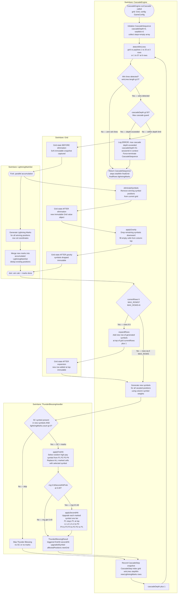

# Activity Diagram — Cascade Elimination Loop

> 來源：EDD.md §4.5.10 Cascade Chain Elimination, §5.1 SlotEngine Algorithm step 3; ARCH.md §3.3

```mermaid
flowchart TD
    subgraph CascadeEngine["Swimlane: CascadeEngine"]
        CE_Start([CascadeEngine.runCascade called\ngrid: Grid, config: GameConfig])
        CE_Init[Initialize CascadeSequence\ncascadeDepth=0, totalWin=0\ncollect steps=empty array]
        CE_Eval[detectWinLines\ngrid vs paylines 1 to 25 at 3 rows\nor 1 to 57 at 6 rows]
        CE_HasWins{Win lines detected?\nwinLines.length gt 0?}
        CE_MaxDepth{cascadeDepth gt 50?\nMax cascade guard}
        CE_LogError[Log ERROR: max cascade depth exceeded\ncascadeDepth=51 sessionId in context\nForce-terminate CascadeSequence]
        CE_RecordStep[Record CascadeStep snapshot\nCascadeStep index grid winLines stepWin\nnewLightningMarks rows]
        CE_Eliminate[eliminateSymbols\nRemove winning symbol positions\nfrom current grid]
        CE_Gravity[applyGravity\nDrop remaining symbols downward\nfill empty cells from column top]
        CE_RowCheck{currentRows lt MAX_ROWS?\nMAX_ROWS=6}
        CE_ExpandRow[expandRows\nAdd new row of generated symbols\nat top of grid currentRows plus 1]
        CE_FillVacant[Generate new symbols\nfor all vacated positions\nusing column symbol weights]
        CE_IncrDepth[cascadeDepth plus 1]
        CE_Return([Return CascadeSequence\nsteps totalWin finalGrid\nfinalRows lightningMarks])
    end

    subgraph Grid["Swimlane: Grid"]
        G_BeforeElim[Grid state BEFORE elimination\n5xN immutable snapshot captured]
        G_AfterElim[Grid state AFTER elimination\nnew immutable Grid value object]
        G_AfterGrav[Grid state AFTER gravity\nsymbols dropped immutable]
        G_AfterExpand[Grid state AFTER expansion\nnew row added at top immutable]
    end

    subgraph LightningMarkSet["Swimlane: LightningMarkSet"]
        LM_Fork{{"Fork: parallel accumulation"}}
        LM_Record[Generate Lightning Marks\nfor all winning positions\nrow col coordinates]
        LM_Merge[Merge new marks into\naccumulated LightningMarkSet\ndedup existing positions]
        LM_Join{{"Join: win calc + marks done"}}
    end

    subgraph ThunderBlessingHandler["Swimlane: ThunderBlessingHandler"]
        TBH_Check{SC symbol present\nin new symbols AND\nlightningMarks.count gt 0?}
        TBH_Skip[Skip Thunder Blessing\nno SC or no marks]
        TBH_First[applyFirstHit\nSelect random high-pay symbol from P1 P2 P3 P4\nReplace ALL marked cells with selected symbol]
        TBH_SecondChance{rng lt tbSecondHitProb\nat 0.40?}
        TBH_Second[applySecondHit\nUpgrade each marked symbol one tier\nP1 stays P1 at top\nL1 L2 L3 L4 to P4\nP4 to P3 P3 to P2 P2 to P1]
        TBH_Done[ThunderBlessingResult\ntriggered firstHit secondHit\nupgradedSymbol affectedPositions newGrid]
    end

    %% ─── Flow ─────────────────────────────────────────────────────────────────

    CE_Start --> CE_Init
    CE_Init --> CE_Eval

    CE_Eval --> CE_HasWins
    CE_HasWins -->|No — zero win lines| CE_Return
    CE_HasWins -->|Yes — wins detected| CE_MaxDepth

    CE_MaxDepth -->|Yes — depth exceeded| CE_LogError
    CE_LogError --> CE_Return

    CE_MaxDepth -->|No — within depth limit| G_BeforeElim
    G_BeforeElim --> LM_Fork

    LM_Fork --> LM_Record
    LM_Fork --> CE_Eliminate

    LM_Record --> LM_Merge
    CE_Eliminate --> G_AfterElim
    G_AfterElim --> CE_Gravity
    CE_Gravity --> G_AfterGrav
    LM_Merge --> LM_Join
    G_AfterGrav --> LM_Join

    LM_Join --> CE_RowCheck
    CE_RowCheck -->|Yes — rows lt 6| CE_ExpandRow
    CE_RowCheck -->|No — rows eq 6 MAX_ROWS| CE_FillVacant

    CE_ExpandRow --> G_AfterExpand
    G_AfterExpand --> CE_FillVacant
    CE_FillVacant --> TBH_Check

    TBH_Check -->|No — skip| TBH_Skip
    TBH_Check -->|Yes — SC + marks| TBH_First
    TBH_First --> TBH_SecondChance
    TBH_SecondChance -->|No — rng gte 0.40| TBH_Done
    TBH_SecondChance -->|Yes — rng lt 0.40| TBH_Second
    TBH_Second --> TBH_Done
    TBH_Skip --> CE_RecordStep
    TBH_Done --> CE_RecordStep

    CE_RecordStep --> CE_IncrDepth
    CE_IncrDepth --> CE_Eval
```
