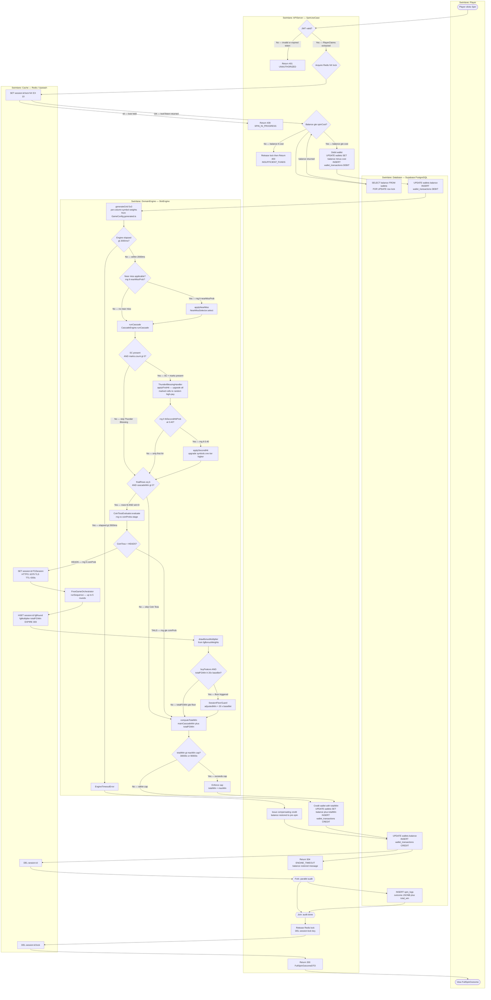

# Activity Diagram — Full Spin Processing

> 來源：EDD.md §4.5.9 Activity Diagram Full Spin Flow, §5.1 SlotEngine Algorithm; ARCH.md §3.4 Data Flow

```mermaid
flowchart TD
    subgraph Player["Swimlane: Player"]
        P_Start([Player clicks Spin])
        P_End([View FullSpinOutcome])
    end

    subgraph APIServer["Swimlane: APIServer — SpinUseCase"]
        S_JWT{JWT valid?}
        S_JWT_Fail[Return 401 UNAUTHORIZED]
        S_Lock{Acquire Redis NX lock}
        S_Lock_Fail[Return 409 SPIN_IN_PROGRESS]
        S_Balance{Balance gte spinCost?}
        S_Balance_Fail[Release lock then Return 400 INSUFFICIENT_FUNDS]
        S_Debit[Debit wallet\nUPDATE wallets SET balance minus cost\nINSERT wallet_transactions DEBIT]
        S_Credit[Credit wallet with totalWin\nUPDATE wallets SET balance plus totalWin\nINSERT wallet_transactions CREDIT]
        S_AuditFork{{"Fork: parallel audit"}}
        S_AuditJoin{{"Join: audit done"}}
        S_ReleaseLock[Release Redis lock\nDEL session:lock key]
        S_Return200[Return 200 FullSpinOutcomeDTO]
        S_Compensate[Issue compensating credit\nbalance restored to pre-spin]
        S_Return504[Return 504 ENGINE_TIMEOUT\nbalance restored message]
    end

    subgraph DomainEngine["Swimlane: DomainEngine — SlotEngine"]
        E_GenerateGrid[generateGrid 5x3\nper-column symbol weights\nfrom GameConfig.generated.ts]
        E_NearMiss{Near miss applicable?\nrng lt nearMissProb?}
        E_ApplyNearMiss[applyNearMiss\nNearMissSelector.select]
        E_Cascade[runCascade\nCascadeEngine.runCascade]
        E_TB{SC present\nAND marks.count gt 0?}
        E_TB1[ThunderBlessingHandler\napplyFirstHit — upgrade all\nmarked cells to random high-pay]
        E_TB2{rng lt tbSecondHitProb\nat 0.40?}
        E_TB2_Apply[applySecondHit\nupgrade symbols one tier higher]
        E_CoinCondition{finalRows eq 6\nAND cascadeWin gt 0?}
        E_CoinToss[CoinTossEvaluator.evaluate\nrng vs coinProbs-stage]
        E_Heads{CoinToss = HEADS?}
        E_RunFG[FreeGameOrchestrator\nrunSequence — up to 5 rounds]
        E_DrawBonus[drawBonusMultiplier\nfrom fgBonusWeights]
        E_Floor{buyFeature AND\ntotalFGWin lt 20x baseBet?}
        E_ApplyFloor[SessionFloorGuard\nadjustedWin = 20 x baseBet]
        E_ComputeWin[computeTotalWin\nmainCascadeWin plus totalFGWin]
        E_MaxWin{totalWin gt maxWin cap?\n30000x or 90000x}
        E_CapWin[Enforce cap\ntotalWin = maxWin]
        E_Timeout{Engine elapsed\ngt 2000ms?}
        E_EngineError[EngineTimeoutError]
    end

    subgraph Database["Swimlane: Database — Supabase PostgreSQL"]
        DB_ReadBalance[SELECT balance FROM wallets\nFOR UPDATE row lock]
        DB_WriteDebit[UPDATE wallets balance\nINSERT wallet_transactions DEBIT]
        DB_WriteCredit[UPDATE wallets balance\nINSERT wallet_transactions CREDIT]
        DB_WriteLog[INSERT spin_logs\noutcome JSONB plus total_win]
    end

    subgraph Cache["Swimlane: Cache — Redis / Upstash"]
        RC_Lock[SET session:id:lock NX EX 10]
        RC_FGStore[SET session:id FGSession\nHTTPS :6379 TLS TTL=300s]
        RC_FGUpdate[HSET session:id fgRound fgMultiplier totalFGWin EXPIRE 300]
        RC_DelFG[DEL session:id]
        RC_RelLock[DEL session:id:lock]
    end

    %% ─── Flow ─────────────────────────────────────────────────────────────────

    P_Start --> S_JWT

    S_JWT -->|No — invalid or expired token| S_JWT_Fail
    S_JWT -->|Yes — PlayerClaims extracted| S_Lock

    S_Lock --> RC_Lock
    RC_Lock -->|nil — lock held| S_Lock_Fail
    RC_Lock -->|OK — lockToken returned| S_Balance

    S_Balance --> DB_ReadBalance
    DB_ReadBalance -->|balance returned| S_Balance
    S_Balance -->|No — balance lt cost| S_Balance_Fail
    S_Balance -->|Yes — balance gte cost| S_Debit

    S_Debit --> DB_WriteDebit
    DB_WriteDebit --> E_GenerateGrid

    E_Timeout -->|No — within 2000ms| E_NearMiss
    E_GenerateGrid --> E_Timeout
    E_Timeout -->|Yes — elapsed gt 2000ms| E_EngineError
    E_EngineError --> S_Compensate
    S_Compensate --> DB_WriteCredit
    DB_WriteCredit --> S_Return504

    E_NearMiss -->|Yes — rng lt nearMissProb| E_ApplyNearMiss
    E_NearMiss -->|No — no near miss| E_Cascade
    E_ApplyNearMiss --> E_Cascade

    E_Cascade --> E_TB

    E_TB -->|Yes — SC + marks present| E_TB1
    E_TB -->|No — skip Thunder Blessing| E_CoinCondition
    E_TB1 --> E_TB2
    E_TB2 -->|Yes — rng lt 0.40| E_TB2_Apply
    E_TB2 -->|No — only first hit| E_CoinCondition
    E_TB2_Apply --> E_CoinCondition

    E_CoinCondition -->|Yes — rows=6 AND win>0| E_CoinToss
    E_CoinCondition -->|No — skip Coin Toss| E_ComputeWin

    E_CoinToss --> E_Heads
    E_Heads -->|TAILS — rng gte coinProb| E_ComputeWin
    E_Heads -->|HEADS — rng lt coinProb| RC_FGStore
    RC_FGStore --> E_RunFG

    E_RunFG --> RC_FGUpdate
    RC_FGUpdate --> E_DrawBonus

    E_DrawBonus --> E_Floor
    E_Floor -->|Yes — floor triggered| E_ApplyFloor
    E_Floor -->|No — totalFGWin gte floor| E_ComputeWin
    E_ApplyFloor --> E_ComputeWin

    E_ComputeWin --> E_MaxWin
    E_MaxWin -->|Yes — exceeds cap| E_CapWin
    E_MaxWin -->|No — within cap| S_Credit
    E_CapWin --> S_Credit

    S_Credit --> DB_WriteCredit
    DB_WriteCredit --> RC_DelFG
    RC_DelFG --> S_AuditFork

    S_AuditFork --> DB_WriteLog
    S_AuditFork --> S_AuditJoin
    DB_WriteLog --> S_AuditJoin

    S_AuditJoin --> S_ReleaseLock
    S_ReleaseLock --> RC_RelLock
    RC_RelLock --> S_Return200
    S_Return200 --> P_End
```
