# Activity Diagram — Excel Toolchain Build Activity

> 來源：EDD.md §4.5.11 Activity Diagram Toolchain Execution, §1.1 Key Constraints, §5.4 Toolchain Integration; ARCH.md §3.2 Container Diagram Toolchain

```mermaid
flowchart TD
    subgraph GameDesigner["Swimlane: Game Designer"]
        GD_Start([Game Designer edits Thunder_Config.xlsx])
        GD_EditData[Edit DATA tab\nAdjust symbol weights payouts\ncoinToss probabilities fgBonusWeights]
        GD_EditCoinToss[Edit COIN_TOSS tab\ncoinProbs: 0.80 0.68 0.56 0.48 0.40]
        GD_EditBetRange[Edit BET_RANGE tab\nUSD levels TWD levels max=320]
        GD_EditNearMiss[Edit NEAR_MISS tab\nnearMissProb targetSymbol]
        GD_SaveExcel[Save Thunder_Config.xlsx\ncommit to repository]
        GD_ReviewOutput[Review DESIGN_VIEW tab\nRTP distribution charts\nVerify green indicators]
        GD_Done([Design complete — deploy config])
    end

    subgraph CISystem["Swimlane: CI System — GitHub Actions"]
        CI_Trigger([CI triggered on push to config branch])
        CI_Checkout[Checkout repository\nInstall Node.js 20 dependencies]
        CI_RunBuild[Run: node build_config.js]
        CI_CheckJSON{engine_config.json\ngenerated OK?}
        CI_RunSim[Run: node excel_simulator.js\n1M Monte Carlo simulations\nper scenario]
        CI_SimStatus{Simulation\ncompleted OK?}
        CI_RunVerify[Run: node verify.js\nValidate 4 RTP scenarios]
        CI_VerifyPass{verify.js\nall 4 scenarios PASS?}
        CI_AbortCI[ABORT CI pipeline\nUpload error report as artifact\nNotify game designer\nDO NOT run engine_generator.js]
        CI_RunGen[Run: node engine_generator.js]
        CI_ChecksumGuard[CI SHA-256 checksum guard\nVerify GameConfig.generated.ts\nnot manually modified]
        CI_ChecksumOK{Checksum\nmatches expected?}
        CI_DeployConfig[Deploy GameConfig.generated.ts\nand BetRangeConfig.generated.ts\nto Kubernetes config volume]
        CI_Success([CI pipeline GREEN])
        CI_Fail([CI pipeline FAILED — alert team])
    end

    subgraph Toolchain["Swimlane: slot-engine Toolchain"]
        TC_ParseExcel[build_config.js\nParse Excel DATA COIN_TOSS BET_RANGE NEAR_MISS tabs\nusing xlsx or exceljs library]
        TC_EmitJSON[Emit engine_config.json\nwith all probability parameters]
        TC_RunMonteCarlo[excel_simulator.js\nRun 1M spins per scenario:\nMain Game EB BuyFG EB+BuyFG]
        TC_WriteSimTabs[Write SIMULATION tab\nand DESIGN_VIEW tab\nback to Thunder_Config.xlsx]
        TC_Verify_Scenario1{Scenario 1: Main Game\nRTP within 97.5 plus-minus 1%?}
        TC_Verify_Scenario2{Scenario 2: Extra Bet\nRTP within 97.5 plus-minus 1%?}
        TC_Verify_Scenario3{Scenario 3: Buy FG\nRTP within 97.5 plus-minus 1%?}
        TC_Verify_Scenario4{Scenario 4: EB+BuyFG\nRTP within 97.5 plus-minus 1%?}
        TC_FailReport[Generate error report\nscenario name actual RTP expected RTP deviation\nexit code 1]
        TC_PassSignal[All 4 scenarios PASS\nexit code 0]
        TC_GenerateTS[engine_generator.js\nGenerate GameConfig.generated.ts\nGenerate BetRangeConfig.generated.ts\nNEVER touch manually]
    end

    subgraph GameConfig["Swimlane: GameConfig"]
        GC_Store[GameConfig.generated.ts\nread-only at runtime\nloaded at server startup\nassertValidGameConfig called]
        GC_Serve[Injected into SlotEngine\nvia DI container\nall probability params active]
        GC_Done([Config live in production])
    end

    %% ─── Flow ─────────────────────────────────────────────────────────────────

    GD_Start --> GD_EditData
    GD_EditData --> GD_EditCoinToss
    GD_EditCoinToss --> GD_EditBetRange
    GD_EditBetRange --> GD_EditNearMiss
    GD_EditNearMiss --> GD_SaveExcel

    GD_SaveExcel --> CI_Trigger

    CI_Trigger --> CI_Checkout
    CI_Checkout --> CI_RunBuild
    CI_RunBuild --> TC_ParseExcel

    TC_ParseExcel --> TC_EmitJSON
    TC_EmitJSON --> CI_CheckJSON
    CI_CheckJSON -->|No — parse error| CI_AbortCI
    CI_CheckJSON -->|Yes — engine_config.json OK| CI_RunSim

    CI_RunSim --> TC_RunMonteCarlo
    TC_RunMonteCarlo --> TC_WriteSimTabs
    TC_WriteSimTabs --> CI_SimStatus
    CI_SimStatus -->|No — simulation error| CI_AbortCI
    CI_SimStatus -->|Yes — 4M spins complete| CI_RunVerify

    CI_RunVerify --> TC_Verify_Scenario1
    TC_Verify_Scenario1 -->|No — Main RTP out of range| TC_FailReport
    TC_Verify_Scenario1 -->|Yes — Main RTP within 97.5 plus-minus 1%| TC_Verify_Scenario2
    TC_Verify_Scenario2 -->|No — EB RTP out of range| TC_FailReport
    TC_Verify_Scenario2 -->|Yes — EB RTP within range| TC_Verify_Scenario3
    TC_Verify_Scenario3 -->|No — BuyFG RTP out of range| TC_FailReport
    TC_Verify_Scenario3 -->|Yes — BuyFG RTP within range| TC_Verify_Scenario4
    TC_Verify_Scenario4 -->|No — EB+BuyFG RTP out of range| TC_FailReport
    TC_Verify_Scenario4 -->|Yes — all 4 scenarios green| TC_PassSignal

    TC_FailReport --> CI_AbortCI
    CI_AbortCI --> CI_Fail

    TC_PassSignal --> CI_VerifyPass
    CI_VerifyPass -->|PASS — proceed to generation| CI_RunGen
    CI_VerifyPass -->|FAIL — guard catches it| CI_AbortCI

    CI_RunGen --> TC_GenerateTS
    TC_GenerateTS --> CI_ChecksumGuard
    CI_ChecksumGuard --> CI_ChecksumOK
    CI_ChecksumOK -->|No — manual edits detected| CI_AbortCI
    CI_ChecksumOK -->|Yes — generated file is clean| CI_DeployConfig

    CI_DeployConfig --> GC_Store
    GC_Store --> GC_Serve
    GC_Serve --> CI_Success
    CI_Success --> GD_ReviewOutput
    GD_ReviewOutput --> GD_Done
    GC_Serve --> GC_Done
```

