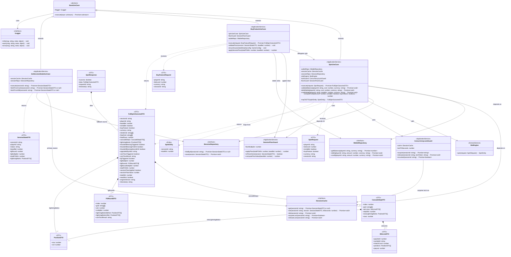

# Class Diagram — Application Layer

> 來源：EDD.md §4.1 Module Map, §4.5.2; ARCH.md §3.3 Component Inventory

```mermaid
classDiagram
    %% ─── Command / Request DTOs ───────────────────────────────────────────────

    class SpinRequest {
        <<DTO>>
        +playerId: string
        +betLevel: number
        +extraBet: boolean
        +buyFeature: boolean
        +currency: string
        +sessionId: string
    }

    class BuyFeatureRequest {
        <<DTO>>
        +playerId: string
        +betLevel: number
        +currency: string
        +sessionId: string
    }

    class SpinResponse {
        <<DTO>>
        +success: boolean
        +data: FullSpinOutcomeDTO
        +requestId: string
        +timestamp: string
    }

    class FullSpinOutcomeDTO {
        <<DTO>>
        +sessionId: string
        +playerId: string
        +baseBet: number
        +extraBet: boolean
        +buyFeature: boolean
        +currency: string
        +initialGrid: string[][]
        +finalGrid: string[][]
        +finalRows: number
        +cascadeSteps: CascadeStepDTO[]
        +lightningMarks: PositionDTO[]
        +thunderBlessingTriggered: boolean
        +thunderBlessingFirstHit: boolean
        +thunderBlessingSecondHit: boolean
        +upgradedSymbol: string
        +coinTossTriggered: boolean
        +coinTossResult: string
        +fgTriggered: boolean
        +fgMultiplier: number
        +fgRounds: FGRoundDTO[]
        +fgBonusMultiplier: number
        +totalFGWin: number
        +sessionFloorApplied: boolean
        +sessionFloorValue: number
        +totalWin: number
        +nearMiss: boolean
        +engineVersion: string
        +timestamp: string
    }

    class CascadeStepDTO {
        <<DTO>>
        +index: number
        +grid: string[][]
        +winLines: WinLineDTO[]
        +stepWin: number
        +newLightningMarks: PositionDTO[]
        +rows: number
    }

    class WinLineDTO {
        <<DTO>>
        +paylineId: number
        +symbolId: string
        +matchCount: number
        +positions: PositionDTO[]
        +payout: number
    }

    class PositionDTO {
        <<DTO>>
        +row: number
        +col: number
    }

    class FGRoundDTO {
        <<DTO>>
        +index: number
        +grid: string[][]
        +win: number
        +multiplier: number
        +lightningMarksBefore: PositionDTO[]
        +lightningMarksAfter: PositionDTO[]
        +coinTossResult: string
    }

    class SessionStateDTO {
        <<DTO>>
        +sessionId: string
        +playerId: string
        +status: string
        +baseBet: number
        +fgRound: number
        +fgMultiplier: number
        +totalFGWin: number
        +lightningMarks: PositionDTO[]
    }

    %% ─── Port Interfaces (defined in Domain, used in Application) ────────────

    class IWalletRepository {
        <<interface>>
        +getBalance(playerId: string, currency: string): Promise~number~
        +debit(playerId: string, amount: number, currency: string): Promise~void~
        +credit(playerId: string, amount: number, currency: string): Promise~void~
    }

    class ISessionRepository {
        <<interface>>
        +findById(sessionId: string): Promise~SessionStateDTO or null~
        +save(session: SessionStateDTO): Promise~void~
    }

    class ISessionCache {
        <<interface>>
        +get(sessionId: string): Promise~SessionStateDTO or null~
        +set(sessionId: string, session: SessionStateDTO, ttlSeconds: number): Promise~void~
        +del(sessionId: string): Promise~void~
        +acquireLock(sessionId: string): Promise~boolean~
        +releaseLock(sessionId: string): Promise~void~
    }

    %% ─── Guards ───────────────────────────────────────────────────────────────

    class SessionFloorGuard {
        <<ApplicationService>>
        -floorMultiplier: number
        +applyFloor(totalFGWin: number, baseBet: number): number
        +isFloorActive(session: SessionStateDTO): boolean
        +computeFloorValue(baseBet: number): number
    }

    class ConcurrencyLockGuard {
        <<ApplicationService>>
        -cache: ISessionCache
        -lockTtlSeconds: number
        +acquire(sessionId: string): Promise~string~
        +release(sessionId: string, lockToken: string): Promise~void~
        +isLocked(sessionId: string): Promise~boolean~
    }

    %% ─── Use Cases ────────────────────────────────────────────────────────────

    class BaseUseCase {
        <<abstract>>
        #logger: ILogger
        +execute(input: unknown): Promise~unknown~
    }

    class ILogger {
        <<interface>>
        +info(msg: string, meta: object): void
        +warn(msg: string, meta: object): void
        +error(msg: string, meta: object): void
    }

    class SpinUseCase {
        <<ApplicationService>>
        -walletRepo: IWalletRepository
        -sessionCache: ISessionCache
        -sessionRepo: ISessionRepository
        -slotEngine: SlotEngine
        -lockGuard: ConcurrencyLockGuard
        -floorGuard: SessionFloorGuard
        +execute(request: SpinRequest): Promise~FullSpinOutcomeDTO~
        -validateBalance(playerId: string, cost: number, currency: string): Promise~void~
        -debitWallet(playerId: string, cost: number, currency: string): Promise~void~
        -creditWallet(playerId: string, totalWin: number, currency: string): Promise~void~
        -computeCost(betLevel: number, extraBet: boolean, buyFeature: boolean): number
        -mapToDTO(spinEntity: SpinEntity): FullSpinOutcomeDTO
    }

    class BuyFeatureUseCase {
        <<ApplicationService>>
        -spinUseCase: SpinUseCase
        -floorGuard: SessionFloorGuard
        -walletRepo: IWalletRepository
        +execute(request: BuyFeatureRequest): Promise~FullSpinOutcomeDTO~
        -validateFloor(session: SessionStateDTO, baseBet: number): void
        -ensureGuaranteedHeads(config: GameConfig): void
        -applySessionFloor(totalFGWin: number, baseBet: number): number
    }

    class GetSessionStateUseCase {
        <<ApplicationService>>
        -sessionCache: ISessionCache
        -sessionRepo: ISessionRepository
        +execute(sessionId: string): Promise~SessionStateDTO~
        -fetchFromCache(sessionId: string): Promise~SessionStateDTO or null~
        -fetchFromDB(sessionId: string): Promise~SessionStateDTO or null~
    }

    %% ─── External Domain Service Reference (for clarity) ─────────────────────

    class SlotEngine {
        <<DomainService>>
        +spin(request: SpinRequest): SpinEntity
    }

    class SpinEntity {
        <<Entity>>
        +sessionId: string
        +totalWin: number
    }

    %% ─── Relationships ────────────────────────────────────────────────────────

    BaseUseCase <|-- SpinUseCase : extends
    BaseUseCase <|-- BuyFeatureUseCase : extends
    BaseUseCase <|-- GetSessionStateUseCase : extends
    BaseUseCase --> ILogger : uses

    SpinUseCase --> IWalletRepository : depends on
    SpinUseCase --> ISessionCache : depends on
    SpinUseCase --> ISessionRepository : depends on
    SpinUseCase --> SlotEngine : calls
    SpinUseCase --> ConcurrencyLockGuard : uses
    SpinUseCase --> SessionFloorGuard : uses
    SpinUseCase ..> SpinRequest : receives
    SpinUseCase ..> FullSpinOutcomeDTO : returns
    SpinUseCase ..> SpinEntity : maps from

    BuyFeatureUseCase --> SpinUseCase : delegates spin
    BuyFeatureUseCase --> SessionFloorGuard : applies floor
    BuyFeatureUseCase --> IWalletRepository : debits 100x
    BuyFeatureUseCase ..> BuyFeatureRequest : receives
    BuyFeatureUseCase ..> FullSpinOutcomeDTO : returns

    GetSessionStateUseCase --> ISessionCache : primary source
    GetSessionStateUseCase --> ISessionRepository : fallback source
    GetSessionStateUseCase ..> SessionStateDTO : returns

    ConcurrencyLockGuard --> ISessionCache : acquires lock via

    FullSpinOutcomeDTO *-- "0..*" CascadeStepDTO : cascadeSteps
    FullSpinOutcomeDTO *-- "0..*" FGRoundDTO : fgRounds
    FullSpinOutcomeDTO *-- "0..*" PositionDTO : lightningMarks
    CascadeStepDTO *-- "0..*" WinLineDTO : winLines
    CascadeStepDTO *-- "0..*" PositionDTO : newLightningMarks
    SpinResponse *-- "1" FullSpinOutcomeDTO : data
```
