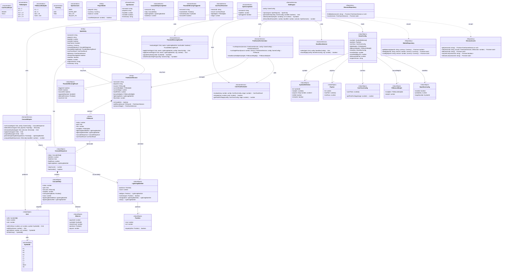

# Class Diagram — Domain Layer

> 來源：EDD.md §3 Domain Model, §4.5.2 Class Diagram, §5 Game Engine Design; ARCH.md §3

```mermaid
classDiagram
    %% ─── Enums ───────────────────────────────────────────────────────────────

    class SymbolId {
        <<enumeration>>
        P1
        P2
        P3
        P4
        L1
        L2
        L3
        L4
        WILD
        SC
    }

    class CoinTossResult {
        <<enumeration>>
        HEADS
        TAILS
    }

    class FGMultiplier {
        <<enumeration>>
        X3 = 3
        X7 = 7
        X17 = 17
        X27 = 27
        X77 = 77
    }

    class FGBonusMultiplier {
        <<enumeration>>
        X1 = 1
        X5 = 5
        X20 = 20
        X100 = 100
    }

    class Currency {
        <<enumeration>>
        USD
        TWD
    }

    class SpinScenario {
        <<enumeration>>
        MAIN
        EXTRA_BET
        BUY_FG
        EB_BUY_FG
    }

    %% ─── Value Objects ────────────────────────────────────────────────────────

    class Position {
        <<ValueObject>>
        +row: number
        +col: number
        +equals(other: Position): boolean
    }

    class Grid {
        <<ValueObject>>
        +cells: SymbolId[][]
        +rows: number
        +cols: number
        +withCell(row: number, col: number, symbol: SymbolId): Grid
        +withRows(rows: number): Grid
        +getCell(row: number, col: number): SymbolId
        +toFlatArray(): SymbolId[]
    }

    class WinLine {
        <<ValueObject>>
        +paylineId: number
        +symbolId: SymbolId
        +matchCount: number
        +positions: Position[]
        +payout: number
    }

    class LightningMarkSet {
        <<ValueObject>>
        +positions: Position[]
        +count: number
        +add(pos: Position): LightningMarkSet
        +contains(pos: Position): boolean
        +merge(other: LightningMarkSet): LightningMarkSet
        +clear(): LightningMarkSet
    }

    class CascadeStep {
        <<ValueObject>>
        +index: number
        +grid: Grid
        +winLines: WinLine[]
        +stepWin: number
        +newLightningMarks: Position[]
        +rows: number
        +lightningMarksBefore: LightningMarkSet
        +lightningMarksAfter: LightningMarkSet
    }

    class CascadeSequence {
        <<ValueObject>>
        +steps: CascadeStep[]
        +totalWin: number
        +finalGrid: Grid
        +finalRows: number
        +lightningMarks: LightningMarkSet
        +stepCount(): number
        +hasScatter(): boolean
    }

    class ThunderBlessingResult {
        <<ValueObject>>
        +triggered: boolean
        +firstHit: boolean
        +secondHit: boolean
        +upgradedSymbol: SymbolId
        +affectedPositions: Position[]
        +newGrid: Grid
    }

    class CoinTossConfig {
        <<ValueObject>>
        +coinProbs: number[]
        +getProbForStage(stage: number): number
    }

    class NearMissConfig {
        <<ValueObject>>
        +enabled: boolean
        +probability: number
        +targetSymbol: SymbolId
    }

    class FGBonusWeight {
        <<ValueObject>>
        +multiplier: FGBonusMultiplier
        +weight: number
    }

    class SymbolDefinition {
        <<ValueObject>>
        +id: SymbolId
        +weights: number[]
        +payouts: Map~number, number~
        +isWild: boolean
        +isScatter: boolean
    }

    class Payline {
        <<ValueObject>>
        +id: number
        +rowPath: number[]
        +minRows: number
    }

    class GameConfig {
        <<ValueObject>>
        +symbols: SymbolDefinition[]
        +paylines: Payline[]
        +coinToss: CoinTossConfig
        +fgMultipliers: FGMultiplier[]
        +fgBonusWeights: FGBonusWeight[]
        +nearMiss: NearMissConfig
        +maxWinMain: number
        +maxWinEBBuyFG: number
        +tbSecondHitProb: number
        +engineVersion: string
    }

    %% ─── Entities ─────────────────────────────────────────────────────────────

    class FGRound {
        <<Entity>>
        +index: number
        +grid: Grid
        +win: number
        +multiplier: FGMultiplier
        +lightningMarksBefore: LightningMarkSet
        +lightningMarksAfter: LightningMarkSet
        +cascadeSequence: CascadeSequence
        +coinTossResult: CoinTossResult
    }

    class FreeGameSession {
        <<Entity>>
        +sessionId: string
        +playerId: string
        +rounds: FGRound[]
        +currentMultiplier: FGMultiplier
        +currentStage: number
        +totalFGWin: number
        +bonusMultiplier: FGBonusMultiplier
        +lightningMarks: LightningMarkSet
        +floorValue: number
        +isComplete(): boolean
        +addRound(round: FGRound): FreeGameSession
        +advanceStage(): FreeGameSession
    }

    class SpinEntity {
        <<Entity>>
        +sessionId: string
        +playerId: string
        +baseBet: number
        +extraBet: boolean
        +buyFeature: boolean
        +currency: Currency
        +cascadeSequence: CascadeSequence
        +thunderBlessingResult: ThunderBlessingResult
        +coinTossResult: CoinTossResult
        +fgSession: FreeGameSession
        +sessionFloorApplied: boolean
        +nearMiss: boolean
        +totalWin: number
        +engineVersion: string
        +timestamp: string
    }

    class PlayerWallet {
        <<Entity>>
        +playerId: string
        +currency: Currency
        +balance: number
        +canAfford(amount: number): boolean
    }

    %% ─── Domain Events ────────────────────────────────────────────────────────

    class SpinStarted {
        <<DomainEvent>>
        +sessionId: string
        +playerId: string
        +baseBet: number
        +extraBet: boolean
        +timestamp: string
    }

    class CascadeStepCompleted {
        <<DomainEvent>>
        +sessionId: string
        +step: CascadeStep
        +lightningMarks: LightningMarkSet
        +newRows: number
    }

    class ThunderBlessingTriggered {
        <<DomainEvent>>
        +sessionId: string
        +markedCells: Position[]
        +selectedSymbol: SymbolId
        +secondHit: boolean
    }

    class CoinTossResolved {
        <<DomainEvent>>
        +sessionId: string
        +result: CoinTossResult
        +fgMultiplier: FGMultiplier
        +stage: number
    }

    class SpinCompleted {
        <<DomainEvent>>
        +sessionId: string
        +totalWin: number
        +fgTriggered: boolean
    }

    %% ─── Domain Services ──────────────────────────────────────────────────────

    class SlotEngine {
        <<DomainService>>
        -config: GameConfig
        +spin(request: SpinRequest): SpinEntity
        +generateGrid(config: GameConfig, extraBet: boolean): Grid
        -selectSymbols(weights: number[], col: number): SymbolId
        -enforceMaxWin(rawWin: number, baseBet: number, scenario: SpinScenario): number
    }

    class CascadeEngine {
        <<DomainService>>
        +runCascade(grid: Grid, config: GameConfig): CascadeSequence
        +detectWinLines(grid: Grid, paylines: Payline[]): WinLine[]
        +eliminateSymbols(grid: Grid, winLines: WinLine[]): Grid
        +applyGravity(grid: Grid): Grid
        +expandRows(grid: Grid): Grid
        -generateLightningMarks(positions: Position[]): LightningMarkSet
        -computeStepWin(winLines: WinLine[], baseBet: number): number
    }

    class ThunderBlessingHandler {
        <<DomainService>>
        +evaluate(grid: Grid, marks: LightningMarkSet, hasScatter: boolean): ThunderBlessingResult
        +applyFirstHit(grid: Grid, marks: LightningMarkSet, config: GameConfig): Grid
        +applySecondHit(grid: Grid, marks: LightningMarkSet, rng: number): Grid
        -upgradeSymbol(symbol: SymbolId): SymbolId
        -selectRandomHighPay(config: GameConfig): SymbolId
    }

    class CoinTossEvaluator {
        <<DomainService>>
        +evaluate(rng: number, config: CoinTossConfig, stage: number): CoinTossResult
        +isHeads(rng: number, prob: number): boolean
        +getProbForStage(config: CoinTossConfig, stage: number): number
    }

    class FreeGameOrchestrator {
        <<DomainService>>
        +runSequence(session: FreeGameSession, config: GameConfig): FreeGameSession
        +runSingleRound(round: number, session: FreeGameSession, config: GameConfig): FGRound
        +drawBonusMultiplier(weights: FGBonusWeight[]): FGBonusMultiplier
    }

    class NearMissSelector {
        <<DomainService>>
        +select(grid: Grid, config: NearMissConfig): Grid
        -shouldApply(config: NearMissConfig, rng: number): boolean
    }

    %% ─── Ports (Repository interfaces) ───────────────────────────────────────

    class IWalletRepository {
        <<Repository>>
        +getBalance(playerId: string, currency: Currency): Promise~number~
        +debit(playerId: string, amount: number, currency: Currency): Promise~void~
        +credit(playerId: string, amount: number, currency: Currency): Promise~void~
    }

    class ISessionRepository {
        <<Repository>>
        +findById(sessionId: string): Promise~FreeGameSession or null~
        +save(session: FreeGameSession): Promise~void~
    }

    class ISessionCache {
        <<Repository>>
        +get(sessionId: string): Promise~FreeGameSession or null~
        +set(sessionId: string, session: FreeGameSession, ttlSeconds: number): Promise~void~
        +del(sessionId: string): Promise~void~
        +acquireLock(sessionId: string): Promise~boolean~
        +releaseLock(sessionId: string): Promise~void~
    }

    %% ─── Relationships ────────────────────────────────────────────────────────

    %% Compositions
    CascadeSequence *-- "1..*" CascadeStep : contains
    FreeGameSession *-- "0..*" FGRound : contains

    %% Aggregations
    SpinEntity o-- "1" CascadeSequence : has
    SpinEntity o-- "0..1" FreeGameSession : may have
    SpinEntity o-- "0..1" ThunderBlessingResult : may have
    CascadeStep o-- "1" Grid : snapshot
    CascadeStep o-- "0..*" WinLine : detected
    FGRound o-- "1" CascadeSequence : fgCascade

    %% Value Object usage
    Grid --> "1..*" SymbolId : cells
    LightningMarkSet --> "0..*" Position : positions
    CascadeSequence --> "1" LightningMarkSet : accumulated
    FreeGameSession --> "1" LightningMarkSet : persisted
    GameConfig --> "1..*" SymbolDefinition : symbols
    GameConfig --> "1..*" Payline : paylines
    GameConfig --> "1" CoinTossConfig : coinToss
    GameConfig --> "1..*" FGBonusWeight : bonusWeights
    GameConfig --> "1" NearMissConfig : nearMiss

    %% Domain service dependencies
    SlotEngine --> CascadeEngine : uses
    SlotEngine --> ThunderBlessingHandler : uses
    SlotEngine --> CoinTossEvaluator : uses
    SlotEngine --> FreeGameOrchestrator : uses
    SlotEngine --> NearMissSelector : uses
    SlotEngine --> GameConfig : reads
    CascadeEngine --> Grid : produces
    CascadeEngine --> CascadeSequence : returns
    FreeGameOrchestrator --> FreeGameSession : manages
    FreeGameOrchestrator --> CoinTossEvaluator : calls

    %% Port dependencies
    SlotEngine ..> IWalletRepository : via port
    SlotEngine ..> ISessionCache : via port
```
