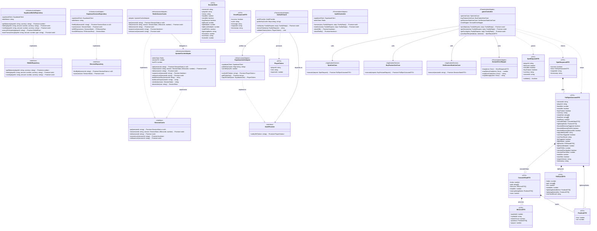

# Class Diagram — Infrastructure + Presentation Layer

> 來源：EDD.md §4.1 Module Map, §4.5.2, §6 API Design; ARCH.md §3.3 C4 L3 Component Diagram

```mermaid
classDiagram
    %% ─── Port Interfaces (from Domain Layer) ─────────────────────────────────

    class IWalletRepository {
        <<interface>>
        +getBalance(playerId: string, currency: string): Promise~number~
        +debit(playerId: string, amount: number, currency: string): Promise~void~
        +credit(playerId: string, amount: number, currency: string): Promise~void~
    }

    class ISessionRepository {
        <<interface>>
        +findById(sessionId: string): Promise~SessionState or null~
        +save(session: SessionState): Promise~void~
    }

    class ISessionCache {
        <<interface>>
        +get(sessionId: string): Promise~SessionState or null~
        +set(sessionId: string, session: SessionState, ttlSeconds: number): Promise~void~
        +del(sessionId: string): Promise~void~
        +acquireLock(sessionId: string): Promise~boolean~
        +releaseLock(sessionId: string): Promise~void~
    }

    class IAuthProvider {
        <<interface>>
        +verifyJWT(token: string): Promise~PlayerClaims~
    }

    %% ─── Infrastructure: Repository Implementations ───────────────────────────

    class SupabaseWalletRepository {
        <<InfrastructureAdapter>>
        -supabaseClient: SupabaseClient
        -tableName: string
        +getBalance(playerId: string, currency: string): Promise~number~
        +debit(playerId: string, amount: number, currency: string): Promise~void~
        +credit(playerId: string, amount: number, currency: string): Promise~void~
        -executeForUpdate(playerId: string): Promise~WalletRow~
        -insertTransaction(playerId: string, amount: number, type: string): Promise~void~
    }

    class SupabaseSessionRepository {
        <<InfrastructureAdapter>>
        -supabaseClient: SupabaseClient
        -tableName: string
        +findById(sessionId: string): Promise~SessionState or null~
        +save(session: SessionState): Promise~void~
        -toDBRow(session: SessionState): FGSessionRow
        -fromDBRow(row: FGSessionRow): SessionState
    }

    %% ─── Infrastructure: Cache Implementations ────────────────────────────────

    class UpstashCacheAdapter {
        <<InfrastructureAdapter>>
        -redisClient: Redis
        -sessionTtl: number
        -lockTtl: number
        +get(sessionId: string): Promise~SessionState or null~
        +set(sessionId: string, session: SessionState, ttlSeconds: number): Promise~void~
        +del(sessionId: string): Promise~void~
        +acquireLock(sessionId: string): Promise~boolean~
        +releaseLock(sessionId: string): Promise~void~
        -buildSessionKey(sessionId: string): string
        -buildLockKey(sessionId: string): string
        -serialize(session: SessionState): string
        -deserialize(raw: string): SessionState
    }

    class RedisSessionCache {
        <<InfrastructureAdapter>>
        -adapter: UpstashCacheAdapter
        +get(sessionId: string): Promise~SessionState or null~
        +set(sessionId: string, session: SessionState, ttlSeconds: number): Promise~void~
        +del(sessionId: string): Promise~void~
        +acquireLock(sessionId: string): Promise~boolean~
        +releaseLock(sessionId: string): Promise~void~
    }

    %% ─── Infrastructure: Auth ─────────────────────────────────────────────────

    class SupabaseAuthAdapter {
        <<InfrastructureAdapter>>
        -supabaseClient: SupabaseClient
        -publicKeyCache: Map~string, string~
        -cacheExpiryMs: number
        +verifyJWT(token: string): Promise~PlayerClaims~
        -getPublicKey(): Promise~string~
        -mapToClaims(user: SupabaseUser): PlayerClaims
    }

    class PlayerClaims {
        <<DTO>>
        +playerId: string
        +role: string
        +expiresAt: number
    }

    class SessionState {
        <<DTO>>
        +sessionId: string
        +playerId: string
        +status: string
        +baseBet: number
        +extraBet: boolean
        +buyFeature: boolean
        +fgRound: number
        +fgMultiplier: number
        +fgBonusMultiplier: number
        +totalFGWin: number
        +lightningMarks: string
        +floorValue: number
        +lockToken: string
        +lockedAt: number
    }

    %% ─── Presentation: DTOs ───────────────────────────────────────────────────

    class SpinRequestDTO {
        <<DTO>>
        +playerId: string
        +betLevel: number
        +extraBet: boolean
        +buyFeature: boolean
        +currency: string
        +sessionId: string
        +validate(): boolean
    }

    class SpinResponseDTO {
        <<DTO>>
        +success: boolean
        +data: FullSpinOutcomeDTO
        +requestId: string
        +timestamp: string
    }

    class FullSpinOutcomeDTO {
        <<DTO>>
        +sessionId: string
        +playerId: string
        +baseBet: number
        +extraBet: boolean
        +buyFeature: boolean
        +currency: string
        +initialGrid: string[][]
        +finalGrid: string[][]
        +finalRows: number
        +cascadeSteps: CascadeStepDTO[]
        +lightningMarks: PositionDTO[]
        +thunderBlessingTriggered: boolean
        +thunderBlessingFirstHit: boolean
        +thunderBlessingSecondHit: boolean
        +upgradedSymbol: string
        +coinTossTriggered: boolean
        +coinTossResult: string
        +fgTriggered: boolean
        +fgMultiplier: number
        +fgRounds: FGRoundDTO[]
        +fgBonusMultiplier: number
        +totalFGWin: number
        +sessionFloorApplied: boolean
        +sessionFloorValue: number
        +totalWin: number
        +nearMiss: boolean
        +engineVersion: string
        +timestamp: string
    }

    class FGRoundDTO {
        <<DTO>>
        +index: number
        +grid: string[][]
        +win: number
        +multiplier: number
        +lightningMarksBefore: PositionDTO[]
        +lightningMarksAfter: PositionDTO[]
        +coinTossResult: string
    }

    class ErrorResponseDTO {
        <<DTO>>
        +success: boolean
        +code: string
        +message: string
        +requestId: string
        +timestamp: string
    }

    class PositionDTO {
        <<DTO>>
        +row: number
        +col: number
    }

    class CascadeStepDTO {
        <<DTO>>
        +index: number
        +grid: string[][]
        +winLines: WinLineDTO[]
        +stepWin: number
        +newLightningMarks: PositionDTO[]
        +rows: number
    }

    class WinLineDTO {
        <<DTO>>
        +paylineId: number
        +symbolId: string
        +matchCount: number
        +positions: PositionDTO[]
        +payout: number
    }

    %% ─── Presentation: Controllers ────────────────────────────────────────────

    class gameController {
        <<PresentationAdapter>>
        -spinUseCase: SpinUseCase
        -buyFeatureUseCase: BuyFeatureUseCase
        -getSessionStateUseCase: GetSessionStateUseCase
        -errorMapper: DomainErrorMapper
        +postSpin(req: FastifyRequest, reply: FastifyReply): Promise~void~
        +getSession(req: FastifyRequest, reply: FastifyReply): Promise~void~
        +getConfig(req: FastifyRequest, reply: FastifyReply): Promise~void~
        -parseSpinRequest(body: unknown): SpinRequestDTO
    }

    class healthController {
        <<PresentationAdapter>>
        -supabaseClient: SupabaseClient
        -redisClient: Redis
        +liveness(req: FastifyRequest, reply: FastifyReply): Promise~void~
        +readiness(req: FastifyRequest, reply: FastifyReply): Promise~void~
        -checkDB(): Promise~boolean~
        -checkRedis(): Promise~boolean~
    }

    %% ─── Presentation: Auth Guard ─────────────────────────────────────────────

    class JwtAuthGuard {
        <<PresentationAdapter>>
        -authProvider: IAuthProvider
        -publicKeyCache: Map~string, string~
        +verify(req: FastifyRequest, reply: FastifyReply): Promise~void~
        -extractToken(req: FastifyRequest): string
        -validateClaims(claims: PlayerClaims): void
    }

    %% ─── Presentation: Error Mapper ───────────────────────────────────────────

    class DomainErrorMapper {
        <<PresentationAdapter>>
        +map(error: Error): ErrorResponseDTO
        -mapStatusCode(error: Error): number
        -mapErrorCode(error: Error): string
        -mapMessage(error: Error): string
    }

    %% ─── Use Case References (from Application Layer) ─────────────────────────

    class SpinUseCase {
        <<ApplicationService>>
        +execute(request: SpinRequest): Promise~FullSpinOutcomeDTO~
    }

    class BuyFeatureUseCase {
        <<ApplicationService>>
        +execute(request: BuyFeatureRequest): Promise~FullSpinOutcomeDTO~
    }

    class GetSessionStateUseCase {
        <<ApplicationService>>
        +execute(sessionId: string): Promise~SessionStateDTO~
    }

    %% ─── Relationships ────────────────────────────────────────────────────────

    %% Interface implementations
    SupabaseWalletRepository ..|> IWalletRepository : implements
    SupabaseSessionRepository ..|> ISessionRepository : implements
    RedisSessionCache ..|> ISessionCache : implements
    UpstashCacheAdapter ..|> ISessionCache : implements
    SupabaseAuthAdapter ..|> IAuthProvider : implements
    RedisSessionCache --> UpstashCacheAdapter : delegates to

    %% Controller dependencies
    gameController --> SpinUseCase : calls
    gameController --> BuyFeatureUseCase : calls
    gameController --> GetSessionStateUseCase : calls
    gameController --> DomainErrorMapper : uses
    gameController ..> SpinRequestDTO : parses
    gameController ..> SpinResponseDTO : returns
    gameController ..> FullSpinOutcomeDTO : wraps

    %% Auth
    JwtAuthGuard --> SupabaseAuthAdapter : verifies via
    JwtAuthGuard ..> PlayerClaims : produces

    %% DTO compositions
    SpinResponseDTO *-- "1" FullSpinOutcomeDTO : data
    FullSpinOutcomeDTO *-- "0..*" CascadeStepDTO : cascadeSteps
    FullSpinOutcomeDTO *-- "0..*" FGRoundDTO : fgRounds
    FullSpinOutcomeDTO *-- "0..*" PositionDTO : lightningMarks
    CascadeStepDTO *-- "0..*" WinLineDTO : winLines
    CascadeStepDTO *-- "0..*" PositionDTO : marks

    %% Infrastructure auth dependency
    JwtAuthGuard --> IAuthProvider : depends on
```
