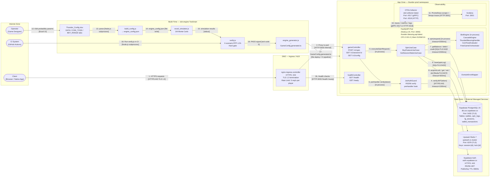

# Communication Diagram — Service-to-Service Communication

> 來源：EDD.md §4.5.7 Communication Diagram, §6 API Design; ARCH.md §3 Component Diagram, §5.1 Sync/Async Matrix, §9.2 Network Policy

```mermaid
flowchart LR
    %% External Actors
    Client(["Client\n(Browser / Native App)"])
    Operator(["Operator\n(Game Designer)"])
    CISystem(["CI System\n(GitHub Actions)"])

    %% Network Boundary: Internet → DMZ
    subgraph Internet["Internet Zone"]
        Client
        Operator
        CISystem
    end

    subgraph DMZ["DMZ — Ingress / ALB"]
        Ingress["nginx-ingress-controller\nHTTPS :443\nTLS 1.3 termination\nRate Limit: 5 req/s per player"]
    end

    subgraph AppZone["App Zone — thunder-prod namespace"]
        direction TB

        subgraph FastifyAPI["FastifyAPI Pod\n(Node.js 20, Port :3000)\nthunder-blessing-api:latest\nCPU 0.5/1.0 | Mem 512Mi/1Gi"]
            direction TB
            GC["gameController\nPOST /v1/spin\nGET /v1/session/:id\nGET /v1/config"]
            HC["healthController\nGET /health\nGET /ready"]
            JWG["JwtAuthGuard\nRS256 verify\npreHandler hook"]
            SU["SpinUseCase\nBuyFeatureUseCase\nGetSessionStateUseCase"]
            SE["SlotEngine (in-process)\nCascadeEngine\nThunderBlessingHandler\nCoinTossEvaluator\nFreeGameOrchestrator"]
            EM["DomainErrorMapper"]
        end

        subgraph ObsZone["Observability"]
            OTEL["OTELCollector\notel-collector:latest\nPort :4317 (gRPC)\nPort :4318 (HTTP)"]
            Grafana["Grafana\nPort :3001"]
        end
    end

    subgraph DataZone["Data Zone — External Managed Services"]
        SupaDB[("Supabase PostgreSQL 15\ndb.zzz.supabase.co\nPort :5432 (TLS)\nTables: wallets, spin_logs,\nfg_sessions, wallet_transactions")]
        UpstashRedis[("Upstash Redis 7\nupstash.io cluster\nPort :6379 (TLS)\nKeys: session:{id}, lock:{id}")]
        SupabaseAuth["Supabase Auth\nauth.supabase.co\nHTTPS :443\nRS256 JWT\nPublicKey TTL=3600s"]
    end

    subgraph ToolchainZone["Build-Time — slot-engine Toolchain"]
        XLSX["Thunder_Config.xlsx\nDATA / COIN_TOSS / BET_RANGE tabs"]
        BuildConfig["build_config.js\n→ engine_config.json"]
        ExcelSim["excel_simulator.js\n1M Monte Carlo"]
        VerifyJS["verify.js\n4-scenario RTP ±1%\nHard gate"]
        EngineGen["engine_generator.js\n→ GameConfig.generated.ts"]
    end

    %% ─── Connection Labels: "sequence. description [protocol:port timeout]" ──

    %% Client → Ingress
    Client -- "1. HTTPS requests [HTTPS:443 TLS 1.3]" --> Ingress

    %% Ingress → FastifyAPI
    Ingress -- "2. Proxy to pod [HTTP:3000 internal]" --> GC
    Ingress -- "2b. Health checks [HTTP:3000 /health /ready]" --> HC

    %% gameController → JwtAuthGuard
    GC -- "3. preHandler verify(token) [in-process]" --> JWG

    %% JwtAuthGuard → SupabaseAuth
    JWG -- "4. verifyJWT(token) [HTTPS:443 timeout=1000ms]" --> SupabaseAuth

    %% gameController → SpinUseCase
    GC -- "5. execute(SpinRequest) [in-process]" --> SU

    %% SpinUseCase → SlotEngine
    SU -- "6. spin(request) [in-process timeout=2000ms]" --> SE

    %% SpinUseCase → SupabaseWalletRepository → SupaDB
    SU -- "7. getBalance / debit / credit [SQL/TLS:5432 timeout=2000ms]" --> SupaDB

    %% SpinUseCase → UpstashCacheAdapter → Redis
    SU -- "8. acquireLock / get / set / del [Redis/TLS:6379 timeout=500ms]" --> UpstashRedis

    %% SlotEngine → SupaDB (session persistence)
    SU -- "9. save(spinLog) [SQL/TLS:5432]" --> SupaDB

    %% FastifyAPI → OTELCollector
    FastifyAPI -- "10. traces / metrics / logs [gRPC:4317 or HTTP:4318]" --> OTEL

    %% OTELCollector → Grafana
    OTEL -- "11. Prometheus scrape + Tempo traces [HTTP:3001]" --> Grafana

    %% Operator → Toolchain
    Operator -- "12. Edit probability params [Excel UI]" --> XLSX
    XLSX -- "13. parse [Node.js subprocess]" --> BuildConfig
    BuildConfig -- "14. engine_config.json [file write]" --> ExcelSim
    ExcelSim -- "15. simulation results [stdout]" --> VerifyJS
    VerifyJS -- "16. PASS signal [exit code 0]" --> EngineGen
    EngineGen -- "17. GameConfig.generated.ts [file deploy / CI pipeline]" --> FastifyAPI

    %% CI System
    CISystem -- "18. Run verify.js in CI [Node.js subprocess]" --> VerifyJS
```
