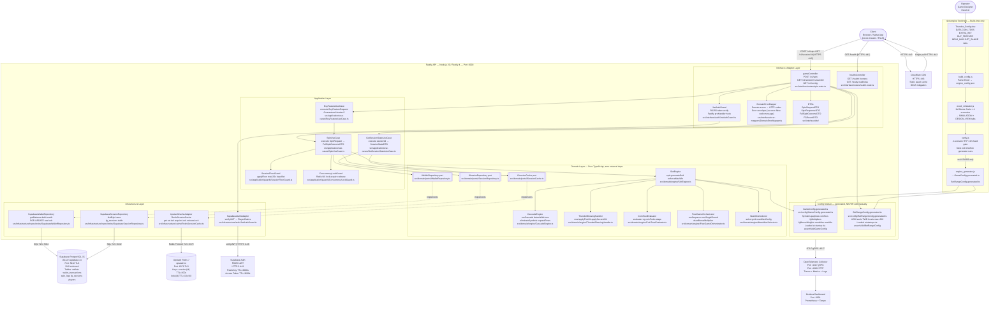

# Component Diagram — Backend Architecture

> 來源：EDD.md §4.5.12 Component Diagram, §4.1 Module Map; ARCH.md §3.3 C4 L3 Component Diagram, §11 Technology Stack

```mermaid
flowchart TD
    %% External clients
    Client(["Client\nBrowser / Native App\nCocos Creator / PixiJS"])
    Operator(["Operator\nGame Designer\nExcel UI"])

    %% External managed services
    SupaDB[("Supabase PostgreSQL 15\ndb.zzz.supabase.co\nPort :5432 TLS\nRLS enforced\nTables: wallets wallet_transactions\nspin_logs fg_sessions players")]
    UpstashRedis[("Upstash Redis 7\nupstash.io\nPort :6379 TLS\nKeys: session:{id} TTL=300s\nlock:{id} TTL=10s NX")]
    SupabaseAuth["Supabase Auth\nRS256 JWT\nHTTPS :443\nPublicKey TTL=3600s\nAccess Token TTL=3600s"]
    CDN["Cloudflare CDN\nHTTPS :443\nStatic asset cache\nDDoS mitigation"]
    OTELCollector["OpenTelemetry Collector\nPort :4317 gRPC\nPort :4318 HTTP\nTraces + Metrics + Logs"]
    Grafana["Grafana Dashboard\nPort :3001\nPrometheus + Tempo"]

    subgraph FastifyAPI["Fastify API — Node.js 20 / Fastify 4 — Port :3000"]
        direction TB

        subgraph InterfaceLayer["Interface / Adapter Layer"]
            GC["gameController\nPOST /v1/spin\nGET /v1/session/:sessionId\nGET /v1/config\nsrc/interface/routes/spin.route.ts"]
            HC["healthController\nGET /health liveness\nGET /ready readiness\nsrc/interface/routes/health.route.ts"]
            JWG["JwtAuthGuard\nRS256 token verify\nFastify preHandler hook\nsrc/interface/auth/JwtAuthGuard.ts"]
            EM["DomainErrorMapper\nDomain errors → HTTP codes\nError envelope {success false code message}\nsrc/interface/error-mappers/DomainErrorMapper.ts"]
            DTOS["DTOs\nSpinRequestDTO SpinResponseDTO\nFullSpinOutcomeDTO FGRoundDTO\nsrc/interface/dto/"]
        end

        subgraph ApplicationLayer["Application Layer"]
            SU["SpinUseCase\nexecute SpinRequest → FullSpinOutcomeDTO\nsrc/application/use-cases/SpinUseCase.ts"]
            BU["BuyFeatureUseCase\nexecute BuyFeatureRequest\nGuaranteed Heads×5\nsrc/application/use-cases/BuyFeatureUseCase.ts"]
            GSU["GetSessionStateUseCase\nexecute sessionId → SessionStateDTO\nsrc/application/use-cases/GetSessionStateUseCase.ts"]
            SFG["SessionFloorGuard\napplyFloor total 20x baseBet\nsrc/application/guards/SessionFloorGuard.ts"]
            CLG["ConcurrencyLockGuard\nRedis NX lock acquire release\nsrc/application/guards/ConcurrencyLockGuard.ts"]
        end

        subgraph DomainLayer["Domain Layer — Pure TypeScript, zero external deps"]
            SE["SlotEngine\nspin generateGrid enforceMaxWin\nsrc/domain/engine/SlotEngine.ts"]
            CE["CascadeEngine\nrunCascade detectWinLines\neliminateSymbols expandRows\nsrc/domain/engine/CascadeEngine.ts"]
            TBH["ThunderBlessingHandler\neval applyFirstHit applySecondHit\nsrc/domain/engine/ThunderBlessingHandler.ts"]
            CTE["CoinTossEvaluator\nevaluate rng coinProbs stage\nsrc/domain/engine/CoinTossEvaluator.ts"]
            FGO["FreeGameOrchestrator\nrunSequence runSingleRound\ndrawBonusMultiplier\nsrc/domain/engine/FreeGameOrchestrator.ts"]
            NMS["NearMissSelector\nselect grid nearMissConfig\nsrc/domain/engine/NearMissSelector.ts"]
            IWR[["IWalletRepository port\nsrc/domain/ports/IWalletRepository.ts"]]
            ISC[["ISessionCache port\nsrc/domain/ports/ISessionCache.ts"]]
            ISR[["ISessionRepository port\nsrc/domain/ports/ISessionRepository.ts"]]
        end

        subgraph InfraLayer["Infrastructure Layer"]
            SWR["SupabaseWalletRepository\ngetBalance debit credit\nFOR UPDATE row lock\nsrc/infrastructure/repositories/SupabaseWalletRepository.ts"]
            SSPG["SupabaseSessionRepository\nfindById save\nfg_sessions table\nsrc/infrastructure/repositories/SupabaseSessionRepository.ts"]
            RSC["UpstashCacheAdapter\nRedisSessionCache\nget set del acquireLock releaseLock\nsrc/infrastructure/cache/RedisSessionCache.ts"]
            SAA["SupabaseAuthAdapter\nverifyJWT → PlayerClaims\nsrc/infrastructure/auth/JwtAuthGuard.ts"]
        end

        subgraph ConfigModule["Config Module — generated, NEVER edit manually"]
            GCF["GameConfig.generated.ts\nsrc/config/GameConfig.generated.ts\nSymbols paylines coinToss fgMultipliers\nfgBonusWeights nearMiss maxWin\nLoaded at startup via assertValidGameConfig"]
            BCF["BetRangeConfig.generated.ts\nsrc/config/BetRangeConfig.generated.ts\nUSD levels TWD levels max=320\nLoaded at startup via assertValidBetRangeConfig"]
        end
    end

    subgraph ToolchainBuild["slot-engine Toolchain — Build-time only"]
        XLSX["Thunder_Config.xlsx\nDATA COIN_TOSS EXTRA_BET\nBUY_FEATURE NEAR_MISS BET_RANGE tabs"]
        BCJ["build_config.js\nParse Excel → engine_config.json"]
        SIM["excel_simulator.js\n1M Monte Carlo × 4 scenarios\n→ SIMULATION + DESIGN_VIEW tabs"]
        VER["verify.js\n4-scenario RTP ±1% hard gate\nMust exit 0 before generator runs"]
        ENG["engine_generator.js\n→ GameConfig.generated.ts\n→ BetRangeConfig.generated.ts"]
    end

    %% ─── Client connections ───────────────────────────────────────────────────
    Client -->|"HTTPS :443"| CDN
    CDN -->|"Origin pull HTTPS :443"| Client
    Client -->|"POST /v1/spin GET /v1/session/:id [HTTPS :443]"| GC
    Client -->|"GET /health [HTTPS :443]"| HC

    %% ─── Interface Layer internal ─────────────────────────────────────────────
    GC --> JWG
    GC --> DTOS
    GC --> SU
    GC --> BU
    GC --> GSU
    GC --> EM
    JWG --> SAA
    SAA -->|"verifyJWT [HTTPS :443]"| SupabaseAuth

    %% ─── Application Layer internal ───────────────────────────────────────────
    SU --> SE
    SU --> SFG
    SU --> CLG
    SU --> IWR
    SU --> ISC
    BU --> SU
    GSU --> ISC
    GSU --> ISR

    %% ─── Domain Layer internal ────────────────────────────────────────────────
    SE --> CE
    SE --> TBH
    SE --> CTE
    SE --> FGO
    SE --> NMS
    SE --> GCF
    GC --> BCF

    %% ─── Port implementations ─────────────────────────────────────────────────
    IWR -.->|implements| SWR
    ISR -.->|implements| SSPG
    ISC -.->|implements| RSC

    %% ─── Infrastructure to external services ─────────────────────────────────
    SWR -->|"SQL TLS :5432"| SupaDB
    SSPG -->|"SQL TLS :5432"| SupaDB
    RSC -->|"Redis Protocol TLS :6379"| UpstashRedis

    %% ─── Toolchain to config ──────────────────────────────────────────────────
    Operator --> XLSX
    XLSX --> BCJ
    BCJ --> SIM
    SIM --> VER
    VER -->|"exit 0 PASS only"| ENG
    ENG --> GCF
    ENG --> BCF

    %% ─── Observability ────────────────────────────────────────────────────────
    FastifyAPI -->|"OTLP gRPC :4317"| OTELCollector
    OTELCollector --> Grafana
```
