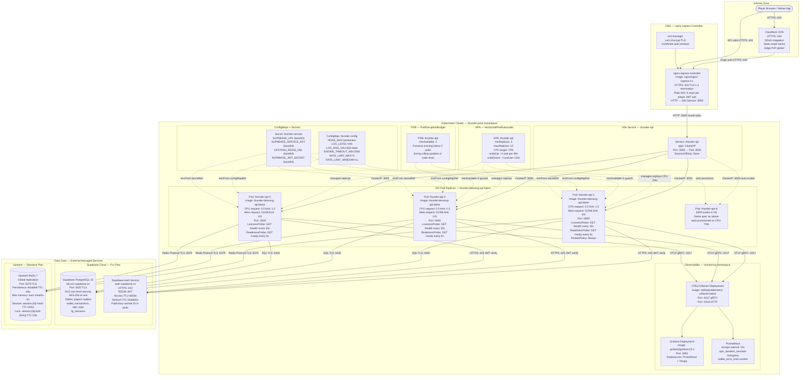

# Deployment Diagram — Kubernetes Production Environment

> 來源：EDD.md §4.5.13 Deployment Diagram, §3.5 Environment Matrix; ARCH.md §7 High Availability, §8 DR, §10 Scalability

```mermaid
flowchart TD
    subgraph Internet["Internet Zone"]
        Player(["Player Browser / Native App"])
        CDN["Cloudflare CDN\nHTTPS :443\nDDoS mitigation\nStatic asset cache\nEdge PoP global"]
    end

    subgraph DMZ["DMZ — nginx Ingress Controller"]
        Ingress["nginx-ingress-controller\nImage: nginx/nginx-ingress:3.x\nHTTPS :443 TLS 1.3 termination\nRate limit: 5 req/s per player JWT sub\nHTTP → K8s Service :3000"]
        Cert["cert-manager\nLet's Encrypt TLS\nCertificate auto-renewal"]
    end

    subgraph K8sCluster["Kubernetes Cluster — thunder-prod namespace"]
        direction TB

        subgraph HPAScaling["HPA — HorizontalPodAutoscaler"]
            HPA["HPA: thunder-api\nminReplicas: 3\nmaxReplicas: 10\nCPU target: 70%\nscaleUp: +1 pod per 60s\nscaleDown: -1 pod per 120s"]
        end

        subgraph PDBControl["PDB — PodDisruptionBudget"]
            PDB["PDB: thunder-api\nminAvailable: 2\nPrevents evicting below 2 pods\nduring rolling updates or node drain"]
        end

        subgraph APIPods["API Pod Replicas — thunder-blessing-api:latest"]
            Pod1["Pod: thunder-api-1\nImage: thunder-blessing-api:latest\nCPU request: 0.5 limit: 1.0\nMem request: 512Mi limit: 1Gi\nPort :3000\nLivenessProbe: GET /health every 10s\nReadinessProbe: GET /ready every 5s\nRestartPolicy: Always"]
            Pod2["Pod: thunder-api-2\nImage: thunder-blessing-api:latest\nCPU request: 0.5 limit: 1.0\nMem request: 512Mi limit: 1Gi\nPort :3000\nLivenessProbe: GET /health every 10s\nReadinessProbe: GET /ready every 5s"]
            Pod3["Pod: thunder-api-3\nImage: thunder-blessing-api:latest\nCPU request: 0.5 limit: 1.0\nMem request: 512Mi limit: 1Gi\nPort :3000\nLivenessProbe: GET /health every 10s\nReadinessProbe: GET /ready every 5s"]
            PodN["Pod: thunder-api-N\n(HPA scales 4-10)\nSame spec as above\nauto-provisioned on CPU 70%"]
        end

        subgraph K8sService["K8s Service — thunder-api"]
            SVC["Service: thunder-api\ntype: ClusterIP\nPort :3000 → Pod :3000\nSessionAffinity: None"]
        end

        subgraph ConfigMaps["ConfigMaps + Secrets"]
            CM["ConfigMap: thunder-config\nNODE_ENV=production\nLOG_LEVEL=info\nLOG_RNG_VALUES=false\nENGINE_TIMEOUT_MS=2000\nRATE_LIMIT_MAX=5\nRATE_LIMIT_WINDOW=1s"]
            SEC["Secret: thunder-secrets\nSUPABASE_URL (base64)\nSUPABASE_SERVICE_KEY (base64)\nUPSTASH_REDIS_URL (base64)\nSUPABASE_JWT_SECRET (base64)"]
        end

        subgraph ObsStack["Observability — monitoring namespace"]
            OTELDeploy["OTELCollector Deployment\nImage: otel/opentelemetry-collector:latest\nPort :4317 gRPC\nPort :4318 HTTP"]
            GrafanaDeploy["Grafana Deployment\nImage: grafana/grafana:10.x\nPort :3001\nDatasources: Prometheus + Tempo"]
            PromDeploy["Prometheus\nScrape interval: 15s\nspin_duration_seconds histogram\nwallet_error_total counter"]
        end
    end

    subgraph DataZone["Data Zone — External Managed Services"]
        subgraph SupabaseCloud["Supabase Cloud — Pro Plan"]
            SupaDB[("Supabase PostgreSQL 15\ndb.zzz.supabase.co\nPort :5432 TLS\nRLS row-level security\nAES-256 at rest\nTables: players wallets\nwallet_transactions spin_logs\nfg_sessions")]
            SupaAuth["Supabase Auth Service\nauth.supabase.co\nHTTPS :443\nRS256 JWT\nAccess TTL=3600s\nRefresh TTL=604800s\nPublicKey cached 1h in pods"]
        end

        subgraph UpstashCloud["Upstash — Standard Plan"]
            UpstashRedis[("Upstash Redis 7\nGlobal replication\nPort :6379 TLS\nPersistence: disabled TTL-only\nMax memory: evict volatile-lru\nSession: session:{id} Hash TTL=300s\nLock: session:{id}:lock String TTL=10s")]
        end
    end

    %% ─── Internet → DMZ ───────────────────────────────────────────────────────
    Player -->|"HTTPS :443"| CDN
    CDN -->|"Origin pull HTTPS :443"| Ingress
    Player -->|"API calls HTTPS :443"| Ingress
    Cert --> Ingress

    %% ─── Ingress → Service → Pods ─────────────────────────────────────────────
    Ingress -->|"HTTP :3000 round-robin"| SVC
    SVC -->|"ClusterIP :3000"| Pod1
    SVC -->|"ClusterIP :3000"| Pod2
    SVC -->|"ClusterIP :3000"| Pod3
    SVC -.->|"ClusterIP :3000 auto-scaled"| PodN

    %% ─── HPA manages pods ────────────────────────────────────────────────────
    HPA -.->|"manages replicas CPU 70%"| Pod1
    HPA -.->|"manages replicas"| Pod2
    HPA -.->|"manages replicas"| Pod3
    HPA -.->|"auto-provisions"| PodN

    %% ─── PDB protects pods ───────────────────────────────────────────────────
    PDB -.->|"minAvailable=2 guards"| Pod1
    PDB -.->|"minAvailable=2 guards"| Pod2

    %% ─── Pods → External Services ────────────────────────────────────────────
    Pod1 -->|"SQL TLS :5432"| SupaDB
    Pod2 -->|"SQL TLS :5432"| SupaDB
    Pod3 -->|"SQL TLS :5432"| SupaDB
    Pod1 -->|"HTTPS :443 JWT verify"| SupaAuth
    Pod2 -->|"HTTPS :443 JWT verify"| SupaAuth
    Pod3 -->|"HTTPS :443 JWT verify"| SupaAuth
    Pod1 -->|"Redis Protocol TLS :6379"| UpstashRedis
    Pod2 -->|"Redis Protocol TLS :6379"| UpstashRedis
    Pod3 -->|"Redis Protocol TLS :6379"| UpstashRedis

    %% ─── Pods → Observability ─────────────────────────────────────────────────
    Pod1 -->|"OTLP gRPC :4317"| OTELDeploy
    Pod2 -->|"OTLP gRPC :4317"| OTELDeploy
    Pod3 -->|"OTLP gRPC :4317"| OTELDeploy
    OTELDeploy --> GrafanaDeploy
    OTELDeploy --> PromDeploy

    %% ─── Config injection ─────────────────────────────────────────────────────
    CM -.->|"envFrom configMapRef"| Pod1
    CM -.->|"envFrom configMapRef"| Pod2
    CM -.->|"envFrom configMapRef"| Pod3
    SEC -.->|"envFrom secretRef"| Pod1
    SEC -.->|"envFrom secretRef"| Pod2
    SEC -.->|"envFrom secretRef"| Pod3
```
