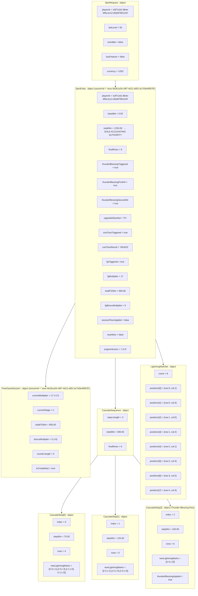
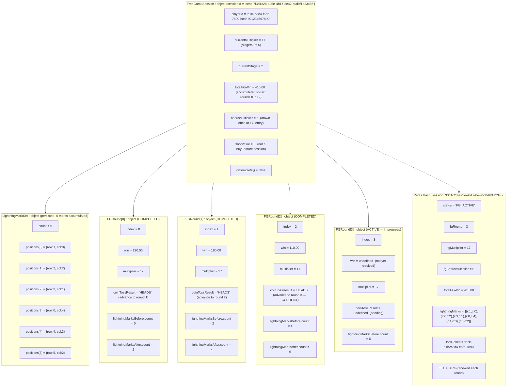

# Object Diagram — Concrete Instance Snapshots

> 來源：EDD.md §4.5.3 Object Diagram, §5.2 FullSpinOutcome Schema, §5.6 FG Bonus Multiplier

## Snapshot A: Spin Triggering Thunder Blessing Scatter (FG Entry)

A spin where 3 cascade steps accumulate 8 Lightning Marks, Thunder Blessing fires on the 3rd step, Coin Toss returns Heads (×17 FG), and totalWin = 1250.00.

---

## Snapshot B: FreeGameSession in Progress (Round 3 of 5, Multiplier ×17)

FG session is active after 3rd Heads, currently running round 3, lightning marks persisted from previous rounds.

