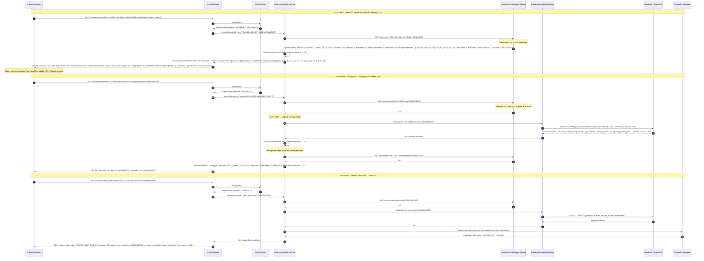

# Sequence Diagram — GET /v1/session/:sessionId (FG Reconnect)

> 來源：EDD.md §6.1 Endpoints, §5.3 Redis Session Schema; ARCH.md §3.3, §3.4

```mermaid
sequenceDiagram
    autonumber

    participant Client as Client (Frontend)
    participant Fastify as Fastify Router
    participant JwtAuthGuard as JwtAuthGuard
    participant GetSessionUseCase as GetSessionStateUseCase
    participant Redis as UpstashCacheAdapter (Redis)
    participant SessionRepo as SupabaseSessionRepository
    participant SupaDB as Supabase PostgreSQL
    participant ErrorMapper as DomainErrorMapper

    Note over Client,ErrorMapper: ─── Path A: Cache HIT (Redis has active FG session) ───

    Client->>Fastify: GET /v1/session/sess-7f3d1c28-a95e-4b17-8e42-c0d9f1a23456 {Authorization: Bearer <token>}
    Fastify->>JwtAuthGuard: verify(token)
    JwtAuthGuard-->>Fastify: PlayerClaims {playerId: "b1c2d3e4...", role: "player"}

    Fastify->>GetSessionUseCase: execute(sessionId: "sess-7f3d1c28-a95e-4b17-8e42-c0d9f1a23456")

    GetSessionUseCase->>Redis: GET session:sess-7f3d1c28-a95e-4b17-8e42-c0d9f1a23456
    Note over Redis: Key exists (TTL = 287s remaining)
    Redis-->>GetSessionUseCase: SessionState { playerId: "b1c2d3e4...", status: "FG_ACTIVE", baseBet: 1.00, fgRound: 3, fgMultiplier: 17, fgBonusMultiplier: 5, totalFGWin: 410.00, lightningMarks: "[{r:1,c:0},{r:2,c:2},{r:3,c:1},{r:0,c:4},{r:4,c:3},{r:5,c:2}]", floorValue: 0, lockToken: "lock-a1b2c3d4...", lockedAt: 1745712345000 }

    GetSessionUseCase->>GetSessionUseCase: Validate: playerId from JWT == session.playerId → OK
    GetSessionUseCase-->>Fastify: SessionStateDTO { sessionId: "sess-7f3d1c28...", status: "FG_ACTIVE", fgRound: 3, fgMultiplier: 17, totalFGWin: 410.00, lightningMarks: [{r:1,c:0}, {r:2,c:2}, {r:3,c:1}, {r:0,c:4}, {r:4,c:3}, {r:5,c:2}] }

    Fastify-->>Client: 200 OK { success: true, data: { sessionId: "sess-7f3d1c28-a95e-4b17-8e42-c0d9f1a23456", status: "FG_ACTIVE", fgRound: 3, fgMultiplier: 17, totalFGWin: 410.00, lightningMarks: [...6 positions...] }, requestId: "req-reconnect-001" }

    Note over Client: Client resumes animation from round 3 / multiplier ×17 / 6 lightning marks

    Note over Client,ErrorMapper: ─── Path B: Cache MISS → PostgreSQL Fallback ───

    Client->>Fastify: GET /v1/session/sess-old-1234-5678-9abc-def012345678 {Authorization: Bearer <token>}
    Fastify->>JwtAuthGuard: verify(token)
    JwtAuthGuard-->>Fastify: PlayerClaims {playerId: "b1c2d3e4..."}

    Fastify->>GetSessionUseCase: execute(sessionId: "sess-old-1234-5678-9abc-def012345678")

    GetSessionUseCase->>Redis: GET session:sess-old-1234-5678-9abc-def012345678
    Note over Redis: Key does NOT exist (TTL expired after 300s)
    Redis-->>GetSessionUseCase: null

    Note over GetSessionUseCase: Cache MISS → fallback to PostgreSQL
    GetSessionUseCase->>SessionRepo: findById("sess-old-1234-5678-9abc-def012345678")
    SessionRepo->>SupaDB: SELECT * FROM fg_sessions WHERE session_id='sess-old-1234...' AND status='FG_ACTIVE'
    SupaDB-->>SessionRepo: FGSessionRow { session_id, player_id, fg_round:2, fg_multiplier:7, total_fg_win:67.50, lightning_marks_json: [...], status: "FG_ACTIVE" }
    SessionRepo-->>GetSessionUseCase: SessionState (from DB)

    GetSessionUseCase->>GetSessionUseCase: Validate: playerId from JWT == session.playerId → OK

    Note over GetSessionUseCase: Re-populate Redis cache for subsequent spins
    GetSessionUseCase->>Redis: SET session:sess-old-1234... {restored session data} EX 300
    Redis-->>GetSessionUseCase: OK

    GetSessionUseCase-->>Fastify: SessionStateDTO { sessionId: "sess-old-1234...", status: "FG_ACTIVE", fgRound: 2, fgMultiplier: 7, totalFGWin: 67.50, lightningMarks: [...] }
    Fastify-->>Client: 200 OK { success: true, data: SessionStateDTO, requestId: "req-reconnect-002" }

    Note over Client,ErrorMapper: ─── Path C: Session Not Found → 404 ───

    Client->>Fastify: GET /v1/session/sess-nonexistent-00000000-0000 {Authorization: Bearer <token>}
    Fastify->>JwtAuthGuard: verify(token)
    JwtAuthGuard-->>Fastify: PlayerClaims {playerId: "c3d4e5f6..."}

    Fastify->>GetSessionUseCase: execute(sessionId: "sess-nonexistent-00000000-0000")

    GetSessionUseCase->>Redis: GET session:sess-nonexistent-00000000-0000
    Redis-->>GetSessionUseCase: null

    GetSessionUseCase->>SessionRepo: findById("sess-nonexistent-00000000-0000")
    SessionRepo->>SupaDB: SELECT * FROM fg_sessions WHERE session_id='sess-nonexistent...'
    SupaDB-->>SessionRepo: (empty result set)
    SessionRepo-->>GetSessionUseCase: null

    GetSessionUseCase->>ErrorMapper: map(SessionNotFoundError("sess-nonexistent-00000000-0000"))
    ErrorMapper-->>GetSessionUseCase: {httpStatus: 404, code: "SESSION_NOT_FOUND"}
    GetSessionUseCase-->>Fastify: 404 SessionNotFoundError

    Fastify-->>Client: 404 { success: false, code: "SESSION_NOT_FOUND", message: "FG session sess-nonexistent-00000000-0000 not found or already expired", requestId: "req-reconnect-003" }
```
