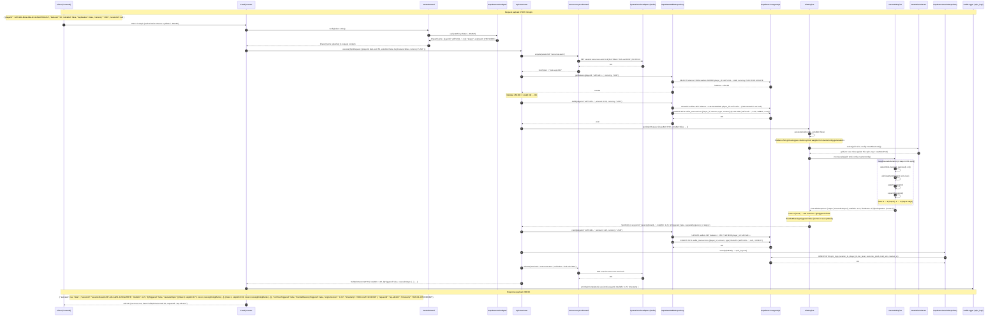

# Sequence Diagram — POST /v1/spin Happy Path (No FG Triggered)

> 來源：EDD.md §4.5.4, §5.1 SlotEngine Algorithm, §6 API Design; ARCH.md §3.4 Data Flow

```mermaid
sequenceDiagram
    autonumber

    participant Client as Client (Frontend)
    participant Fastify as Fastify Router
    participant JwtAuthGuard as JwtAuthGuard
    participant SupabaseAuth as SupabaseAuthAdapter
    participant SpinUseCase as SpinUseCase
    participant ConcurrencyLockGuard as ConcurrencyLockGuard
    participant UpstashCache as UpstashCacheAdapter (Redis)
    participant WalletRepo as SupabaseWalletRepository
    participant SupaDB as Supabase PostgreSQL
    participant SlotEngine as SlotEngine
    participant CascadeEngine as CascadeEngine
    participant NearMiss as NearMissSelector
    participant SessionRepo as SupabaseSessionRepository
    participant AuditLog as AuditLogger (spin_logs)

    Note over Client,AuditLog: Request payload: POST /v1/spin
    Note over Client: { "playerId": "a3f7c2d1-8b4e-4f9a-bc12-d5e6f7891234", "betLevel": 50, "extraBet": false, "buyFeature": false, "currency": "USD", "sessionId": null }

    Client->>Fastify: POST /v1/spin {Authorization: Bearer eyJhbGci...RS256}
    Fastify->>JwtAuthGuard: verify(token: string)
    JwtAuthGuard->>SupabaseAuth: verifyJWT("eyJhbGci...RS256")
    SupabaseAuth-->>JwtAuthGuard: PlayerClaims { playerId: "a3f7c2d1...", role: "player", expiresAt: 1745712000 }
    JwtAuthGuard-->>Fastify: PlayerClaims (attached to request context)

    Fastify->>SpinUseCase: execute(SpinRequest { playerId, betLevel=50, extraBet=false, buyFeature=false, currency="USD" })

    SpinUseCase->>ConcurrencyLockGuard: acquire(sessionId: "sess-new-auto")
    ConcurrencyLockGuard->>UpstashCache: SET session:sess-new-auto:lock {lockToken="lock-uuid-001"} NX EX 10
    UpstashCache-->>ConcurrencyLockGuard: OK
    ConcurrencyLockGuard-->>SpinUseCase: lockToken = "lock-uuid-001"

    SpinUseCase->>WalletRepo: getBalance(playerId: "a3f7c2d1...", currency: "USD")
    WalletRepo->>SupaDB: SELECT balance FROM wallets WHERE player_id='a3f7c2d1...' AND currency='USD' FOR UPDATE
    SupaDB-->>WalletRepo: balance = 250.00
    WalletRepo-->>SpinUseCase: 250.00

    Note over SpinUseCase: Validate: 250.00 >= cost(0.50) → OK

    SpinUseCase->>WalletRepo: debit(playerId: "a3f7c2d1...", amount: 0.50, currency: "USD")
    WalletRepo->>SupaDB: UPDATE wallets SET balance = 249.50 WHERE player_id='a3f7c2d1...' (FOR UPDATE row lock)
    WalletRepo->>SupaDB: INSERT INTO wallet_transactions (player_id, amount, type, created_at) VALUES ('a3f7c2d1...', 0.50, 'DEBIT', now())
    SupaDB-->>WalletRepo: OK
    WalletRepo-->>SpinUseCase: void

    SpinUseCase->>SlotEngine: spin(SpinRequest { baseBet=0.50, extraBet=false, ... })

    SlotEngine->>SlotEngine: generateGrid(config, extraBet=false)
    Note over SlotEngine: Produces 5x3 grid using per-column symbol weights from GameConfig.generated.ts

    SlotEngine->>NearMiss: select(grid: Grid, config: NearMissConfig)
    NearMiss-->>SlotEngine: grid (no near-miss applied this spin, rng > nearMissProb)

    SlotEngine->>CascadeEngine: runCascade(grid: Grid, config: GameConfig)

    loop Cascade iteration (2 steps in this spin)
        CascadeEngine->>CascadeEngine: detectWinLines(grid, paylines[0..24])
        CascadeEngine->>CascadeEngine: eliminateSymbols(grid, winLines)
        CascadeEngine->>CascadeEngine: applyGravity(grid)
        CascadeEngine->>CascadeEngine: expandRows(grid)
        Note over CascadeEngine: rows: 3 → 4 (step 0), 4 → 4 (step 1 stays)
    end

    CascadeEngine-->>SlotEngine: CascadeSequence { steps: [CascadeStep×2], totalWin: 1.25, finalRows: 4, lightningMarks: {count:3} }

    Note over SlotEngine: rows=4 (not 6) → NO CoinToss. fgTriggered=false.
    Note over SlotEngine: thunderBlessingTriggered=false (no SC in new symbols)

    SlotEngine-->>SpinUseCase: SpinEntity { sessionId: "sess-9e2b1a34...", totalWin: 1.25, fgTriggered: false, cascadeSequence: {2 steps} }

    SpinUseCase->>WalletRepo: credit(playerId: "a3f7c2d1...", amount: 1.25, currency: "USD")
    WalletRepo->>SupaDB: UPDATE wallets SET balance = 250.75 WHERE player_id='a3f7c2d1...'
    WalletRepo->>SupaDB: INSERT INTO wallet_transactions (player_id, amount, type) VALUES ('a3f7c2d1...', 1.25, 'CREDIT')
    SupaDB-->>WalletRepo: OK

    SpinUseCase->>SessionRepo: save(SpinEntity → spin_log row)
    SessionRepo->>SupaDB: INSERT INTO spin_logs (session_id, player_id, bet_level, outcome_jsonb, total_win, created_at)
    SupaDB-->>SessionRepo: OK

    SpinUseCase->>ConcurrencyLockGuard: release(sessionId: "sess-new-auto", lockToken: "lock-uuid-001")
    ConcurrencyLockGuard->>UpstashCache: DEL session:sess-new-auto:lock
    UpstashCache-->>ConcurrencyLockGuard: OK

    SpinUseCase-->>Fastify: FullSpinOutcomeDTO { totalWin: 1.25, fgTriggered: false, cascadeSteps: [...], ... }

    Fastify->>AuditLog: emit SpinCompleted { sessionId, playerId, totalWin: 1.25, timestamp }

    Note over Client,AuditLog: Response payload: 200 OK
    Note over Fastify: { "success": true, "data": { "sessionId": "sess-9e2b1a34-cf87-4d12-a951-bc7d3e4f5678", "totalWin": 1.25, "fgTriggered": false, "cascadeSteps": [{index:0, stepWin:0.75, rows:4, newLightningMarks:[...]}, {index:1, stepWin:0.50, rows:4, newLightningMarks:[...]}], "coinTossTriggered": false, "thunderBlessingTriggered": false, "engineVersion": "1.0.0", "timestamp": "2026-04-26T10:30:00Z" }, "requestId": "req-abc123", "timestamp": "2026-04-26T10:30:00Z" }

    Fastify-->>Client: 200 OK {success: true, data: FullSpinOutcomeDTO, requestId: "req-abc123"}
```
