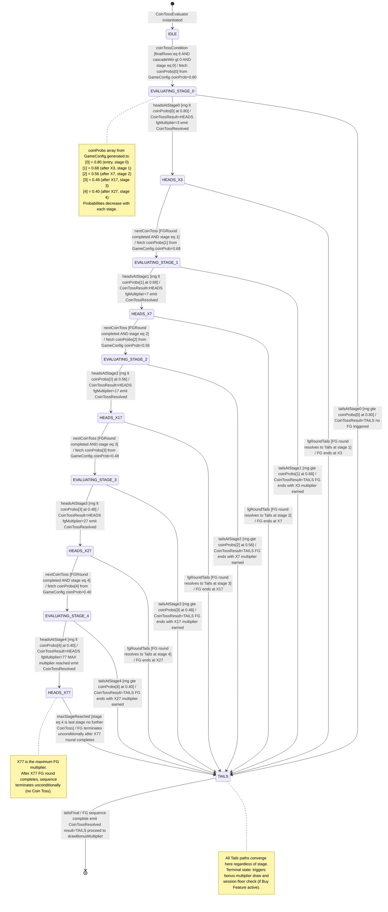

# State Machine — CoinToss Phase

> 來源：EDD.md §5.1 step 3c (evaluateCoinToss), §5.6 FG Multiplier Sequence; ARCH.md §3.3 CoinTossEvaluator component

```mermaid
stateDiagram-v2
    [*] --> IDLE : CoinTossEvaluator instantiated

    IDLE --> EVALUATING_STAGE_0 : coinTossCondition [finalRows eq 6 AND cascadeWin gt 0 AND stage eq 0] / fetch coinProbs[0] from GameConfig coinProb=0.80

    EVALUATING_STAGE_0 --> TAILS : tailsAtStage0 [rng gte coinProbs[0] at 0.80] / CoinTossResult=TAILS no FG triggered
    EVALUATING_STAGE_0 --> HEADS_X3 : headsAtStage0 [rng lt coinProbs[0] at 0.80] / CoinTossResult=HEADS fgMultiplier=3 emit CoinTossResolved

    HEADS_X3 --> EVALUATING_STAGE_1 : nextCoinToss [FGRound completed AND stage eq 1] / fetch coinProbs[1] from GameConfig coinProb=0.68
    HEADS_X3 --> TAILS : fgRoundTails [FG round resolves to Tails at stage 1] / FG ends at X3

    EVALUATING_STAGE_1 --> TAILS : tailsAtStage1 [rng gte coinProbs[1] at 0.68] / CoinTossResult=TAILS FG ends with X3 multiplier earned
    EVALUATING_STAGE_1 --> HEADS_X7 : headsAtStage1 [rng lt coinProbs[1] at 0.68] / CoinTossResult=HEADS fgMultiplier=7 emit CoinTossResolved

    HEADS_X7 --> EVALUATING_STAGE_2 : nextCoinToss [FGRound completed AND stage eq 2] / fetch coinProbs[2] from GameConfig coinProb=0.56
    HEADS_X7 --> TAILS : fgRoundTails [FG round resolves to Tails at stage 2] / FG ends at X7

    EVALUATING_STAGE_2 --> TAILS : tailsAtStage2 [rng gte coinProbs[2] at 0.56] / CoinTossResult=TAILS FG ends with X7 multiplier earned
    EVALUATING_STAGE_2 --> HEADS_X17 : headsAtStage2 [rng lt coinProbs[2] at 0.56] / CoinTossResult=HEADS fgMultiplier=17 emit CoinTossResolved

    HEADS_X17 --> EVALUATING_STAGE_3 : nextCoinToss [FGRound completed AND stage eq 3] / fetch coinProbs[3] from GameConfig coinProb=0.48
    HEADS_X17 --> TAILS : fgRoundTails [FG round resolves to Tails at stage 3] / FG ends at X17

    EVALUATING_STAGE_3 --> TAILS : tailsAtStage3 [rng gte coinProbs[3] at 0.48] / CoinTossResult=TAILS FG ends with X17 multiplier earned
    EVALUATING_STAGE_3 --> HEADS_X27 : headsAtStage3 [rng lt coinProbs[3] at 0.48] / CoinTossResult=HEADS fgMultiplier=27 emit CoinTossResolved

    HEADS_X27 --> EVALUATING_STAGE_4 : nextCoinToss [FGRound completed AND stage eq 4] / fetch coinProbs[4] from GameConfig coinProb=0.40
    HEADS_X27 --> TAILS : fgRoundTails [FG round resolves to Tails at stage 4] / FG ends at X27

    EVALUATING_STAGE_4 --> TAILS : tailsAtStage4 [rng gte coinProbs[4] at 0.40] / CoinTossResult=TAILS FG ends with X27 multiplier earned
    EVALUATING_STAGE_4 --> HEADS_X77 : headsAtStage4 [rng lt coinProbs[4] at 0.40] / CoinTossResult=HEADS fgMultiplier=77 MAX multiplier reached emit CoinTossResolved

    HEADS_X77 --> TAILS : maxStageReached [stage eq 4 is last stage no further CoinToss] / FG terminates unconditionally after X77 round completes

    TAILS --> [*] : tailsFinal / FG sequence complete emit CoinTossResolved result=TAILS proceed to drawBonusMultiplier

    note right of EVALUATING_STAGE_0
        coinProbs array from GameConfig.generated.ts:
        [0] = 0.80 (entry, stage 0)
        [1] = 0.68 (after X3, stage 1)
        [2] = 0.56 (after X7, stage 2)
        [3] = 0.48 (after X17, stage 3)
        [4] = 0.40 (after X27, stage 4)
        Probabilities decrease with each stage.
    end note

    note right of HEADS_X77
        X77 is the maximum FG multiplier.
        After X77 FG round completes, sequence
        terminates unconditionally (no Coin Toss).
    end note

    note right of TAILS
        All Tails paths converge here regardless of stage.
        Terminal state: triggers bonus multiplier draw and
        session floor check (if Buy Feature active).
    end note
```
