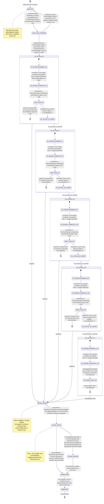

# State Machine — FreeGameSession Lifecycle

> 來源：EDD.md §4.5.8, §5.1 CoinToss stages, §5.6 FG Bonus Multiplier, §5.7 Buy Feature Session Floor

```mermaid
stateDiagram-v2
    [*] --> INACTIVE : initial state no FG session

    INACTIVE --> COIN_TOSS_PENDING : coinTossCondition [finalRows eq 6 AND cascadeWin gt 0] / CascadeEngine returns cascadeSequence.finalRows eq 6

    COIN_TOSS_PENDING --> INACTIVE : tailsResult [rng gte coinProbs[0] at stage 0 prob 0.80] / no FG triggered totalWin equals mainWin only

    COIN_TOSS_PENDING --> FG_ACTIVE_X3 : headsResult [rng lt coinProbs[0] at stage 0 prob 0.80] / create FreeGameSession currentMultiplier=3 store in Redis TTL=300s

    state FG_ACTIVE_X3 {
        [*] --> FG_ROUND_RUNNING_X3
        FG_ROUND_RUNNING_X3 --> FG_ROUND_COMPLETE_X3 : roundDone / accumulate roundWin=cascadeWin times 3 update totalFGWin persist lightningMarks in Redis
        FG_ROUND_COMPLETE_X3 --> COIN_TOSS_X3 : evalNextCoin / CoinTossEvaluator.evaluate(rng, coinProbs[1] at stage 1 prob 0.68)
        COIN_TOSS_X3 --> [*] : tailsAtX3 [rng gte 0.68] / FG sequence ends draw bonusMultiplier apply floor check
        COIN_TOSS_X3 --> FG_ACTIVE_X7_ENTRY : headsAtX3 [rng lt 0.68] / advance stage=2 currentMultiplier=7
    }

    state FG_ACTIVE_X7 {
        [*] --> FG_ROUND_RUNNING_X7
        FG_ROUND_RUNNING_X7 --> FG_ROUND_COMPLETE_X7 : roundDone / accumulate roundWin=cascadeWin times 7 update totalFGWin
        FG_ROUND_COMPLETE_X7 --> COIN_TOSS_X7 : evalNextCoin / CoinTossEvaluator.evaluate(rng, coinProbs[2] at stage 2 prob 0.56)
        COIN_TOSS_X7 --> [*] : tailsAtX7 [rng gte 0.56] / FG sequence ends draw bonusMultiplier
        COIN_TOSS_X7 --> FG_ACTIVE_X17_ENTRY : headsAtX7 [rng lt 0.56] / advance stage=3 currentMultiplier=17
    }

    state FG_ACTIVE_X17 {
        [*] --> FG_ROUND_RUNNING_X17
        FG_ROUND_RUNNING_X17 --> FG_ROUND_COMPLETE_X17 : roundDone / accumulate roundWin=cascadeWin times 17 update totalFGWin
        FG_ROUND_COMPLETE_X17 --> COIN_TOSS_X17 : evalNextCoin / CoinTossEvaluator.evaluate(rng, coinProbs[3] at stage 3 prob 0.48)
        COIN_TOSS_X17 --> [*] : tailsAtX17 [rng gte 0.48] / FG sequence ends draw bonusMultiplier
        COIN_TOSS_X17 --> FG_ACTIVE_X27_ENTRY : headsAtX17 [rng lt 0.48] / advance stage=4 currentMultiplier=27
    }

    state FG_ACTIVE_X27 {
        [*] --> FG_ROUND_RUNNING_X27
        FG_ROUND_RUNNING_X27 --> FG_ROUND_COMPLETE_X27 : roundDone / accumulate roundWin=cascadeWin times 27 update totalFGWin
        FG_ROUND_COMPLETE_X27 --> COIN_TOSS_X27 : evalNextCoin / CoinTossEvaluator.evaluate(rng, coinProbs[4] at stage 4 prob 0.40)
        COIN_TOSS_X27 --> [*] : tailsAtX27 [rng gte 0.40] / FG sequence ends draw bonusMultiplier
        COIN_TOSS_X27 --> FG_ACTIVE_X77_ENTRY : headsAtX27 [rng lt 0.40] / advance stage=5 MAX multiplier currentMultiplier=77
    }

    state FG_ACTIVE_X77 {
        [*] --> FG_ROUND_RUNNING_X77
        FG_ROUND_RUNNING_X77 --> FG_ROUND_COMPLETE_X77 : roundDone / accumulate roundWin=cascadeWin times 77 update totalFGWin
        FG_ROUND_COMPLETE_X77 --> FG_FORCE_END_X77 : maxStageReached [stage eq 5 no further Coin Toss] / FG sequence terminates unconditionally
        FG_FORCE_END_X77 --> [*] : sequenceEnd / draw bonusMultiplier
    }

    %% Transitions between composite states
    FG_ACTIVE_X3 --> FG_ACTIVE_X7 : FG_ACTIVE_X7_ENTRY
    FG_ACTIVE_X7 --> FG_ACTIVE_X17 : FG_ACTIVE_X17_ENTRY
    FG_ACTIVE_X17 --> FG_ACTIVE_X27 : FG_ACTIVE_X27_ENTRY
    FG_ACTIVE_X27 --> FG_ACTIVE_X77 : FG_ACTIVE_X77_ENTRY

    %% Converging to BONUS_DRAW
    FG_ACTIVE_X3 --> BONUS_DRAW : tailsAtX3
    FG_ACTIVE_X7 --> BONUS_DRAW : tailsAtX7
    FG_ACTIVE_X17 --> BONUS_DRAW : tailsAtX17
    FG_ACTIVE_X27 --> BONUS_DRAW : tailsAtX27
    FG_ACTIVE_X77 --> BONUS_DRAW : maxStageReached

    BONUS_DRAW --> FLOOR_CHECK : bonusDrawn [FreeGameOrchestrator.drawBonusMultiplier from fgBonusWeights X1 X5 X20 X100] / totalFGWin times bonusMultiplier

    FLOOR_CHECK --> COMPLETING : floorNotNeeded [totalFGWin gte floorValue OR NOT buyFeature session] / totalWin equals mainWin plus totalFGWin
    FLOOR_CHECK --> FLOOR_APPLIED : floorTriggered [totalFGWin lt 20 times baseBet AND buyFeature eq true] / SessionFloorGuard.applyFloor sets sessionFloorApplied=true adjustedWin=20 times baseBet

    FLOOR_APPLIED --> COMPLETING : floorAdjusted / totalWin equals mainWin plus floorValue

    COMPLETING --> COMPLETE : winFinalized / enforce maxWin cap emit SpinCompleted event DEL Redis session key
    COMPLETE --> [*] : sessionClosed

    note right of INACTIVE
        New Main Game spin: lightningMarks cleared,
        rows reset to 3, paylines reset to 25.
    end note

    note right of BONUS_DRAW
        Bonus multipliers: X1 (high weight),
        X5 (medium), X20 (low), X100 (very low).
        Drawn ONCE per FG sequence total.
    end note

    note right of FLOOR_CHECK
        Floor = 20 x baseBet, only for BuyFeature.
        Applied at session level, NEVER per-spin.
    end note
```
