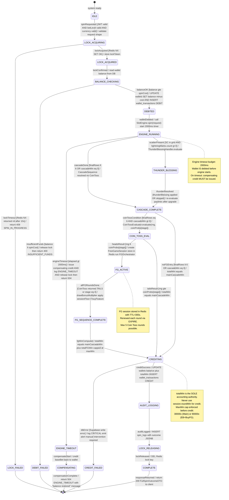

# State Machine — SpinEntity Lifecycle

> 來源：EDD.md §4.5.8 State Machine, §5.1 SlotEngine Algorithm, §6.3 Error Codes; ARCH.md §5.1, §6 Partial Failure

```mermaid
stateDiagram-v2
    [*] --> IDLE : system ready

    IDLE --> LOCK_ACQUIRING : spinRequested [JWT valid AND betLevel valid AND currency valid] / validate request shape

    LOCK_ACQUIRING --> LOCK_FAILED : lockTimeout [Redis NX returned nil after 10s] / return 409 SPIN_IN_PROGRESS
    LOCK_FAILED --> [*]

    LOCK_ACQUIRING --> LOCK_ACQUIRED : lockAcquired [Redis NX SET OK] / store lockToken

    LOCK_ACQUIRED --> BALANCE_CHECKING : lockConfirmed / read wallet balance from DB

    BALANCE_CHECKING --> DEBIT_FAILED : insufficientFunds [balance lt spinCost] / release lock then return 400 INSUFFICIENT_FUNDS
    DEBIT_FAILED --> [*]

    BALANCE_CHECKING --> DEBITED : balanceOK [balance gte spinCost] / UPDATE wallets SET balance minus cost AND INSERT wallet_transactions DEBIT

    DEBITED --> ENGINE_RUNNING : walletDebited / call SlotEngine.spin(request) start 2000ms timer

    ENGINE_RUNNING --> ENGINE_TIMEOUT : engineTimeout [elapsed gt 2000ms] / issue compensating credit AND log ENGINE_TIMEOUT AND release lock then return 504
    ENGINE_TIMEOUT --> COMPENSATING : compensateStart / credit baseBet back to wallet
    COMPENSATING --> [*] : compensationComplete / return 504 ENGINE_TIMEOUT with "balance restored" message

    ENGINE_RUNNING --> CASCADE_COMPLETE : cascadeDone [finalRows lt 6 OR cascadeWin eq 0] / CascadeSequence resolved no CoinToss

    ENGINE_RUNNING --> THUNDER_BLESSING : scatterPresent [SC in grid AND lightningMarks.count gt 0] / ThunderBlessingHandler.evaluate

    THUNDER_BLESSING --> CASCADE_COMPLETE : thunderResolved [thunderBlessing applied OR skipped] / re-evaluate paylines after upgrade

    CASCADE_COMPLETE --> COIN_TOSS_EVAL : coinTossCondition [finalRows eq 6 AND cascadeWin gt 0] / CoinTossEvaluator.evaluate(rng, coinProbs[stage])
    CASCADE_COMPLETE --> CREDITING : noFGEntry [finalRows lt 6 OR cascadeWin eq 0] / totalWin equals mainCascadeWin

    COIN_TOSS_EVAL --> FG_ACTIVE : headsResult [rng lt coinProbs[stage]] / create FreeGameSession store in Redis run FGOrchestrator
    COIN_TOSS_EVAL --> CREDITING : tailsResult [rng gte coinProbs[stage]] / totalWin equals mainCascadeWin

    FG_ACTIVE --> FG_SEQUENCE_COMPLETE : allFGRoundsDone [CoinToss returned TAILS or stage eq 4] / drawBonusMultiplier apply sessionFloor if buyFeature
    FG_SEQUENCE_COMPLETE --> CREDITING : fgWinComputed / totalWin equals mainCascadeWin plus totalFGWin capped at maxWin

    CREDITING --> CREDIT_FAILED : dbError [Supabase write error] / log CRITICAL emit alert manual intervention required
    CREDIT_FAILED --> [*]

    CREDITING --> AUDIT_LOGGING : creditSuccess / UPDATE wallets balance plus totalWin INSERT wallet_transactions CREDIT
    AUDIT_LOGGING --> LOCK_RELEASING : auditLogged / INSERT spin_logs with outcome JSONB
    LOCK_RELEASING --> COMPLETE : lockReleased / DEL Redis lock key
    COMPLETE --> [*] : responseReturned / return 200 FullSpinOutcomeDTO to client

    note right of ENGINE_RUNNING
        Engine timeout budget: 2000ms
        Wallet IS debited before engine starts.
        On timeout: compensating credit MUST be issued.
    end note

    note right of FG_ACTIVE
        FG session stored in Redis with TTL=300s.
        Renewed each round via EXPIRE.
        Max 5 Coin Toss rounds possible.
    end note

    note right of CREDITING
        totalWin is the SOLE accounting authority.
        Never use session.roundWin for credit.
        MaxWin cap enforced before credit:
        30000x (Main) or 90000x (EB+BuyFG).
    end note
```
