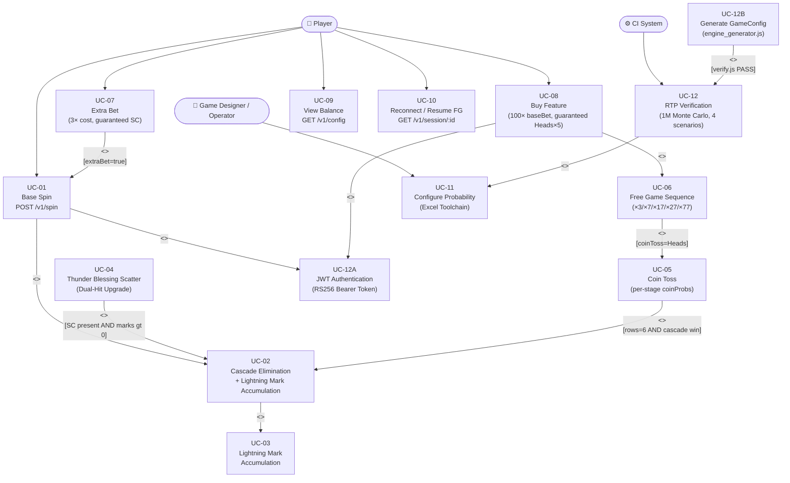

# Use Case Diagram — Thunder Blessing Slot Game

> 來源：PRD.md §4 Scope, §5 User Stories; EDD.md §4.5.1, §6.1

```mermaid
flowchart TD
    %% Actors
    Player(["👤 Player"])
    Operator(["👤 Game Designer / Operator"])
    CISystem(["⚙ CI System"])

    %% Use Cases
    UC01["UC-01\nBase Spin\nPOST /v1/spin"]
    UC02["UC-02\nCascade Elimination\n+ Lightning Mark Accumulation"]
    UC03["UC-03\nLightning Mark\nAccumulation"]
    UC04["UC-04\nThunder Blessing Scatter\n(Dual-Hit Upgrade)"]
    UC05["UC-05\nCoin Toss\n(per-stage coinProbs)"]
    UC06["UC-06\nFree Game Sequence\n(×3/×7/×17/×27/×77)"]
    UC07["UC-07\nExtra Bet\n(3× cost, guaranteed SC)"]
    UC08["UC-08\nBuy Feature\n(100× baseBet, guaranteed Heads×5)"]
    UC09["UC-09\nView Balance\nGET /v1/config"]
    UC10["UC-10\nReconnect / Resume FG\nGET /v1/session/:id"]
    UC11["UC-11\nConfigure Probability\n(Excel Toolchain)"]
    UC12["UC-12\nRTP Verification\n(1M Monte Carlo, 4 scenarios)"]
    UC12A["UC-12A\nJWT Authentication\n(RS256 Bearer Token)"]

    %% Player interactions
    Player --> UC01
    Player --> UC07
    Player --> UC08
    Player --> UC09
    Player --> UC10

    %% Operator interactions
    Operator --> UC11

    %% CI System interactions
    CISystem --> UC12

    %% UC-01 includes
    UC01 -- "<<include>>" --> UC12A
    UC01 -- "<<include>>" --> UC02

    %% UC-02 includes
    UC02 -- "<<include>>" --> UC03

    %% UC-02 extends
    UC04 -- "<<extend>>\n[SC present AND marks gt 0]" --> UC02
    UC05 -- "<<extend>>\n[rows=6 AND cascade win]" --> UC02

    %% UC-05 extends
    UC06 -- "<<extend>>\n[coinToss=Heads]" --> UC05

    %% UC-07 extends UC-01
    UC07 -- "<<extend>>\n[extraBet=true]" --> UC01

    %% UC-08 extends
    UC08 -- "<<include>>" --> UC06
    UC08 -- "<<include>>" --> UC12A

    %% UC-11 triggers UC-12
    UC12 -- "<<include>>" --> UC11

    %% UC-12 gates config generation
    UC12A2["UC-12B\nGenerate GameConfig\n(engine_generator.js)"]
    UC12A2 -- "<<extend>>\n[verify.js PASS]" --> UC12
```
